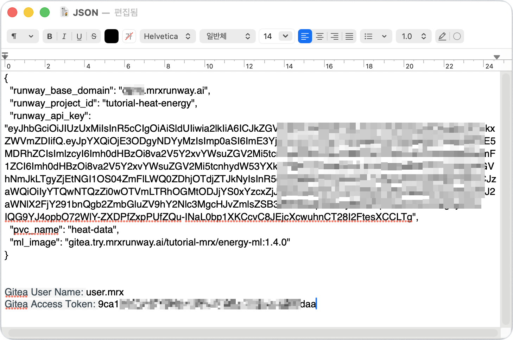
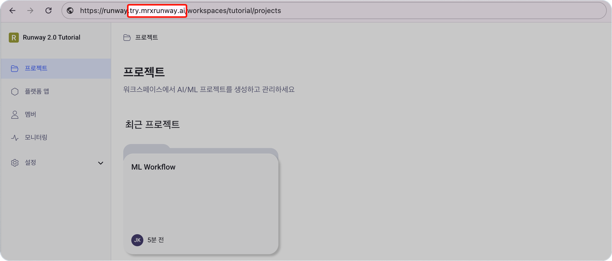
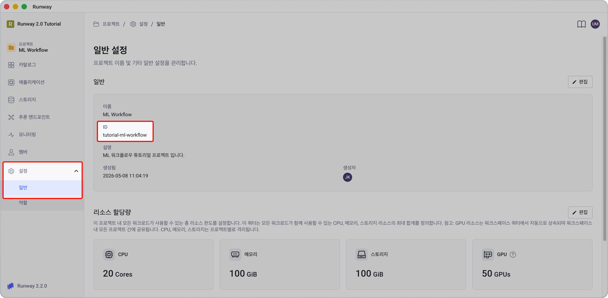
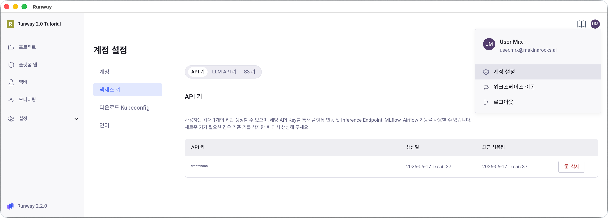
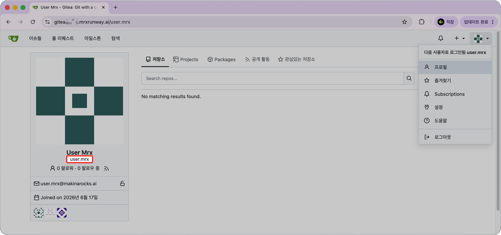
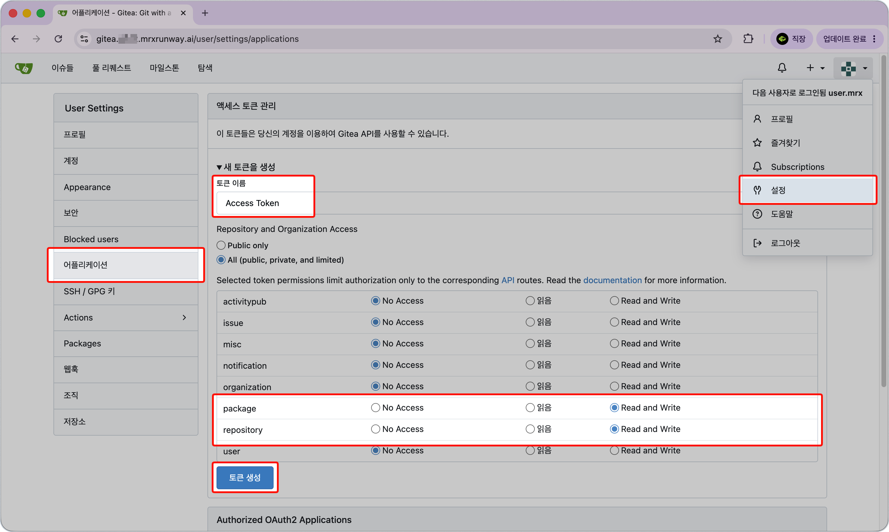

<!-- v2.2.0 에너지 수요 예측 MLOps 튜토리얼 신규 추가 | 2026-06-16 -->

# 0-1. 환경 정보 및 인증 키 발급 {#keys}

이후 단계에서 사용하는 베이스 도메인, id, 인증 키 값들을 확보합니다.

!!! note "표기 규약"
    이 튜토리얼 전체에서 `<your-project-id>`, `<your-runway-domain>` 형태의 값은 사용자 환경에 맞게 교체해서 사용합니다.

## :material-information-outline: 이 단계에서 준비할 값 {#overview}

| 값 | 어디서 | 용도 |
|----|--------|------|
| Runway 베이스 도메인 | 브라우저 주소창 | 모든 서비스 URL의 host suffix  <your-runway-domain> |
| Runway 프로젝트 ID | Runway 콘솔 | K8s namespace, S3 버킷, MLflow 실험명, DAG ID |
| Runway API 키 | Runway 콘솔 | MLflow 인증, 추론 엔드포인트 호출, Airflow REST API |
| Gitea 사용자명 | Gitea 프로필 | Git push, 이미지 레지스트리 인증 |
| Gitea 개인 액세스 토큰 | Gitea 설정 | DAG 파일 push, 이미지 push |

<!-- v2.4.0 RWP-1805 개인 S3 키 발급 단계 제거 — 프로젝트에 자동 제공되는 s3-rw Secret이 같은 이름의 환경 변수를 주입하므로 코드 변경 없이 대체된다. dev2 실환경 확인 | 2026-09-01 -->

!!! info "S3 자격 증명은 따로 발급하지 않음"
    학습 데이터와 모델 아티팩트를 읽고 쓰는 **S3 자격 증명은 프로젝트에 자동으로 제공**됩니다. 별도로 발급할 필요가 없습니다.

    프로젝트마다 `s3-rw`(읽기·쓰기)와 `s3-ro`(읽기 전용) Secret이 만들어져 있고, 애플리케이션을 배포할 때 연결하면 `AWS_ACCESS_KEY_ID` · `AWS_SECRET_ACCESS_KEY` · `AWS_ENDPOINT_URL` · `AWS_REGION` · `S3_BUCKET`이 환경 변수로 들어옵니다. 연결 방법은 1단계에서 안내합니다.

    :octicons-arrow-right-24: **사용자 가이드 > 개발하기 > 자격 증명 이해**

---

## 값 채우기 템플릿 {#template}

아래 **두 코드 블록을 메모장에 복사**해 각 항목을 확인하면서 채워두세요. 이후 단계에서 바로 활용할 수 있습니다.

아래 JSON은 다음 단계(0-2)에서 OpenBao UI에 붙여넣습니다.

<!-- v2.2.1 OpenBao 기본 지원 대응 — openbao_role 키 제거, role은 "default" 고정 | 2026-07-06 -->

```json
{
  "runway_base_domain": "<your-runway-domain>",
  "runway_project_id": "<your-project-id>",
  "runway_api_key": "<your-runway-api-key>",
  "pvc_name": "<your-pvc-name>",
  "ml_image": "gitea.try.mrxrunway.ai/tutorial-mrx/energy-ml:1.4.0"
}
```

- `pvc_name`은 1단계에서 만들 볼륨의 ID입니다. 본인이 정하며(예: `heat-data`), **1-1에서 같은 값을 입력합니다.**  
- `ml_image`는 튜토리얼 제공 이미지이므로 그대로 사용합니다.

<br>

Gitea 값은 코드 저장소·이미지 레지스트리 인증에 직접 사용합니다.

```
Gitea User Name: <your-gitea-username>
Gitea Access Token: <your-gitea-pat>
```

<br>

아래는 샘플 이미지 입니다. 실제 값은 본인 환경에서 확인한 값으로 채워야 합니다.

{width=60%}


??? tip "각 항목 빠르게 찾아가기"

    이미 사용 경험이 있다면 아래 내용을 참고하여 빠르게 항목을 찾고, 아래에서 차례대로 안내하는 자세한 확인/발급 방법은 보지 않아도 됩니다.

    - **베이스 도메인**: 브라우저 주소창에서 확인 `https://runway.<your-runway-domain>/` 
    - **프로젝트 ID**: 프로젝트 화면 → **설정 → 일반** → **ID** 항목
    - **Runway API 키**: (우측 상단) 내 프로필 아이콘 → **계정 설정 → 액세스 키 → API 키**    
    - **Gitea 사용자명**: `https://gitea.<your-runway-domain>` 로그인 → 우측 상단 프로필 아이콘 → **프로필** → 표시 이름 아래 사용자명 확인
    - **Gitea 개인 액세스 토큰**: 우측 상단 프로필 아이콘 → **설정 → 어플리케이션 → 새 토큰을 생성**


---

<div class="pdf-pb"></div>

## Runway 베이스 도메인

Runway 콘솔 접속 URL에서 추출합니다.

- 접속 URL이 `https://runway.try.mrxrunway.ai`라면 베이스 도메인은 `try.mrxrunway.ai`입니다.

이후 본문의 `<your-runway-domain>`은 이 값을 가리킵니다.



---

<div class="pdf-pb"></div>

## Runway 프로젝트 ID

튜토리얼을 진행할 프로젝트의 고유 ID 입니다.

> 본인 프로젝트 > **설정** > **일반** > **ID**

이후 본문의 `<your-project-id>`는 항상 이 값을 가리킵니다.



이 값은 이후 단계에서 다음과 같이 동일하게 사용됩니다.

- Kubernetes / OpenBao namespace
- S3 버킷 이름
- MLflow 실험·모델명 prefix
- Airflow DAG ID

---

## Runway API 키

> 우측 상단 프로필 아이콘 > **계정 설정** > **액세스 키** > **API 키**

Key 문자열은 발급 시 **1회만** 표시됩니다. 키를 발급하고 문자열을 안전하게 저장합니다.



이 키 하나로 세 가지 인증을 처리합니다.

- MLflow 인증 (Bearer)
- 추론 엔드포인트 호출 인증 (Bearer)
- 웹 대시보드가 Airflow REST API를 호출할 때 인증 (Bearer)

---

<div class="pdf-pb"></div>

## Gitea 사용자명

1. `https://gitea.<your-runway-domain>`에 접속해 SSO 로그인합니다.
2. 우측 상단 프로필 아이콘 → **프로필**을 클릭합니다. 표시 이름 아래에 사용자명이 표시됩니다.



---

## Gitea 개인 액세스 토큰(PAT)

1. `https://gitea.<your-runway-domain>`에 접속해 SSO 로그인합니다.
2. 우측 상단 프로필 아이콘 → **설정** → 좌측 **어플리케이션**으로 이동합니다.
3. **새 토큰을 생성** 섹션에서 아래와 같이 설정합니다.

    | 항목 | 값 |
    |------|----|
    | **토큰 이름** | 본인이 정하는 이름 (예: `energy-tutorial`) |
    | **repository** | Read and Write |
    | **package** | Read and Write |

4. **토큰 생성**을 클릭합니다.
5. 표시된 토큰 값을 즉시 안전한 곳에 저장합니다. 이 창을 닫으면 다시 확인할 수 없습니다.



!!! note "각 권한의 용도"
    - `repository`: 3단계에서 Airflow DAG 파일을 `airflow-dags` 레포에 push할 때 필요합니다.
    - `package`: 부록 A에서 ML 이미지와 Helm 차트를 직접 빌드·push할 때 필요합니다.

---

## 준비 완료 체크리스트

아래 항목이 모두 준비됐는지 확인합니다.

- [ ] Runway 베이스 도메인 (`<your-runway-domain>`)
- [ ] Runway 프로젝트 ID (`<your-project-id>`)
- [ ] Runway API 키 (`<your-runway-api-key>`)
- [ ] Gitea 사용자명 (`<your-gitea-username>`)
- [ ] Gitea 개인 액세스 토큰 (`<your-gitea-pat>`)

---

:octicons-arrow-right-24: 다음 단계: **[0-2. OpenBao 자격 증명 등록](02-openbao.md)**
