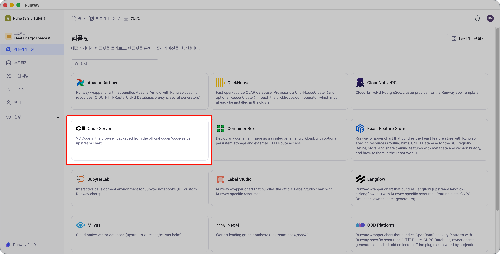
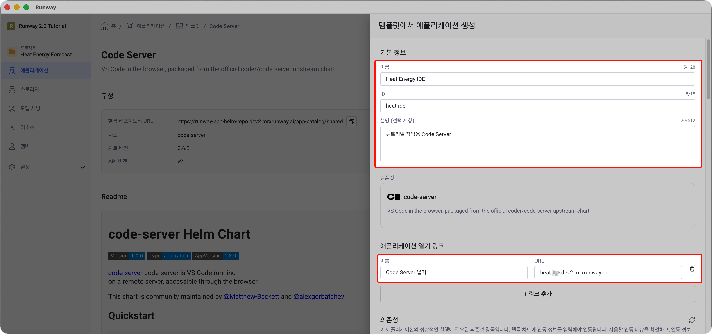
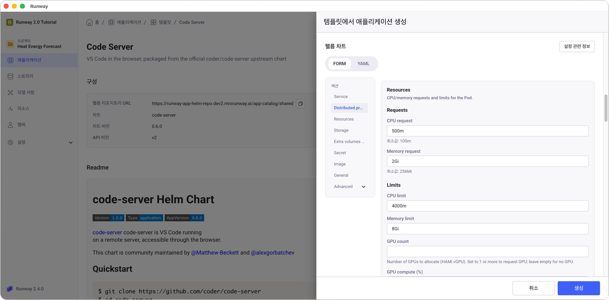
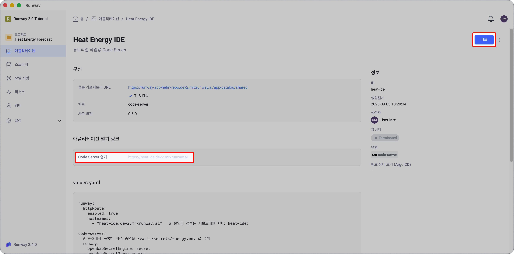
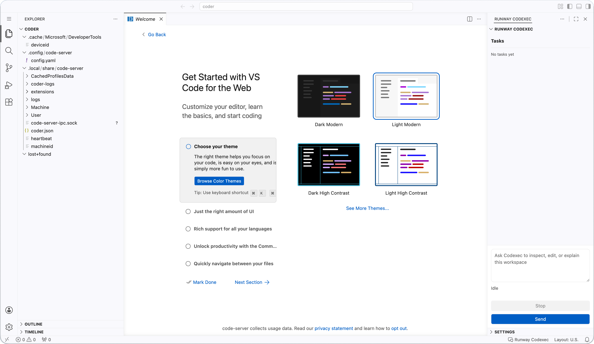

<!-- v2.2.0 에너지 수요 예측 MLOps 튜토리얼 신규 추가 | 2026-06-16 -->
<!-- v2.3.0 RWP-1756 워크스페이스 "카탈로그" 메뉴 삭제에 따라 진입 경로 갱신 | 2026-07-28 -->

# 1-2. Code Server 배포 {#code-server}

브라우저에서 VS Code처럼 사용할 수 있는 개발 환경을 배포합니다. 0단계에서 등록한 자격 증명이 자동으로 주입되고, 1-1에서 만든 공유 볼륨이 연결되도록 설정합니다.

<!-- v2.4.0 버튼 레이블 정정 — 실제 화면은 「애플리케이션 생성」이다(dev2 확인) | 2026-09-02 -->
> 본인 프로젝트 > **애플리케이션** > **앱 템플릿 보기** > **Code Server** > **애플리케이션 생성** 버튼 클릭



---

## :material-form-textbox: 1. 기본 정보 {#basic}

| 항목 | 값 |
|------|----|
| **이름** | 본인이 정하는 이름 (예: `Heat Demand IDE`) |
| **ID** | 본인이 정하는 ID (예: `heat-ide`) |

<!-- v2.4.0 애플리케이션 열기 링크 단계 추가 — 생성 시에만 입력할 수 있어, 빠뜨리면 앱 목록에 「열기」 버튼이 생기지 않는다 | 2026-09-03 -->
**애플리케이션 열기 링크** 섹션에서 **+ 링크 추가**를 클릭하고 아래를 입력합니다.



| 항목 | 값 |
|------|----|
| **이름** | `Code Server 열기` |
| **URL** | `<your-ide-hostname>.<your-runway-domain>` |

---

<!-- v2.4.0 RWP-1805 폼 중심으로 재작성 — 차트의 OpenBao 폼 필드(openbaoSecretEngine/Name)와 s3-rw envFrom을 쓰도록 바꿨다. 손으로 쓰던 Vault 템플릿 8줄이 폼 항목 2개로 줄었다. values.yaml 전문은 접이식으로 유지 | 2026-09-01 -->
## :material-tune: 2. 헬름 차트 설정 {#chart}

**헬름 차트** 영역은 기본으로 **FORM** 탭이 열려 있습니다. 항목 이름은 영문 그대로 표시됩니다.

<!-- v2.4.0 폼 실측 반영 — 화면 순서로 정렬, 목록형 항목의 「추가」와 Existing claim 두 곳 구분을 표 안으로 흡수(노트 4개 삭제) | 2026-09-02 -->



| 그룹 | 항목 | 넣을 값 |
|------|------|--------|
| **External access (HTTPRoute)** | Enable external access | 토글 켜기 |
| | Hostname list | **추가** 클릭 → `<your-ide-hostname>.<your-runway-domain>` |
| **Resources** | CPU request / Memory request | `500m` / `2Gi` |
| | CPU limit / Memory limit | `4000m` / `8Gi` |
| **Storage** | Volume size | `5Gi` |
| | Access mode | `ReadWriteOnce` (기본값 유지) |
| | Existing claim | **비워 두기** — 값을 넣으면 `/home/coder`가 그 볼륨으로 대체됨 |
| **Extra volumes (PVCs)** | — | **추가** 클릭 → `Item 1` 생성 |
| | Name / Mount path | `data-fs` / `/mnt/data` |
| | Existing claim | 1-1에서 만든 볼륨 ID (`<your-pvc-name>`) |
| **Secret** | OpenBao secret engine | `secret` |
| | OpenBao secret name | `energy` |
| **Advanced > Env From** | — | **추가** 클릭 → `Item 1` 생성 |
| | Secret ref | `{ "name": "s3-rw" }` |

교체할 값은 세 개입니다.

| 자리 | 값 |
|------|----|
| `<your-ide-hostname>` | 본인 이니셜을 붙여 짓는 IDE 서브도메인 (예: `<your-initials>-heat-ide`) |
| `<your-runway-domain>` | Runway 플랫폼 도메인 |
| `<your-pvc-name>` | 1-1에서 만든 볼륨 ID |

<!-- v2.4.0 values.yaml 블록 정정 — 차트가 금지한 seed-vscode-settings init container 제거(이미지 entrypoint가 대신하며, root 소유로 남아 pip --user·uv가 깨진다), persistence.annotations → keepOnDelete, 자리표시자 횟수 4회→1회 | 2026-09-02 -->
??? note "values.yaml 전문으로 한 번에 붙여넣기"

    폼을 하나씩 채우는 대신 **YAML** 탭에서 아래를 통째로 붙여도 됩니다.

    ⚠️ **폼과 YAML을 섞어 쓰지 마세요.** 한 앱을 만들면서 두 탭을 오가면 입력한 값을 놓치기 쉽습니다. 위 폼으로 채웠다면 이 YAML은 쓰지 않습니다.

    1. 아래 YAML 블록을 복사합니다.
    2. **YAML** 탭에서 기존 내용을 모두 선택해 지우고(<kbd>Cmd/Ctrl</kbd> + <kbd>A</kbd>) 붙여넣습니다. 미리 채워진 내용은 차트 기본값이라 지워도 배포에는 그대로 적용됩니다.
    3. `<your-ide-hostname>`과 `<your-runway-domain>`을 본인 값으로 바꿉니다. 각각 한 번씩 나옵니다.
    4. `existingClaim`을 1-1에서 만든 볼륨 이름으로 맞춥니다.
    5. `<your-` 로 검색해 남은 자리표시자가 없는지 확인하고, 아래 **Problems** 영역에 오류가 없는지 봅니다.

    ```yaml
    runway:
      httpRoute:
        enabled: true
        hostnames:
          - "<your-ide-hostname>.<your-runway-domain>"

    code-server:
      # 0-2에서 등록한 자격 증명을 /vault/secrets/energy.env 로 주입
      runway:
        openbaoSecretEngine: secret
        openbaoSecretName: energy

      # 프로젝트에 자동 제공되는 S3 자격 증명
      envFrom:
        - secretRef:
            name: s3-rw

      resources:
        requests:
          cpu: 500m
          memory: 2Gi
        limits:
          cpu: 4000m
          memory: 8Gi

      persistence:
        enabled: true
        accessMode: ReadWriteOnce
        size: 5Gi
        keepOnDelete: true          # 앱을 지워도 작업 데이터를 남깁니다(기본값)

      extraPVCs:
        - name: data-fs             # "data"는 홈 볼륨이 쓰는 예약 이름이라 사용 불가
          mountPath: /mnt/data
          existingClaim: <your-pvc-name>  # 1-1에서 만든 볼륨 ID
          readOnly: false
    ```

**스토리지 구성 요약**

| 경로 | 스토리지 | 용도 |
|------|---------|------|
| `/home/coder` | **Storage** 항목이 자동 생성하는 볼륨 (5 GiB, RWO) | VS Code 설정·확장·Python 가상환경 |
| `/mnt/data` | 1-1에서 만든 공유 볼륨 (RWX) | 데이터셋·모델 <p> — Airflow 학습 Pod, 추론 Pod과 공유 |

<!-- v2.4.0 볼륨을 둘로 나누는 이유 추가 — 접근 모드가 다르다 | 2026-09-02 -->
볼륨을 둘로 나누는 것은 접근 모드가 다르기 때문입니다. `/mnt/data`는 Code Server와 학습·추론 Pod이 동시에 마운트하므로 RWX여야 하고, `/home/coder`는 Code Server만 쓰므로 RWO로 충분합니다.

---

## :material-rocket-launch: 3. 생성 및 배포 {#deploy}

1. **생성** 버튼을 클릭하여 애플리케이션 설정을 저장합니다.

2. 애플리케이션 상세 화면에서 **배포** 버튼을 클릭합니다.

    

    Pod가 준비될 때까지 1~2분 기다립니다.

3. 브라우저에서 `https://<your-ide-hostname>.<your-runway-domain>`에 접속합니다.

    

---

:octicons-arrow-right-24: 다음 단계: **[1-3. 자격 증명·볼륨(PVC) 확인](03-verify.md)**
