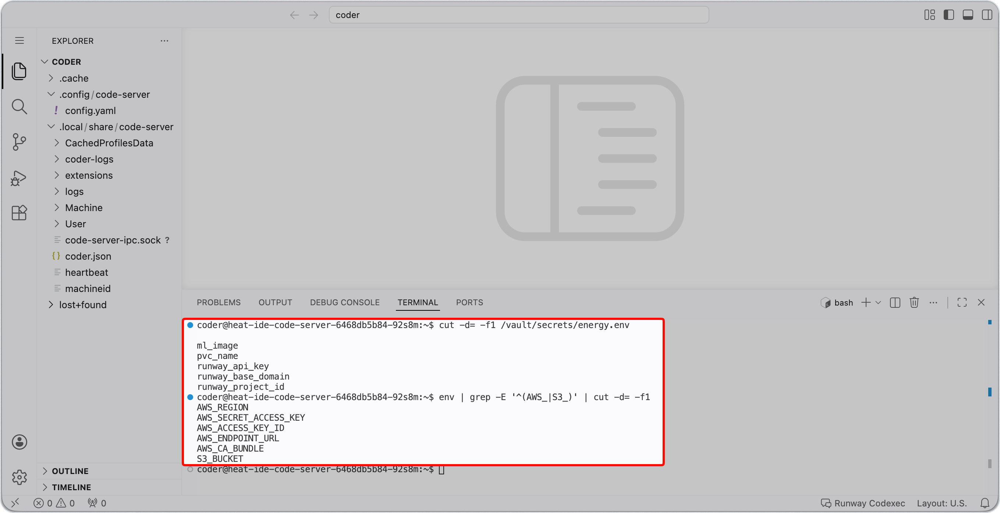
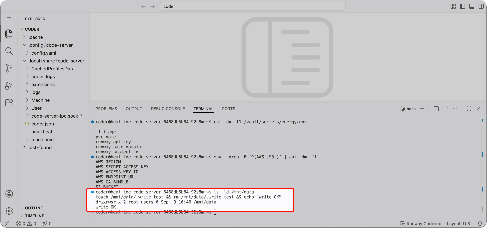

<!-- v2.2.0 에너지 수요 예측 MLOps 튜토리얼 신규 추가 | 2026-06-16 -->

# 1-3. 자격 증명·볼륨(PVC) 확인 {#verify}

0단계에서 등록한 자격 증명이 Code Server에 정상 주입됐는지, 1-1에서 만든 공유 볼륨이 정상 연결됐는지 확인합니다.

<!-- v2.4.0 RWP-1805 평문 조회 제거 — cat/env를 그대로 실행하면 비밀 키가 화면에 그대로 뜬다. 이름만 확인하도록 바꿨다. 파일명도 creds.env → energy.env(폼의 OpenBao secret name 기준), source 불필요 | 2026-09-01 -->
## A. 자격 증명 확인 {#secret}

Code Server 안에서 좌측 상단 **≡ → Terminal → New Terminal**을 클릭해 터미널을 엽니다. 자격 증명은 두 곳에서 들어오므로 각각 확인합니다.

**① OpenBao에서 주입된 값**

0-2에서 등록한 값이 `/vault/secrets/energy.env` 파일로 들어옵니다.

```bash title="주입된 항목 확인 - Code Server 터미널"
cut -d= -f1 /vault/secrets/energy.env
```

기대 출력:

```
ml_image
pvc_name
runway_api_key
runway_base_domain
runway_project_id
```

**② 프로젝트 자격 증명(`s3-rw`)에서 들어온 값**

배포할 때 **Env From**으로 연결한 Secret이 환경 변수로 들어옵니다.

```bash title="S3 환경 변수 확인 - Code Server 터미널"
env | grep -E '^(AWS_|S3_)' | cut -d= -f1
```

기대 출력:

```
AWS_ACCESS_KEY_ID
AWS_SECRET_ACCESS_KEY
AWS_ENDPOINT_URL
AWS_REGION
S3_BUCKET
```

①에 5개, ②에 5개가 모두 표시되면 정상입니다.



---

## B. 공유 볼륨(PVC) 마운트 확인 {#pvc}

**`/mnt/data`가 마운트되어 있고 쓰기 가능한지 확인**

```bash title="볼륨 마운트 및 쓰기 확인 - Code Server 터미널"
ls -ld /mnt/data
touch /mnt/data/.write_test && rm /mnt/data/.write_test && echo "write OK"
```

**이후 단계에서 사용할 디렉토리 생성**

```bash title="데이터 디렉토리 생성 - Code Server 터미널"
mkdir -p /mnt/data/dataset
```

`write OK`가 출력되고 `dataset/` 디렉토리가 생성되면 볼륨 마운트가 정상입니다.



---

:octicons-arrow-right-24: 다음 단계: **[2단계. 코드와 데이터 준비](../02-code-data/index.md)**
