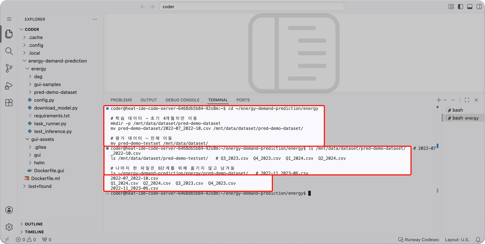

<!-- v2.2.0 에너지 수요 예측 MLOps 튜토리얼 신규 추가 | 2026-06-16 -->

# 2-2. 학습 데이터 배치 {#dataset}

Airflow DAG의 학습 Pod는 Code Server와 **같은 스토리지 볼륨(PVC)**(`/mnt/data/`)을 마운트해서 데이터를 읽습니다.  
Code Server에서 PVC에 파일을 넣어두면 학습 Pod가 별도 전송 없이 그대로 사용할 수 있습니다.

<!-- v2.4.0 학습 데이터를 분기별에서 수집 기간별로 재구성 | 2026-09-02 -->
데이터 파일은 **파일명이 담고 있는 기간**만큼의 열수요 실적입니다. 열수요는 1년을 주기로 같은 흐름이 반복되므로, 학습 데이터가 한 주기를 덮는지가 예측 정확도를 좌우합니다.

| 파일 | 기간 | 용도 |
|------|------|------|
| `2022-07_2022-10.csv` | 2022년 7~10월 | 3단계 초기 학습 |
| `2022-11_2023-06.csv` | 2022년 11월~2023년 6월 | 6단계 재학습에서 추가 |

이 튜토리얼은 데이터가 쌓이는 과정을 그대로 따라갑니다.

| 단계 | PVC에 있는 학습 데이터 | 결과 |
|------|----------------------|------|
| 3단계 초기 학습 | 4개월치 | Version 1 모델. 겨울을 학습하지 못한 상태 |
| 6단계 재학습 | 1년치(한 주기 전체) | Version 2 모델 |

지금은 **`2022-07_2022-10.csv`만** PVC로 이동합니다. 나머지 한 파일은 6단계를 위해 남겨둡니다. 평가 데이터는 전체를 미리 이동합니다.

```bash title="데이터셋 PVC 이동 - Code Server 터미널"
cd ~/energy-demand-prediction/energy

# 학습 데이터 — 초기 4개월치만 이동
mkdir -p /mnt/data/dataset/pred-demo-dataset
mv pred-demo-dataset/2022-07_2022-10.csv /mnt/data/dataset/pred-demo-dataset/

# 평가 데이터 — 전체 이동
mv pred-demo-testset /mnt/data/dataset/
```

이동 결과를 확인합니다.

```bash title="데이터셋 배치 결과 확인 - Code Server 터미널"
ls /mnt/data/dataset/pred-demo-dataset/   # 2022-07_2022-10.csv
ls /mnt/data/dataset/pred-demo-testset/   # Q3_2023.csv  Q4_2023.csv  Q1_2024.csv  Q2_2024.csv

# 나머지 한 파일은 6단계를 위해 옮기지 않고 남겨둠
ls ~/energy-demand-prediction/energy/pred-demo-dataset/   # 2022-11_2023-06.csv
```

평가 데이터는 학습 구간보다 **뒤의 기간**(2023년 7월~2024년 6월)이므로, 모델이 학습에서 본 적 없는 데이터로 정확도를 잽니다.



---

:octicons-arrow-right-24: 다음 단계: **[2-3. Python 환경 구성](03-python-env.md)**
