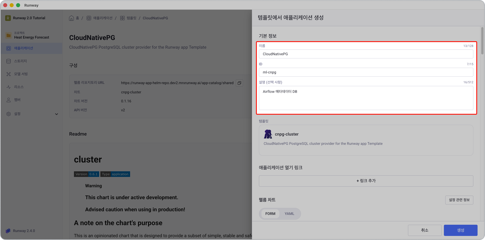
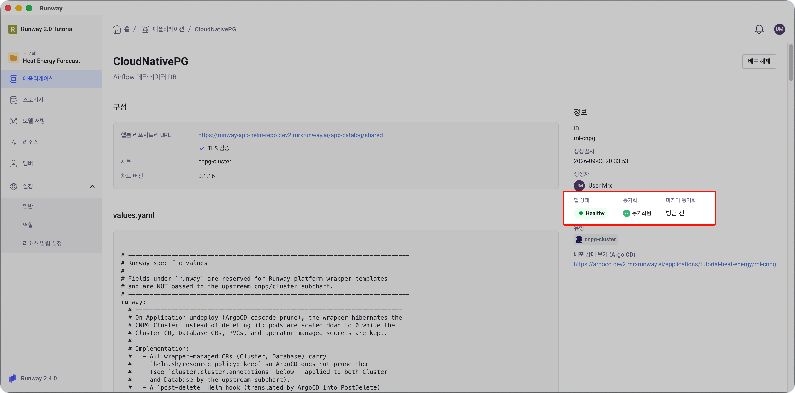
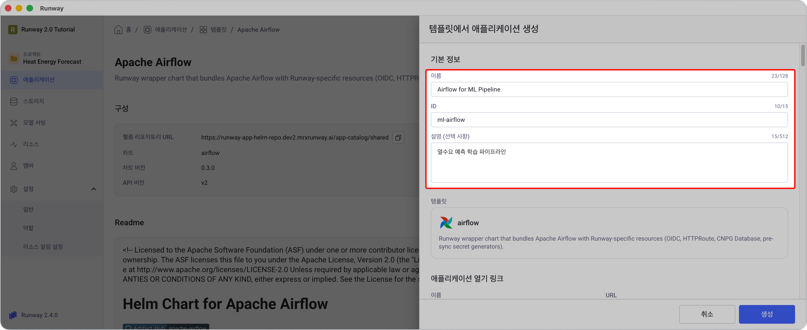
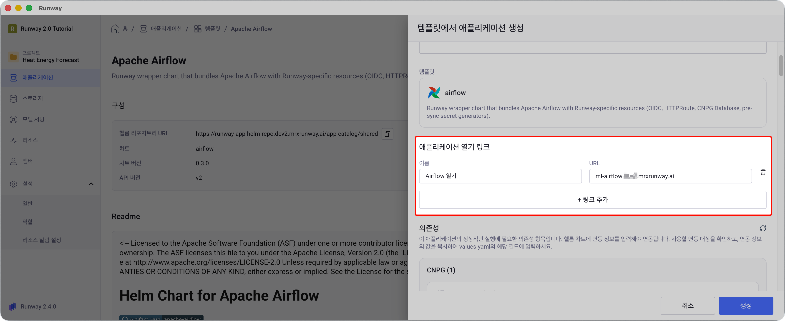
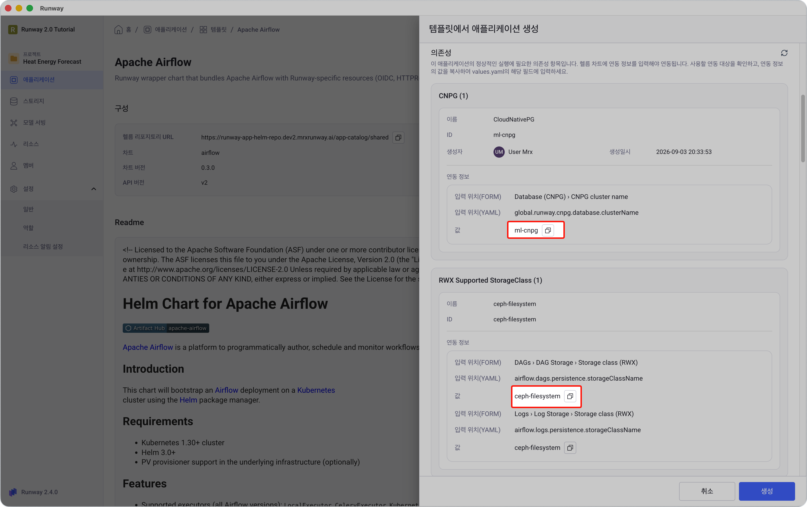
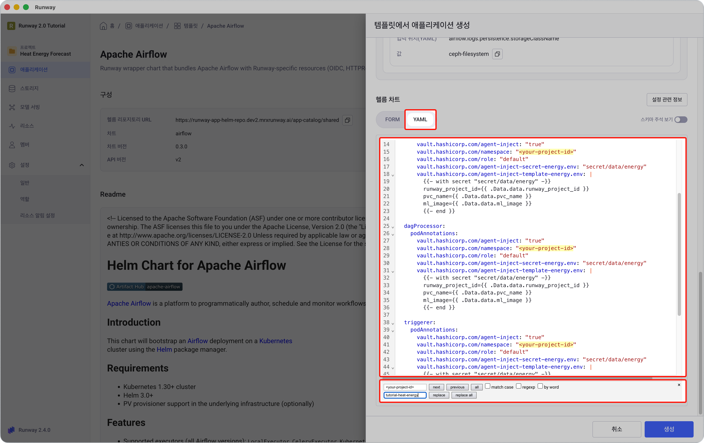
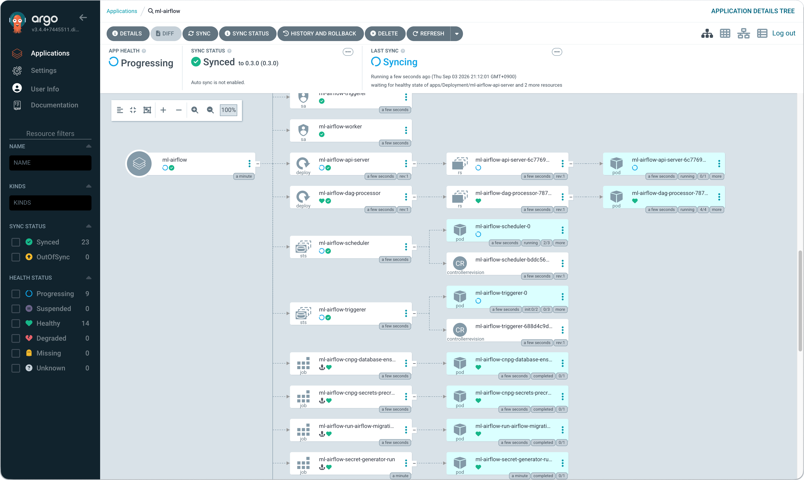
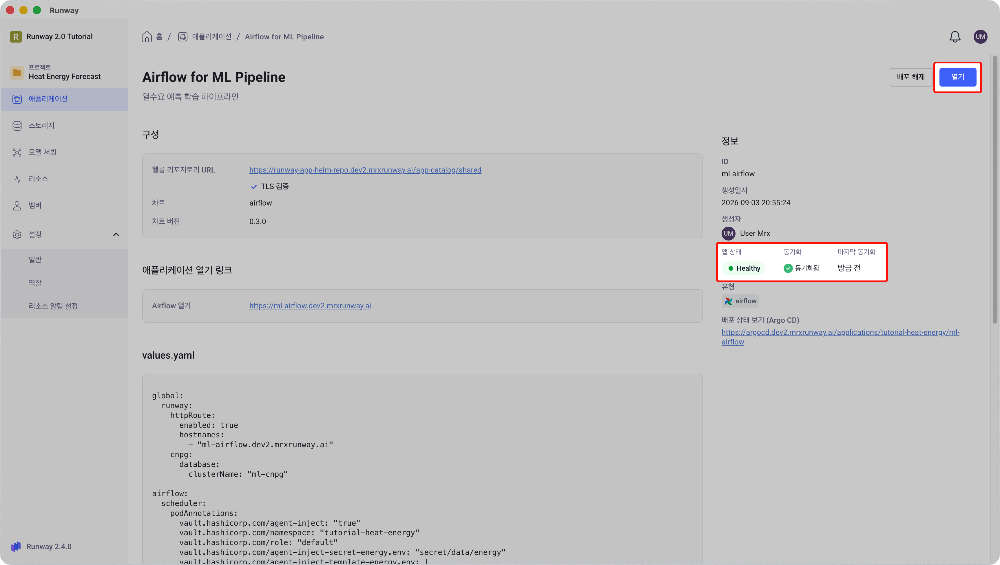
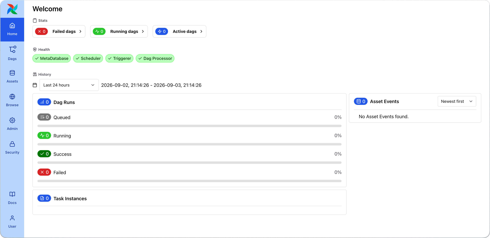

<!-- v2.2.0 에너지 수요 예측 MLOps 튜토리얼 신규 추가 | 2026-06-16 -->
<!-- v2.3.0 RWP-1756 워크스페이스 "카탈로그" 메뉴 삭제에 따라 진입 경로 갱신 | 2026-07-28 -->

# 3-1. CNPG 및 Airflow 배포 {#deploy}

학습 파이프라인을 실행할 Airflow를 배포합니다. Airflow는 내부적으로 PostgreSQL이 필요하므로, 먼저 **CloudNativePG(CNPG)**를 배포한 뒤 이를 의존성으로 연결합니다.

---

## A. CNPG 배포

<!-- v2.4.0 버튼 레이블 정정 — 실제 화면은 「애플리케이션 생성」이다(dev2 확인) | 2026-09-02 -->
> 본인 프로젝트 > **애플리케이션** > **앱 템플릿 보기** > **CloudNativePG** > **애플리케이션 생성**



1. 아래 표를 참고해 기본 정보를 입력합니다.

    | 항목 | 값 |
    |------|----|
    | **이름** | 본인이 정하는 이름 (예: `CloudNativePG`) |
    | **ID** | 본인이 정하는 ID (예: `ml-cnpg`) — 이후 `<your-cnpg-name>`으로 표기 |
    | **헬름차트(values.yaml)** | 수정 불필요 |

2. **생성**을 클릭합니다.

3. 애플리케이션 상세 화면에서 **배포** 버튼을 클릭합니다.

    - 배포 버튼을 클릭하고 1~2분 뒤 배포 상태가 **Healthy**로 바뀌면 다음 단계로 진행합니다.
    - 상태가 바뀌지 않으면 **배포 상태 보기** URL을 클릭해 상태를 확인합니다.
    
    

---

## B. Airflow 배포

<!-- v2.4.0 버튼 레이블 정정 — 실제 화면은 「애플리케이션 생성」이다(dev2 확인) | 2026-09-02 -->
> 본인 프로젝트 > **애플리케이션** > **앱 템플릿 보기** > **Apache Airflow** > **애플리케이션 생성**

1. 아래 표를 참고해 기본 정보를 입력합니다.

    <!-- v2.4.0 ID 예시가 15자 제한을 초과해 잘리고 입력 오류가 났다(dev2 확인). 15자 이내로 교체 -->

    | 항목 | 값 |
    |------|----|
    | **이름** | 본인이 정하는 이름 (예: `Airflow for ML Pipeline`) |
    | **ID** | 본인이 정하는 ID (예: `ml-airflow`) |

    

2. **애플리케이션 열기 링크** 섹션에서 아래 표를 참고해 입력합니다.

    | 항목 | 값 |
    |------|----|
    | **이름** | `Airflow 열기` |
    | **URL** | `<your-airflow-hostname>.<your-runway-domain>` |

    

3. 사이드패널 **의존성** 섹션에서 연동 정보를 확인합니다. 확인한 값은 복사 버튼을 활용해서 다음 단계 values.yaml에 입력합니다.

    **CNPG 의존성**

    | 연동 대상 | 확인할 연동 정보 |
    |-----------|----------------|
    | A단계에서 만든 `<your-cnpg-name>` | `global.runway.cnpg.database.clusterName` |

    **RWX StorageClass 의존성**

    | 확인할 연동 정보 |
    |----------------|
    | `airflow.dags.persistence.storageClassName`, `airflow.logs.persistence.storageClassName` |

    

    <!-- v2.2.1 OpenBao 기본 지원 대응 — role "default" 고정, OPENBAO_ROLE export 제거, 부록 A 참조 제거 | 2026-07-06 -->
    <!-- v2.2.1 Airflow storageClassName 확인 안내 추가 | 2026-07-06 -->
    <!-- v2.3.0 RWP-1293 폼/YAML 탭 UI 반영, YAML 탭 선택 안내 추가 | 2026-08-03 -->
    
4. **헬름 차트** 영역은 기본으로 **FORM** 탭이 열려 있습니다. **YAML** 탭을 선택한 뒤, 아래 **values.yaml 전문**을 붙여넣고 `<your-...>` 항목 4개를 본인 값으로 교체합니다.

    <!-- v2.4.0 RWP-1805 1-2는 폼, 여기는 YAML — 튜토리얼에서 두 입력 방식을 모두 경험하게 한다 | 2026-09-01 -->

    !!! info "이 단계는 YAML로 입력"
        Runway는 앱을 배포할 때 **FORM**과 **YAML** 두 가지 입력 방식을 제공합니다. 1-2에서는 폼으로 배포했고 이 단계는 YAML로 진행하므로, 튜토리얼을 마치면 두 방식을 모두 경험하게 됩니다.

        한 앱을 만들면서 두 탭을 오가면 입력한 값을 놓치기 쉽습니다. **이 단계는 처음부터 YAML 탭 하나로** 진행하세요.

    **입력 순서**

    1. 튜토리얼을 위해 미리 만들어둔 **values.yaml 전문**을 펼쳐 **복사**합니다. 코드 블록 오른쪽 위의 복사 버튼을 사용합니다.

        ??? note "values.yaml 전문"

            ```yaml
            global:
              runway:
                httpRoute:
                  enabled: true
                  hostnames:
                    - "<your-airflow-hostname>.<your-runway-domain>"
                cnpg:
                  database:
                    clusterName: "<your-cnpg-name>"

            airflow:
              scheduler:
                podAnnotations:
                  vault.hashicorp.com/agent-inject: "true"
                  vault.hashicorp.com/namespace: "<your-project-id>"
                  vault.hashicorp.com/role: "default"
                  vault.hashicorp.com/agent-inject-secret-energy.env: "secret/data/energy"
                  vault.hashicorp.com/agent-inject-template-energy.env: |
                    {{- with secret "secret/data/energy" -}}
                    runway_project_id={{ .Data.data.runway_project_id }}
                    pvc_name={{ .Data.data.pvc_name }}
                    ml_image={{ .Data.data.ml_image }}
                    {{- end }}

              dagProcessor:
                podAnnotations:
                  vault.hashicorp.com/agent-inject: "true"
                  vault.hashicorp.com/namespace: "<your-project-id>"
                  vault.hashicorp.com/role: "default"
                  vault.hashicorp.com/agent-inject-secret-energy.env: "secret/data/energy"
                  vault.hashicorp.com/agent-inject-template-energy.env: |
                    {{- with secret "secret/data/energy" -}}
                    runway_project_id={{ .Data.data.runway_project_id }}
                    pvc_name={{ .Data.data.pvc_name }}
                    ml_image={{ .Data.data.ml_image }}
                    {{- end }}

              triggerer:
                podAnnotations:
                  vault.hashicorp.com/agent-inject: "true"
                  vault.hashicorp.com/namespace: "<your-project-id>"
                  vault.hashicorp.com/role: "default"
                  vault.hashicorp.com/agent-inject-secret-energy.env: "secret/data/energy"
                  vault.hashicorp.com/agent-inject-template-energy.env: |
                    {{- with secret "secret/data/energy" -}}
                    runway_project_id={{ .Data.data.runway_project_id }}
                    pvc_name={{ .Data.data.pvc_name }}
                    ml_image={{ .Data.data.ml_image }}
                    {{- end }}

              dags:
                persistence:
                  storageClassName: "ceph-filesystem"   # step 3에서 확인한 RWX StorageClass 이름과 일치해야 합니다
                  size: 1Gi

              logs:
                persistence:
                  storageClassName: "ceph-filesystem"   # 위와 동일
                  size: 1Gi
            ```

    2. **YAML** 탭에서 기존 내용을 **모두 선택해 지우고**(<kbd>Cmd/Ctrl</kbd> + <kbd>A</kbd>) 붙여넣습니다.

    3. <kbd>Cmd/Ctrl</kbd> + <kbd>F</kbd>로 **찾아 바꾸기**를 열고, 자리표시자를 본인 값으로 바꿉니다. **`replace all`** 을 쓰면 한 번에 바뀝니다.

        같은 자리표시자가 여러 곳에 반복되므로 하나씩 눈으로 찾으면 빠뜨리기 쉽습니다.

        

        <!-- v2.4.0 자리표시자 횟수 표와 설명 표를 하나로 합침 — 같은 대상을 두 번 나열하고 있었다 -->

        | 자리표시자 | 넣을 값 | 나오는 횟수 |
        |-----------|--------|-----------|
        | `<your-project-id>` | 프로젝트 ID | 3회 |
        | `<your-airflow-hostname>` | 본인 이니셜을 붙여 짓는 Airflow 서브도메인 (예: `<your-initials>-ml-airflow`) | 1회 |
        | `<your-runway-domain>` | Runway 플랫폼 도메인 | 1회 |
        | `<your-cnpg-name>` | A단계에서 생성한 CNPG 이름 | 1회 |

    4. `<your-` 로 한 번 더 검색해 **남은 자리표시자가 없는지** 확인합니다.

        !!! warning "자리표시자 미교체 시 배포 실패"

            - `<your-...>` 형태의 자리표시자는 YAML 내 여러 위치에 반복 사용됩니다. 모든 위치를 빠짐없이 실제 값으로 교체하지 않으면 Airflow가 정상적으로 배포되지 않습니다.
            - 자리표시자 교체 방식은 튜토리얼을 위해 단순화한 것이므로, 실제 배포 시에는 자리표시자가 표시되지는 않습니다. Runway에서 제공하는 **FORM** 탭을 활용해 입력하는 것을 권장합니다.

    5. 편집기 아래 **Problems** 영역에 오류가 없는지 확인합니다.

        자리표시자를 바꾸지 않았거나 값이 비어 있으면 아래처럼 **줄 번호와 함께** 표시됩니다. 생성 전에 스스로 확인할 수 있습니다.

        ```
        194번째 줄 "global.runway.cnpg.database.clusterName" — 요구되는 형식에 맞게 입력하세요.
        699번째 줄 "airflow.dags.persistence.storageClassName" — 1자 이상 입력하세요.
        ```

    

5. **생성**을 클릭합니다.

6. 애플리케이션 상세 화면에서 **배포** 버튼을 클릭합니다.

    - 배포 후 3~5분 뒤 상태가 **Healthy**로 바뀌면 다음 단계로 진행합니다.

    !!! note "배포가 오래 걸리는 경우"
        **배포 상태 보기** 링크를 클릭하면 Argo CD에서 세부 배포 상태를 확인할 수 있습니다.

        

7. 오른쪽 상단 **열기** > **Airflow 열기**를 클릭해 Airflow 화면으로 연결되는지 확인합니다.

    

8. Airflow 로그인 화면에서 **Sign In with keycloak**을 클릭해 로그인합니다.

    

---

:octicons-arrow-right-24: 다음 단계: **[3-2. DAG 파일 등록](02-dag-push.md)**
