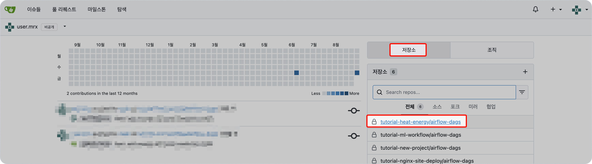
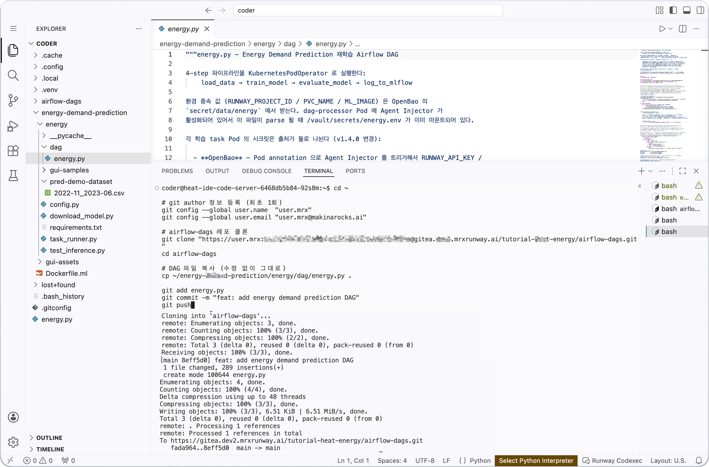
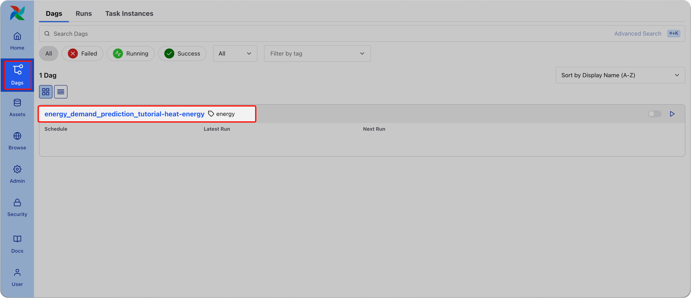
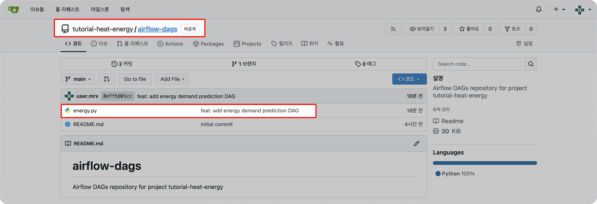

<!-- v2.2.0 에너지 수요 예측 MLOps 튜토리얼 신규 추가 | 2026-06-16 -->

# 3-2. DAG 파일 등록 {#dag-push}

`dag/energy.py` 파일을 Gitea 저장소에 push하면 Airflow가 에너지 수요 예측 학습 파이프라인을 실행하는 DAG를 자동으로 인식합니다.  

<!-- v2.4.0 RWP-1805 git-sync 동기화 주기 정정 30초→5초. 차트 기본값이며 dev2 실측 | 2026-09-01 -->

!!! note "Gitea 저장소의 airflow-dags 폴더"
     프로젝트 별로 Gitea에 저장소(레포)가 생성되고, airflow-dags 폴더(`<your-project-id>/airflow-dags`)가 자동으로 만들어지며, git-sync가 5초마다 airflow-dags 폴더의 변경 사항을 확인하고 Airflow에 반영합니다.

<!-- v2.4.0 Gitea 저장소 확인 단계 추가 — 프로젝트 생성보다 먼저 토큰을 발급하면 Gitea 접속 권한이 아직 붙지 않아 클론이 Repository not found 로 실패한다. 로그인하면 해소된다. dev2 실측 | 2026-09-03 -->

## Gitea 저장소 확인

터미널 작업에 앞서 저장소가 만들어졌는지 확인합니다.

1. `https://gitea.<your-runway-domain>`에 접속합니다.
2. **로그인** > **Sign in with keycloak**을 클릭하고 Runway 계정으로 로그인합니다.
3. 오른쪽 **저장소** 탭에 `<your-project-id>/airflow-dags` 저장소가 있는지 확인합니다.



---

## DAG 파일 push

`dag/energy.py`는 수정 없이 그대로 push합니다. 자격 증명과 환경 값은 OpenBao가 자동으로 주입합니다.

아래 명령에는 자리표시자가 있습니다. **터미널에 붙여넣기 전에 `<your-...>` 를 본인 값으로 바꿉니다.**  
0-1 단계 수행 시, 체크리스트에 적어 둔 값입니다.

<!-- v2.4.0 터미널 블록 자리표시자 안내 추가 — 앞 단계 터미널 명령에는 자리표시자가 거의 없어 그대로 붙여넣고 인증에 실패하는 경우가 있다 | 2026-09-03 -->

| 자리표시자 | 넣을 값 |
|-----------|--------|
| `<your-gitea-username>` | Gitea 사용자명 |
| `<your-gitea-email>` | 커밋 작성자로 쓸 이메일 (Gitea 계정 이메일 권장) |
| `<your-gitea-pat>` | Gitea 개인 액세스 토큰 |
| `<your-runway-domain>` | Runway 플랫폼 도메인 |
| `<your-project-id>` | 프로젝트 ID |

```bash title="DAG 파일 Gitea 등록 - Code Server 터미널"
cd ~

# git author 정보 등록 (최초 1회)
git config --global user.name  "<your-gitea-username>"
git config --global user.email "<your-gitea-email>"

# airflow-dags 레포 클론
git clone "https://<your-gitea-username>:<your-gitea-pat>@gitea.<your-runway-domain>/<your-project-id>/airflow-dags.git"
cd airflow-dags

# DAG 파일 복사 (수정 없이 그대로)
cp ~/energy-demand-prediction/energy/dag/energy.py .

git add energy.py
git commit -m "feat: add energy demand prediction DAG"
git push
```



---

## DAG 인식 확인

<!-- v2.4.0 RWP-1805 git-sync 동기화 주기 정정 30초→5초 | 2026-09-01 -->

Gitea에 push된 파일은 git-sync가 자동으로 Airflow에 동기화합니다. 약 5초 뒤 Airflow UI에서 DAG가 나타납니다.

1. `https://<your-airflow-hostname>.<your-runway-domain>`에 접속합니다.
2. 잠시 대기합니다 (git-sync 주기 5초).
3. DAG 목록에 `energy_demand_prediction_<your-project-id>`가 나타납니다.



!!! tip "DAG가 보이지 않는다면"

    Gitea 웹 UI에서 `airflow-dags` 레포의 `main` 브랜치에 `energy.py`가 있는지 확인합니다.  
    파일이 없으면 Code Server 터미널에서 push가 정상적으로 되었는지 확인합니다.

    - 접속 주소: `https://gitea.<your-runway-domain>/<your-project-id>/airflow-dags/`
    
    
---

:octicons-arrow-right-24: 다음 단계: **[3-3. DAG 실행 및 모니터링](03-dag-anatomy.md)**
