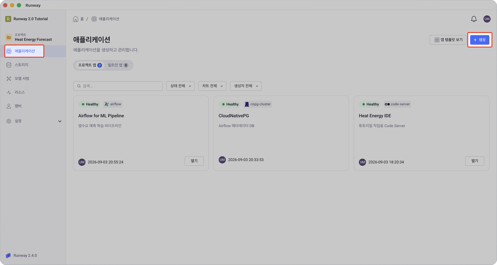
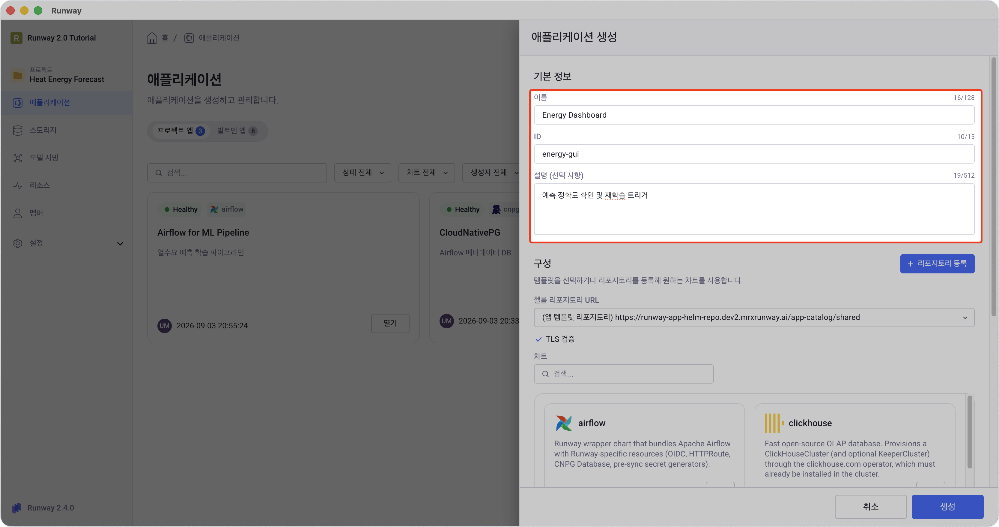
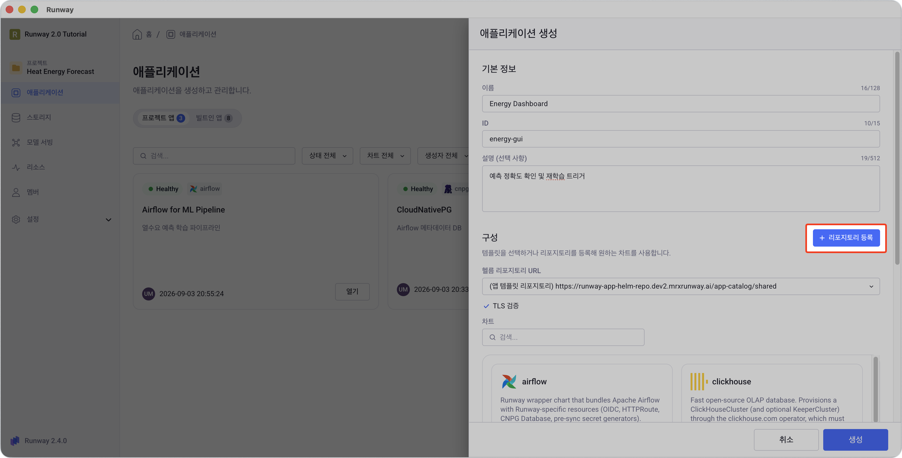
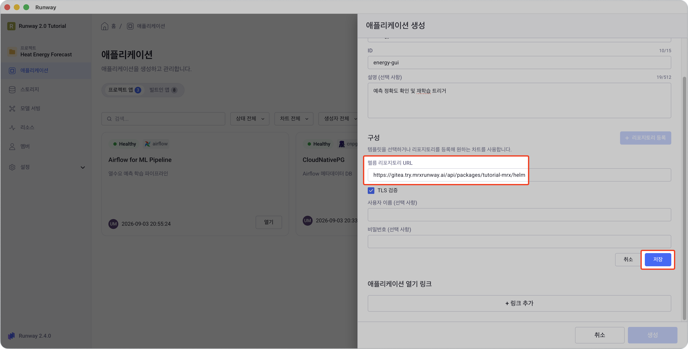
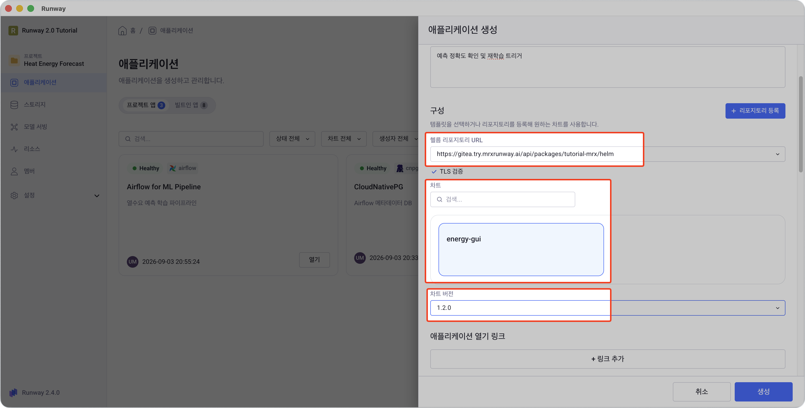
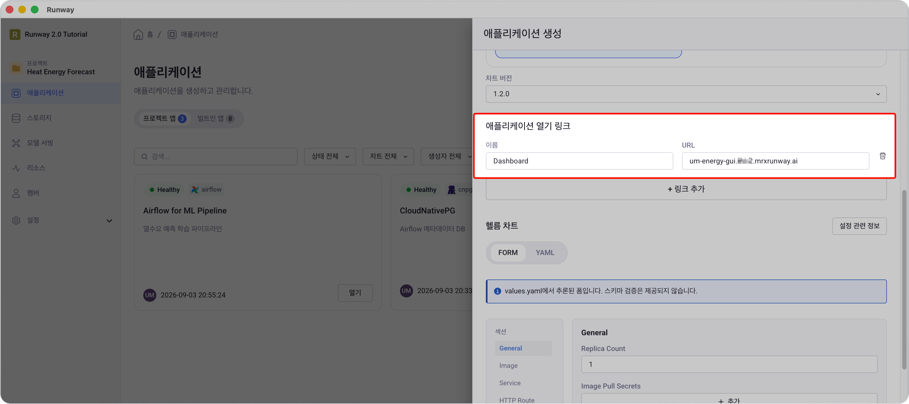
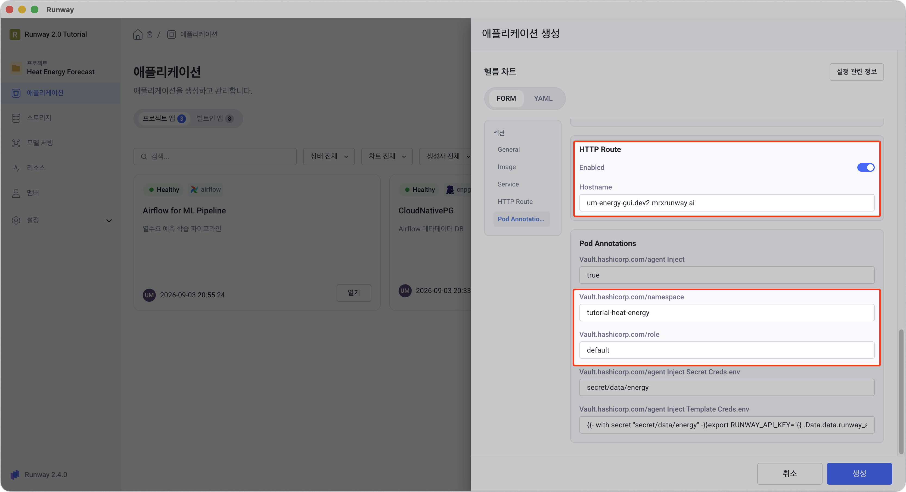

<!-- v2.2.0 에너지 수요 예측 MLOps 튜토리얼 신규 추가 | 2026-06-16 -->

# 5-1. 웹 대시보드 배포 {#deploy}

에너지 수요 예측 결과를 시각화하고 재학습을 트리거하는 웹 대시보드를 배포합니다.  
튜토리얼에서는 사전에 구성된 Helm 리포지토리를 등록하고 미리 푸시된 컨테이너 이미지를 사용합니다.

!!! note "GUI 이미지·Helm 차트 빌드하는 방법"
    튜토리얼에서는 준비되어 있는 이미지와 Helm 차트를 사용합니다. 직접 Helm 차트를 구성하고, 컨테이너 이미지를 본인 Gitea 레지스트리에 직접 빌드·푸시 해보고 싶다면 :octicons-arrow-right-24: [부록 A](../appendix/a-self-build.md)를 참고하세요.

> 본인 프로젝트 > **애플리케이션** > **생성**

1. **애플리케이션** 메뉴에서 오른쪽 상단 **생성** 버튼을 클릭합니다.

    

2. **기본 정보**를 입력합니다.

    <!-- v2.4.0 ID 예시가 15자 제한을 1자 초과했다. 15자 이내로 교체 -->

    - **이름**: 본인이 정하는 이름 (예: `Energy Dashboard`)
    - **ID**: 본인이 정하는 ID (예: `energy-gui`)
    - **설명** (선택): 본인이 정하는 설명 (예: `에너지 수요 예측 결과 시각화 및 재학습 트리거`)

    

3. **구성** 영역 오른쪽에 **+ 리포지토리 등록** 버튼을 클릭합니다.  

    

4. **헬름 리포지토리 URL**에 아래 주소를 입력하고, **저장** 버튼을 클릭합니다.

    ```
    https://gitea.try.mrxrunway.ai/api/packages/tutorial-mrx/helm
    ```

    

    <!-- v2.4.0 차트 1.2.0 — nginx 설정을 이미지에 포함하도록 재구성 | 2026-09-03 -->

5. **차트**와 **차트 버전**을 선택합니다. 선택하면 하단에 **헬름 차트(values.yaml)**가 표시됩니다.

    - **차트**: `energy-gui`
    - **차트 버전**: `1.2.0`

    


6. **애플리케이션 열기 링크**에서 대시보드 이름과 URL을 추가합니다.

    - **이름**: `Dashboard`
    - **URL**: 본인 이니셜을 붙여 짓는 호스트명 + 도메인 (예: `<your-initials>-energy-gui.<your-runway-domain>`)

    

    <!-- v2.3.0 RWP-1293 폼/YAML 탭 UI 반영 | 2026-08-03 -->
    <!-- v2.4.0 YAML 탭 편집에서 FORM 탭 입력으로 변경. 채울 값이 3개뿐이라 폼이 더 빠르고, YAML 전문을 붙여넣다 다른 키를 건드릴 위험이 없다 | 2026-09-03 -->
    <!-- v2.2.1 OpenBao 기본 지원 대응 — role "default" 고정 | 2026-07-06 -->

7. **헬름 차트** 섹션은 기본으로 **FORM** 탭이 열려 있습니다. 왼쪽 **섹션** 목록에서 아래 두 섹션을 차례로 선택해 값을 입력합니다.

    | 섹션 | 항목 | 넣을 값 |
    |------|------|--------|
    | **HTTP Route** | Hostname | `<your-gui-hostname>.<your-runway-domain>` |
    | **Pod Annotations** | Vault.hashicorp.com/namespace | `<your-project-id>` |
    | **Pod Annotations** | Vault.hashicorp.com/role | `default` |

    

8. **생성** 버튼을 클릭하고, 상세화면에서 **배포** 버튼을 클릭합니다.

    - 1~2분 뒤 애플리케이션 상태가 **Healthy**로 바뀌면 완료입니다.

---

:octicons-arrow-right-24: 다음 단계: **[5-2. 대시보드 접속 및 설정](02-setup.md)**
