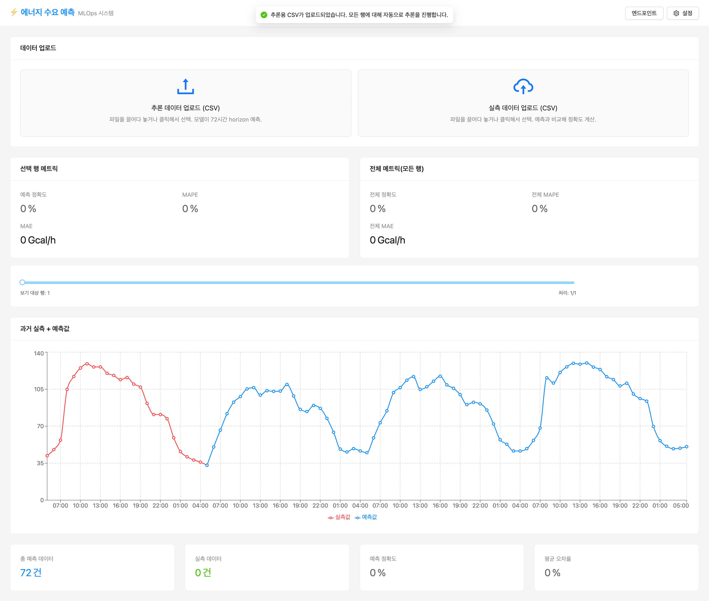
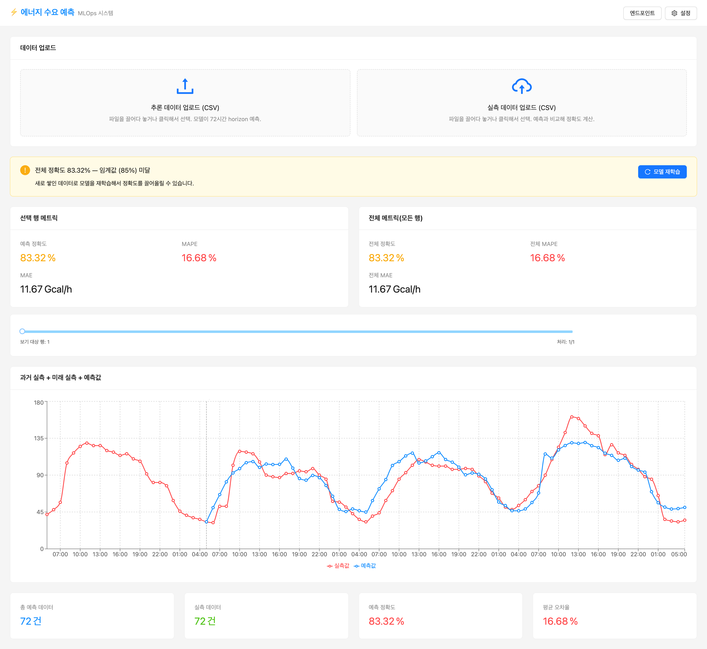
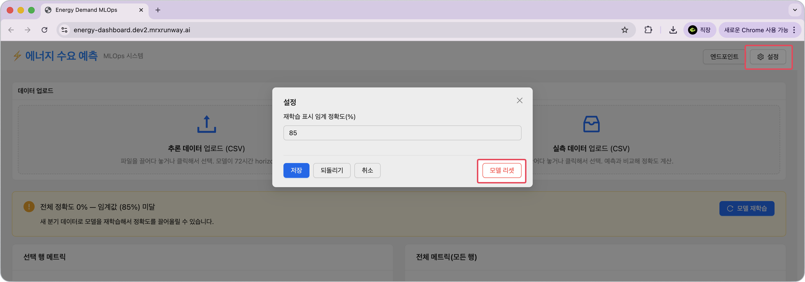
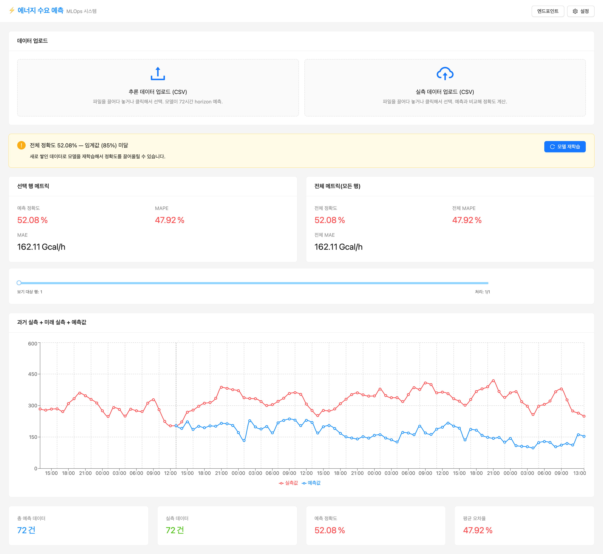
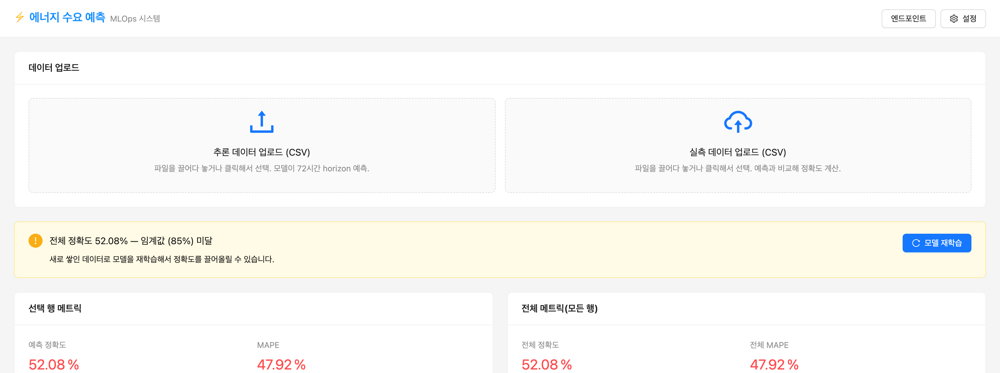

<!-- v2.2.0 에너지 수요 예측 MLOps 튜토리얼 신규 추가 | 2026-06-16 -->

# 5-3. 최초 모델 정확도 확인 {#test}

<!-- v2.4.0 분기별 테스트에서 계절별 테스트로 재구성 | 2026-09-02 -->
샘플 데이터를 업로드해 4개월치로만 학습된 Version 1 모델의 계절별 예측 정확도를 확인합니다.

샘플 CSV 파일은 아래 링크에서 다운로드하거나, 코드서버의 `~/energy-demand-prediction/energy/gui-samples/` 폴더에서 저장하여 사용할 수 있습니다.

[:octicons-download-16: gui-samples.zip 다운로드](https://github.com/makinarocks/runway-v2-tutorials/raw/main/tutorials/energy-demand-prediction-v2/energy/gui-samples/gui-samples.zip)

| 파일 | 내용 |
|------|------|
| `summer_x.csv` | 여름 구간 피처 (추론 데이터) |
| `summer_xy.csv` | 여름 구간 피처 + 실측 타겟 (정확도 비교용) |
| `winter_x.csv` | 겨울 구간 피처 (추론 데이터) |
| `winter_xy.csv` | 겨울 구간 피처 + 실측 타겟 (정확도 비교용) |

이 파일들은 다운로드하여 **로컬 PC에서** 브라우저로 직접 업로드합니다.

--- 

## 여름 테스트 (모델이 학습한 계절)

1. **추론 데이터 업로드** 영역에 `summer_x.csv`를 drag-drop합니다.

    -  nginx가 추론 엔드포인트로 요청을 전달하고 72시간 예측 차트가 표시됩니다.

     

2. **실측 데이터 업로드** 영역에 `summer_xy.csv`를 drag-drop합니다.

    -  차트에 실측 라인이 겹쳐 표시되고 **정확도 / MAPE / MAE** 메트릭이 계산됩니다.

     

     | 지표 | 설명 |
     |------|------|
     | **정확도** | `(1 - MAPE) × 100`으로 계산한 값입니다. 높을수록 예측이 실측에 가깝습니다. |
     | **MAPE** | 예측값과 실측값의 차이를 실측값 대비 비율로 나타낸 평균 오차입니다. 낮을수록 좋습니다. |
     | **MAE** | 예측값과 실측값의 절대 차이 평균입니다. 단위는 열수요 실적과 동일하며, 낮을수록 좋습니다. |

Version 1의 학습 구간(2022년 7~10월)에 여름이 들어 있어 예측이 실측을 잘 따라갑니다.

---

## 겨울 테스트 (모델이 학습하지 않은 계절)

1. 오른쪽 상단의 **설정** → **모델 리셋**을 클릭하고, 확인 창에서 **네**를 클릭해 여름 결과를 초기화합니다.

    

2. **추론 데이터 업로드**에 `winter_x.csv`, **실측 데이터 업로드**에 `winter_xy.csv`를 차례로 올립니다.

3. 결과: 예측 라인이 실측 아래에 깔리고 정확도가 크게 떨어집니다.

    

4. 정확도가 임계값(85%) 미만이므로 화면에 **모델 재학습** 배너가 표시됩니다. 6단계에서 이 배너로 재학습을 실행합니다.

    

    임계값은 오른쪽 상단의 **설정**에서 바꿀 수 있습니다.

<!-- v2.4.0 노트 재작성 — 학습 구간에 무엇이 없는지만 사실로 적었다 | 2026-09-03 -->

!!! info "겨울만 크게 빗나가는 이유"
    열수요는 기온에 반비례해서, 겨울 수요가 여름의 세 배를 넘습니다. Version 1의 학습 구간(2022년 7~10월)에는 **겨울의 에너지 수요 실측 값이 들어 있지 않습니다.** 그래서 예측 라인이 실측보다 아래에 깔립니다.

    6단계에서 나머지 8개월을 추가해 한 주기(1년)를 채운 뒤 재학습하고, 결과가 달라지는지 확인합니다.

---

:octicons-arrow-right-24: 다음 단계: **[6단계. 재학습 및 트래픽 전환](../06-retrain/index.md)**
