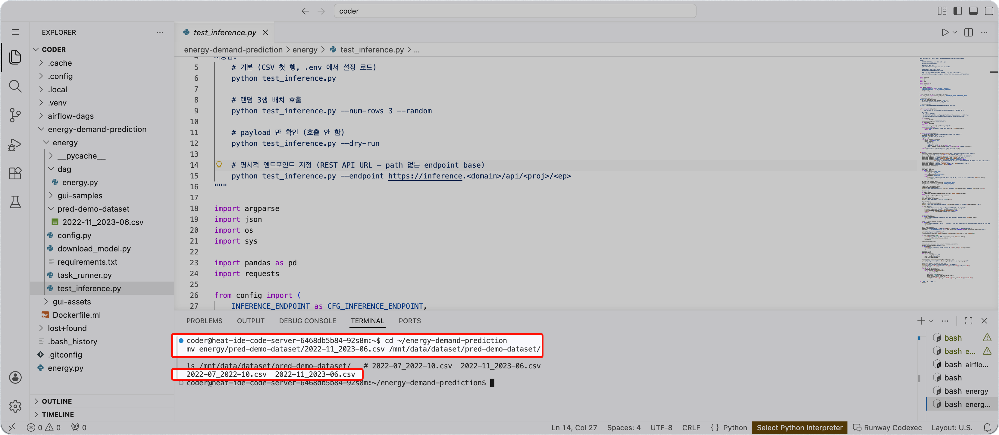

<!-- v2.2.0 에너지 수요 예측 MLOps 튜토리얼 신규 추가 | 2026-06-16 -->

# 6-1. 학습 데이터 추가 {#add-data}

<!-- v2.4.0 분기 추가에서 수집 기간 확장으로 재구성 | 2026-09-02 -->
Airflow는 파이프라인을 실행할 때 PVC의 모든 `*.csv`를 학습 데이터로 사용합니다. 2단계에서 남겨둔 파일을 PVC에 넣으면 학습 범위가 4개월에서 1년으로 늘어납니다.

```bash title="학습 데이터 추가 이동 - Code Server 터미널"
cd ~/energy-demand-prediction
mv energy/pred-demo-dataset/2022-11_2023-06.csv /mnt/data/dataset/pred-demo-dataset/

ls /mnt/data/dataset/pred-demo-dataset/   # 2022-07_2022-10.csv  2022-11_2023-06.csv
```

이제 학습 데이터가 2022년 7월부터 2023년 6월까지 이어져 **한 주기를 모두 덮습니다.** Version 1이 보지 못했던 겨울과 봄이 여기에 들어 있습니다.



---

:octicons-arrow-right-24: 다음 단계: **[6-2. 재학습 실행](02-trigger.md)**
