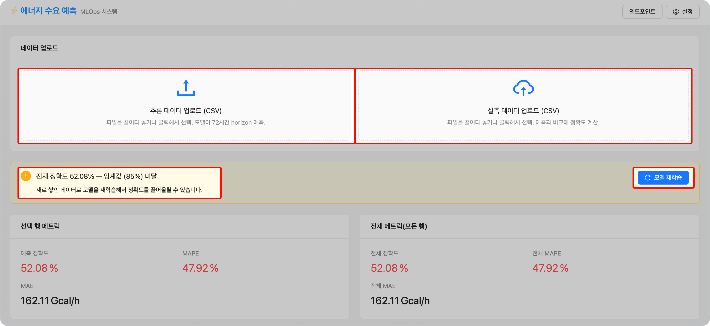
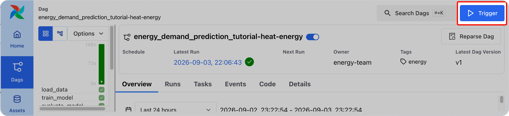

<!-- v2.2.0 에너지 수요 예측 MLOps 튜토리얼 신규 추가 | 2026-06-16 -->

# 6-2. 재학습 실행 {#trigger}

<!-- v2.4.0 「Q2·Q3 데이터」는 분기 단위 구성의 잔재다. 6-1에서 추가한 8개월 기준으로 정정 | 2026-09-03 -->
6-1에서 추가한 데이터까지 포함해 모델을 재학습합니다. 두 가지 방법 중 하나를 선택합니다.

<!-- v2.4.0 버튼 레이블을 화면 표기(「모델 재학습」)로 정정 | 2026-09-02 -->
## 방법 A — 웹 대시보드 재학습 버튼 (권장)

1. 웹 대시보드에서 5-3과 동일하게 겨울 샘플을 업로드합니다. **추론 데이터 업로드**에 `winter_x.csv`, **실측 데이터 업로드**에 `winter_xy.csv`를 차례로 올립니다.
2. 정확도가 임계값(85%) 미만이면 **모델 재학습** 버튼이 표시됩니다.
3. **모델 재학습** 버튼을 클릭합니다.

!!! note "무엇이 일어나나"
    버튼을 누르면 3단계에서 만든 Airflow가 실행되어, 방금 추가한 데이터까지 포함해 다시 학습합니다.

    학습 데이터가 늘어난 만큼 **5~10분 정도 걸립니다.** 진행 상황은 Airflow(`<your-airflow-hostname>.<your-runway-domain>`)에서 볼 수 있습니다.

---

## 방법 B — Airflow UI 직접 트리거

Airflow DAG는 `/mnt/data/dataset/pred-demo-dataset/`의 모든 `*.csv`를 자동으로 학습합니다. **데이터 파일을 추가하는 것이 곧 학습 범위를 늘리는 것**입니다.

> Airflow UI → `<your-airflow-hostname>.<your-runway-domain>` → 우측 상단 **▶ Trigger**

- 재학습은 초기 학습보다 데이터량이 많아 **5~10분 정도 소요**될 수 있습니다.

---

:octicons-arrow-right-24: 다음 단계: **[6-3. Version 2 학습 결과 확인](03-monitor.md)**
