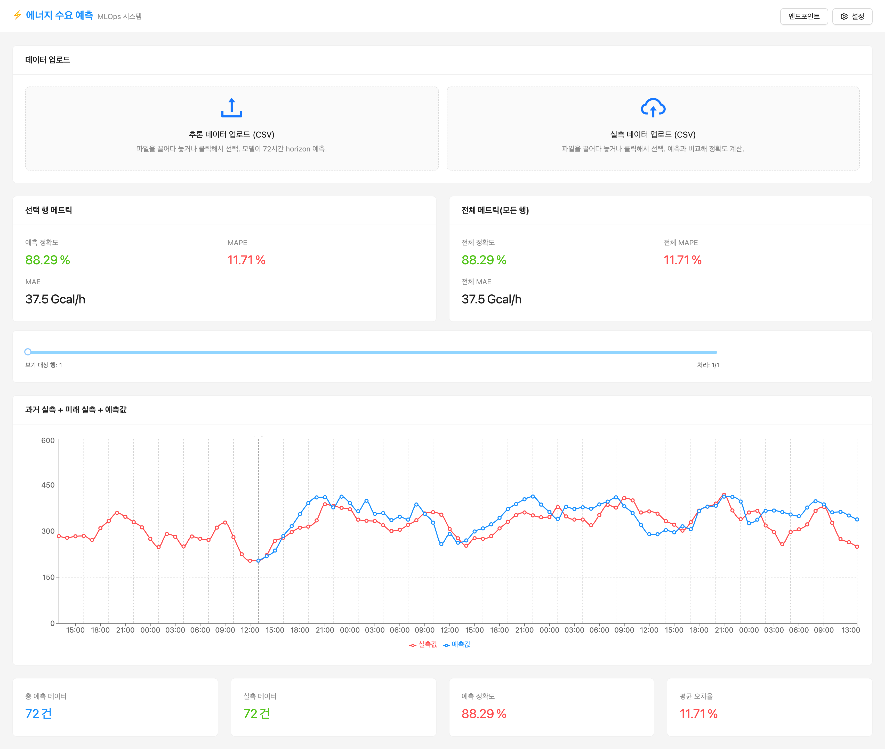
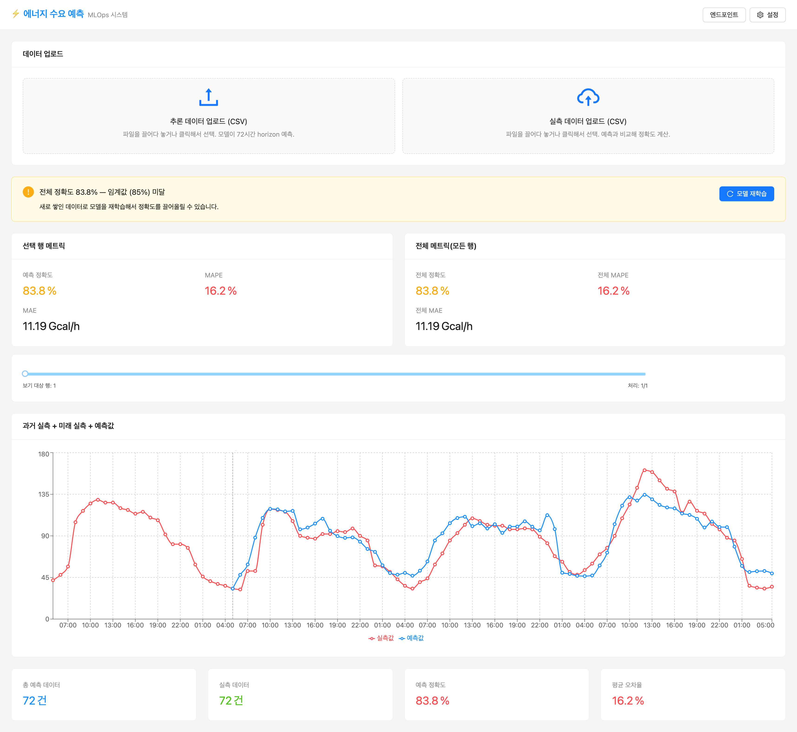

<!-- v2.2.0 에너지 수요 예측 MLOps 튜토리얼 신규 추가 | 2026-06-16 -->

# 6-5. Version 1 vs Version 2 비교 {#compare}

<!-- v2.4.0 계절별 비교로 재구성 | 2026-09-02 -->
웹 대시보드에서 Version 1과 Version 2 모델의 계절별 예측 정확도를 비교합니다.

## 재학습 후 결과 확인
웹 대시보드 새로고침 → 설정 → **모델 리셋** 후 [5-3단계](../05-gui/03-verify.md)와 동일한 방법으로 두 계절을 테스트합니다.

| 테스트 | 기대 결과 |
|--------|----------|
| 겨울 (`winter_x.csv`와 `winter_xy.csv`) | Version 1 대비 **크게 개선** — 학습 범위에 겨울이 들어옴 |
| 여름 (`summer_x.csv`와 `summer_xy.csv`) | 큰 변화 없음 — Version 1도 이미 학습한 계절 |

## 계절별 재학습 전과 후 비교

**겨울 — Version 1 및 Version 2 결과 비교**

재학습 전 (Version 1)

재학습 후 (Version 2)

**여름 — Version 1 및 Version 2 결과 비교**

재학습 전 (Version 1)

재학습 후 (Version 2)

<!-- v2.4.0 노트 재작성 — 두 버전의 학습 구간 차이만 사실로 적고, 제목을 명사형으로 | 2026-09-03 -->

!!! info "여름 정확도가 그대로인 이유"
    여름 구간은 Version 1의 학습 데이터(2022년 7~10월)에 이미 들어 있었습니다. Version 2에서 새로 추가된 구간은 2022년 11월~2023년 6월, 겨울과 봄입니다.

    두 버전의 학습 데이터가 여름 구간에서는 같고 겨울 구간에서만 다르므로, 정확도 차이도 겨울에서만 나타납니다.

!!! note "문제 해결"
    트래픽이 Version 2로 전달되는지 의심된다면 아래 항목을 확인합니다.

    - 추론 엔드포인트 상세의 트래픽 분배에서 Version 2가 100%인지 확인합니다.
    - Version 2 배포 카드의 모델 경로가 새 `m-<your-model-id>`와 일치하는지 확인합니다.
    - 웹 대시보드 엔드포인트 modal의 URL이 REST API URL(path 없는 base) 형태인지 재확인합니다.

---

## 튜토리얼 완료 {#done}

여기까지 완료했다면 Runway 위에서 end-to-end ML 워크플로우를 처음부터 끝까지 경험한 것입니다.

**이 튜토리얼에서 경험한 것:**

<!-- v2.3.0 RWP-1756 카탈로그 앱→앱 템플릿 용어 변경 반영 | 2026-07-28 -->
- OpenBao Agent Injector를 사용한 자격 증명 관리 — 코드에 하드코딩 없이 모든 Pod이 자동으로 자격 증명을 받아가는 패턴
- Runway 앱 템플릿(Code Server, CNPG, Airflow)을 values.yaml로 배포하고 의존성을 구성하는 방법
- Airflow DAG + KubernetesPodOperator를 사용한 ML 학습 파이프라인 자동화
- MLflow Model Registry를 통한 모델 버전 관리
- Runway 추론 엔드포인트에서의 트래픽 비중 기반 A/B 배포
- React + nginx 기반 커스텀 앱 배포 (외부 Helm 차트)
- 데이터 추가 → 재학습 → 트래픽 전환의 반복 가능한 MLOps 사이클

