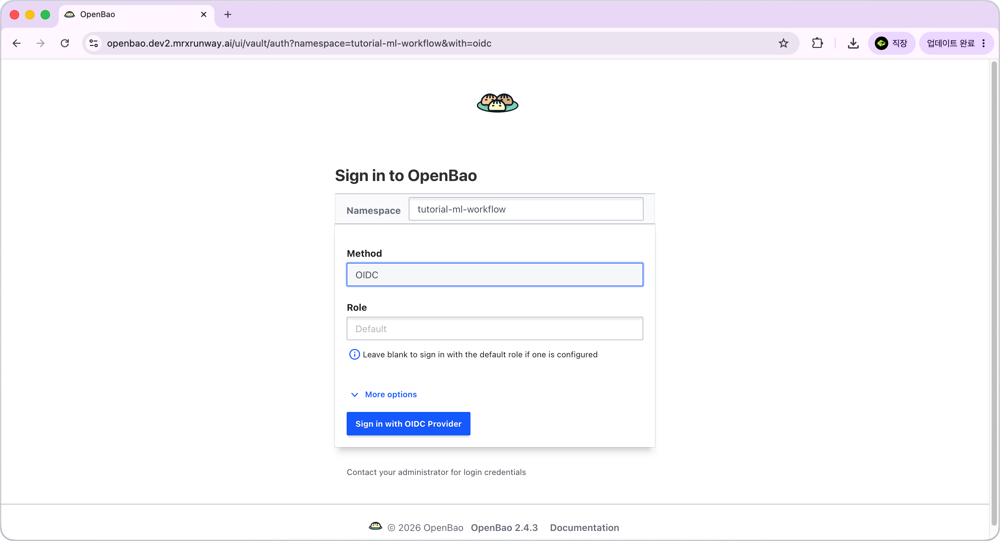
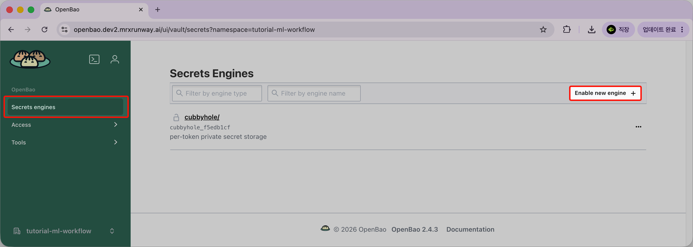
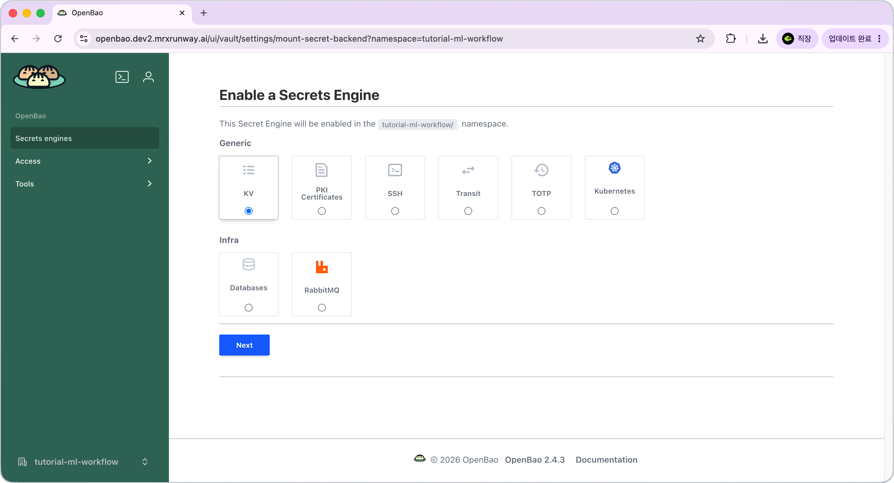
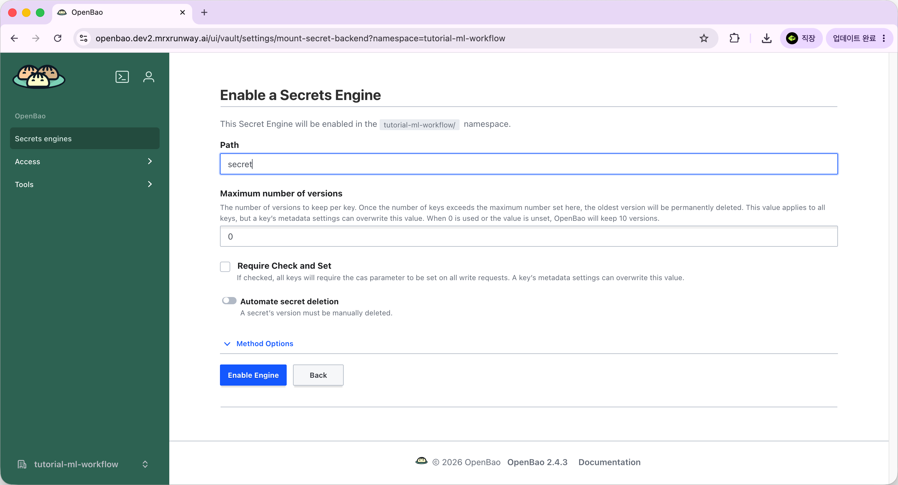
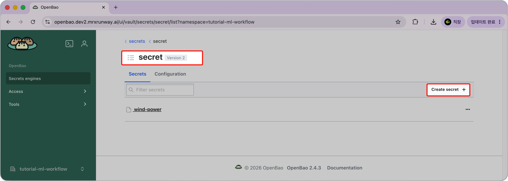
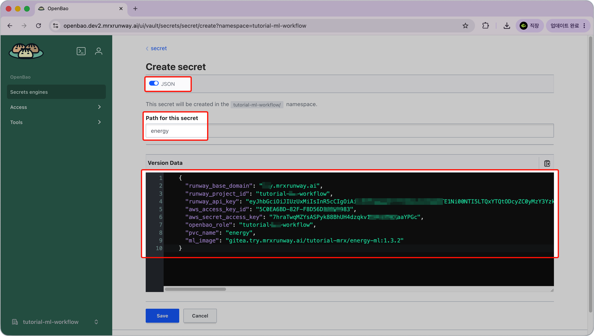
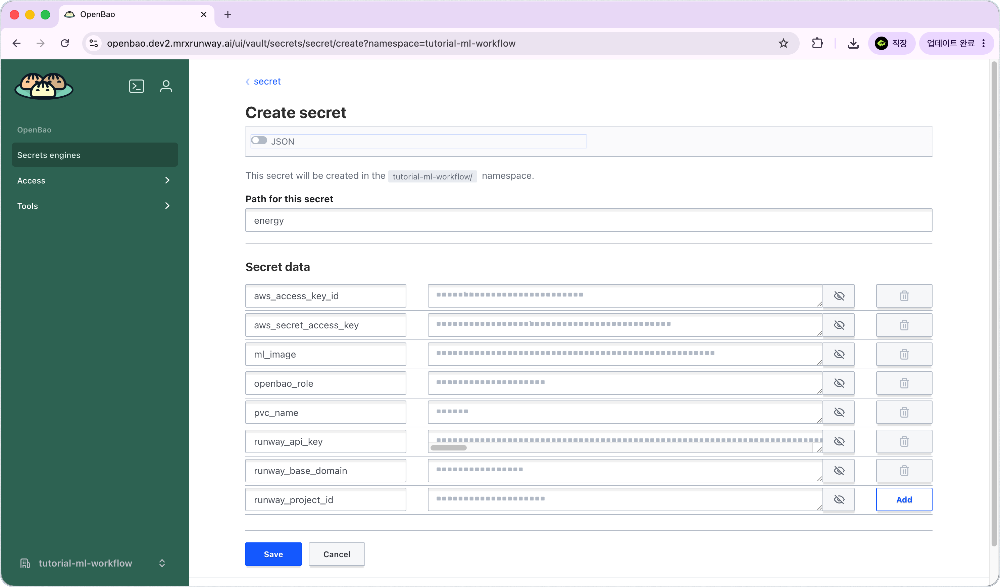
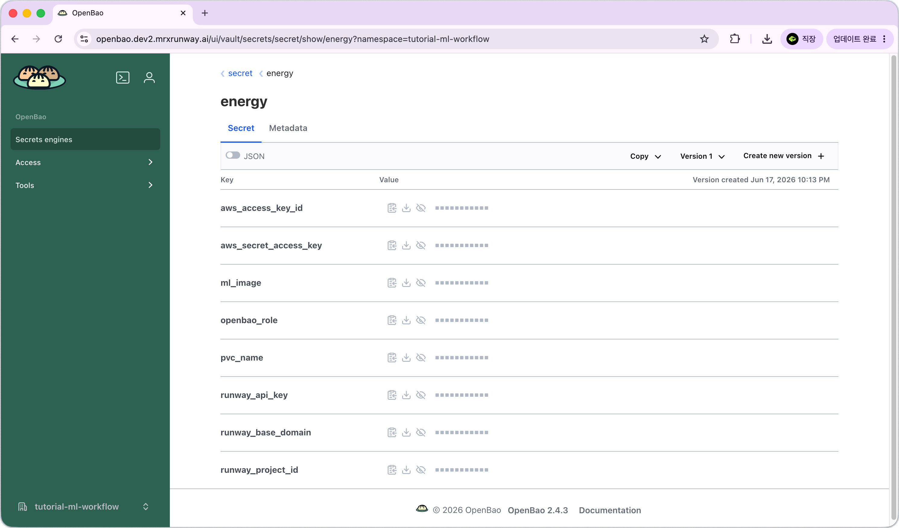

<!-- v2.2.0 에너지 수요 예측 MLOps 튜토리얼 신규 추가 | 2026-06-16 -->

# 0-2. OpenBao 시크릿 등록 {#register}

이전 단계에서 채운 JSON을 OpenBao에 등록합니다.  
OpenBao는 Kubernetes 기반 시크릿 관리 솔루션으로, 이후 단계에서 필요한 키와 환경 정보를 안전하게 저장하고 Pod에 주입하는 역할을 합니다. 
등록이 완료되면 이후 모든 Pod(Code Server, Airflow, GUI)이 시작될 때 필요한 값을 자동으로 주입받습니다.

!!! note "0-1 단계에서 값 채우기를 아직 완료하지 않았다면"
    [0-1. 환경 정보 및 인증 키 발급](01-keys.md#template)으로 돌아가 JSON 템플릿을 먼저 채워두세요.

??? note "OpenBao를 사용하는 이유"
    접속 정보나 API 키를 코드에 직접 넣으면 Git에 노출될 위험이 있고, 값이 바뀔 때마다 코드·설정 파일을 수정하고 재배포해야 합니다. OpenBao는 이 문제를 해결합니다.

    - **중앙 관리**: 키와 환경 정보를 암호화된 저장소 한 곳에서 관리합니다.
    - **변경 용이**: 값이 바뀌면 OpenBao만 수정하면 되고, DAG 파일이나 코드는 그대로입니다.
    - **최소 노출**: Pod이 시작될 때 해당 Pod에 필요한 값만 선택적으로 주입합니다.

---

## A. OpenBao 로그인

1. `https://openbao.<your-runway-domain>`에 접속합니다.

2. 로그인 화면에서 아래와 같이 설정합니다.

    | 항목 | 값 |
    |------|----|
    | **Namespace** | `<your-project-id>` |
    | **Method** | `OIDC` |

    

3. **Sign in with OIDC Provider** 버튼을 클릭합니다.

4. Keycloak SSO 페이지에서 Runway 계정으로 인증합니다. 
    - 브라우저에서 Runway에 로그인된 상태라면 바로 로그인됩니다.

5. OpenBao에 로그인이 완료되면 좌측 하단에 현재 namespace(`<your-project-id>`)가 표시되는지 확인합니다.

---

## B. (최초 1회) KV v2 Secrets Engine 활성화

좌측 메뉴 **Secrets engines**에 `secret/` 경로가 이미 보이면 이 단계는 건너뜁니다.

보이지 않으면 아래 절차를 진행합니다.

1. 좌측 **Secrets engines → Enable new engine +**를 클릭합니다.

    

2. **Type**: `KV`를 선택하고, **Next**를 클릭합니다.

    

3. **Path**: `secret`를 입력하고, **Enable Engine**을 클릭합니다.

    

---

## C. 시크릿 생성 및 값 등록

1. **Secrets engines → `secret/` → Create secret +**를 클릭합니다.

    

2. **Path for this secret**에 `energy`를 입력합니다.

    !!! warning "경로를 그대로 사용하세요"
        이 튜토리얼은 경로를 `energy`로 고정합니다. 다른 이름을 사용하면 values.yaml annotation, DAG 파일 등 이 경로를 참조하는 모든 곳을 직접 수정해야 합니다.

3. **Secret data** 섹션에서 값을 입력합니다. 두 가지 방법 중 하나를 사용하세요.

    === "JSON으로 한 번에 입력 (권장)"

        **JSON** 탭을 클릭하고 0-1에서 채워둔 JSON을 붙여넣습니다.

        

    === "키-값으로 하나씩 입력"

        **Secret data** 기본 폼에서 8개의 키-값을 하나씩 입력합니다.

        | 키 | 값 |
        |----|----|
        | `runway_base_domain` | 베이스 도메인 |
        | `runway_project_id` | 프로젝트 ID |
        | `runway_api_key` | Runway API 키 |
        | `aws_access_key_id` | Runway S3 Access Key |
        | `aws_secret_access_key` | Runway S3 Secret Key |
        | `openbao_role` | 프로젝트 ID (예: `pdm-tutorial-energy`) |
        | `pvc_name` | 1단계에서 만들 PVC 이름 (예: `energy`) |
        | `ml_image` | `gitea.try.mrxrunway.ai/tutorial-mrx/energy-ml:1.3.2` |

        

4. **Save**를 클릭합니다.

---

## D. 등록 확인 {#verify}

**Secrets engines → `secret/` → `energy`**를 클릭해 8개 키가 모두 표시되는지 확인합니다.

- 등록 경로는 `secret/energy`지만, 이후 단계 설정 파일에서는 `secret/data/energy`로 참조합니다. (KV v2 컨벤션에 따름)

!!! note "Pod에 어떻게 전달되나요?"
    1단계에서 Code Server를 배포할 때 values.yaml에 Agent Injector annotation을 추가합니다. Pod이 시작될 때 Injector가 annotation을 읽고, `secret/data/energy`의 값을 `/vault/secrets/creds.env` 파일로 마운트합니다. 각 컴포넌트(Code Server, Airflow, 웹 대시보드)마다 마운트하는 키 조합이 조금씩 다르며, 이후 각 단계에서 확인할 수 있습니다.

---

:octicons-arrow-right-24: 다음 단계: **[1단계. 개발 환경 설정](../01-dev-env/index.md)**
