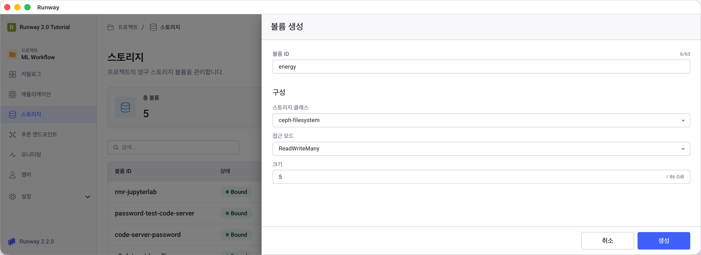
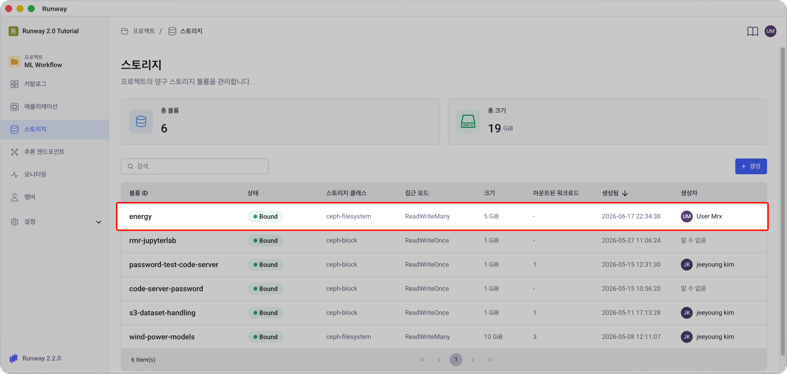

<!-- v2.2.0 에너지 수요 예측 MLOps 튜토리얼 신규 추가 | 2026-06-16 -->

# 1-1. PVC 생성 {#pvc}

학습 데이터와 모델 파일을 저장할 공유 스토리지(PVC)를 만듭니다. 이후 단계의 모든 앱이 이 공간을 함께 사용합니다.

> 본인 프로젝트 > **스토리지** > **+ 생성**

| 항목 | 값 |
|------|----|
| **볼륨 ID** | 본인이 정하는 이름 (예: `energy`) — 0단계에서 `pvc_name`으로 등록한 값과 동일하게 |
| **스토리지 클래스** | `ceph-filesystem` |
| **접근 모드** | `ReadWriteMany` |
| **크기** | `5` GiB |

!!! warning "접근 모드는 ReadWriteMany(RWX) 필수"
    `ReadWriteOnce(RWO)`로 설정하면 여러 Pod이 동시에 마운트할 때 Multi-Attach 에러가 발생합니다. 반드시 `ReadWriteMany`로 설정하세요.

생성 후 목록에서 상태가 **Bound**인지 확인합니다.

---

:octicons-arrow-right-24: 다음 단계: **[1-2. Code Server 배포](02-code-server.md)**
