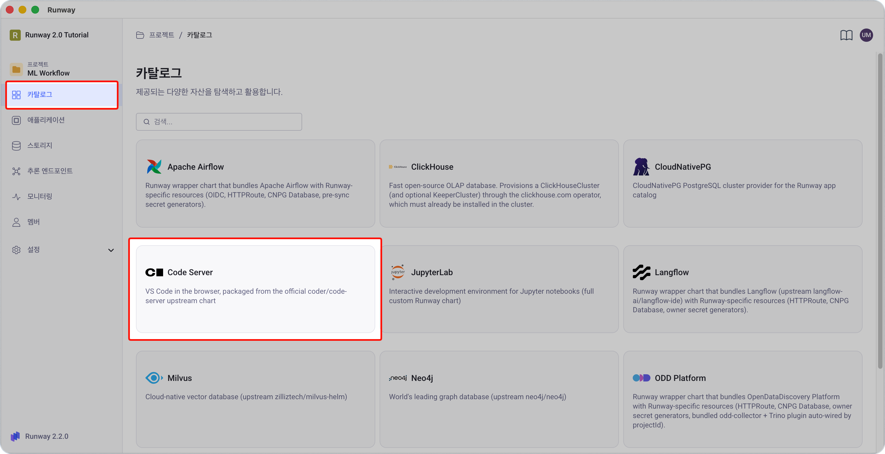
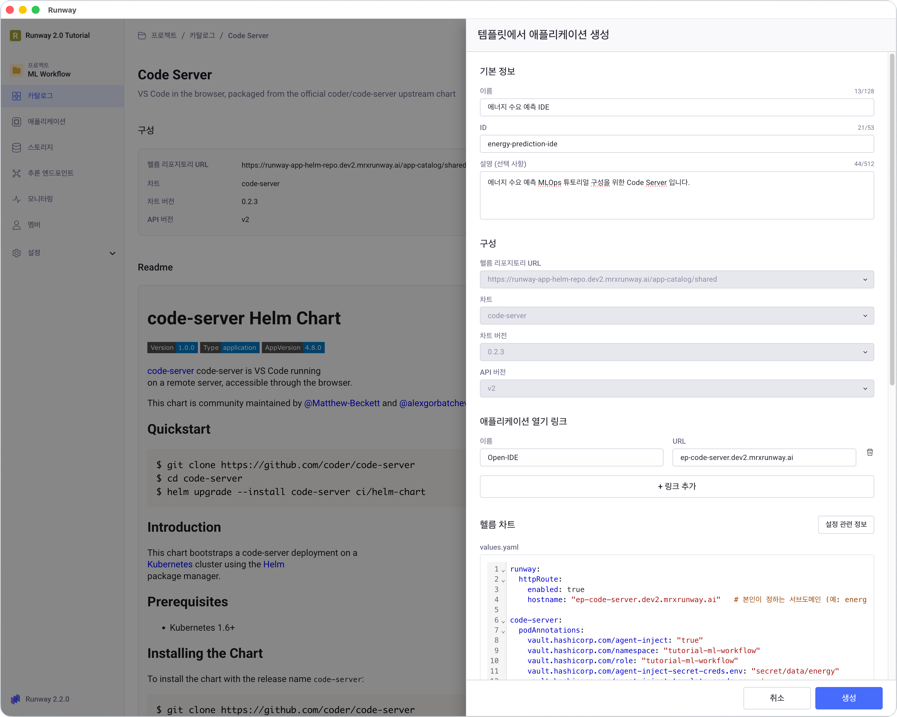
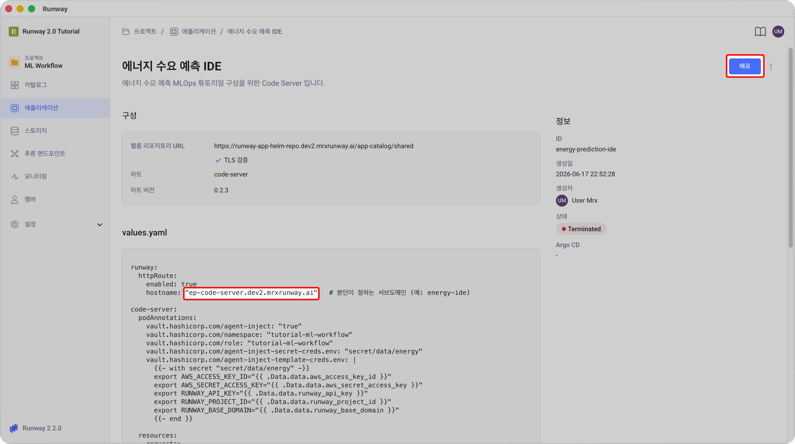
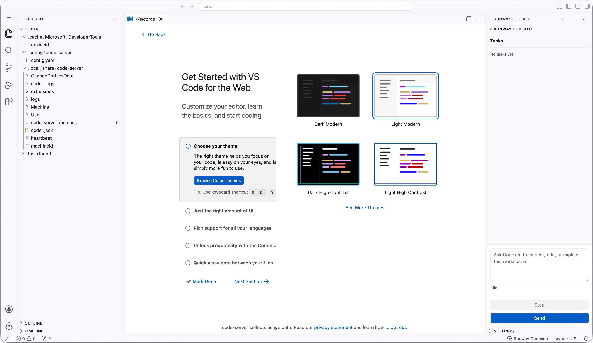

<!-- v2.2.0 에너지 수요 예측 MLOps 튜토리얼 신규 추가 | 2026-06-16 -->

# 1-2. Code Server 배포 {#code-server}

브라우저에서 VS Code처럼 사용할 수 있는 개발 환경을 배포합니다. 0단계에서 등록한 시크릿이 자동 주입되고, 공유 스토리지(PVC)가 연결되도록 설정합니다.

> 본인 프로젝트 > **카탈로그** > **Code Server** > **+ 애플리케이션 생성** 버튼 클릭



1. **기본 정보** 입력합니다.

    

    | 항목 | 값 |
    |------|----|
    | **이름** | 본인이 정하는 이름 (예: `Energy IDE`) |
    | **ID** | 본인이 정하는 ID (예: `energy-ide`) |

2. 아래 차트에서 `<your-...>` 항목 5개를 사용자 환경에 맞는 값으로 교체하고, **values.yaml**에 붙입니다.

    
    | 항목 | 설명 |
    |------|------|
    | `<your-ide-hostname>` | IDE 서브도메인 (예: `energy-ide`) - 사용자 지정 |
    | `<your-runway-domain>` | Runway 플랫폼 도메인 | 
    | `<your-project-id>` | 프로젝트 ID |
    | `<your-openbao-role>` | OpenBao 롤 이름 |
    | `<your-pvc-name>` | 1-1에서 생성한 PVC 이름 |

      
    ```yaml
    runway:
      httpRoute:
        enabled: true
        hostname: "<your-ide-hostname>.<your-runway-domain>"   # 본인이 정하는 서브도메인 (예: energy-ide)

    code-server:
      podAnnotations:
        vault.hashicorp.com/agent-inject: "true"
        vault.hashicorp.com/namespace: "<your-project-id>"
        vault.hashicorp.com/role: "<your-openbao-role>"
        vault.hashicorp.com/agent-inject-secret-creds.env: "secret/data/energy"
        vault.hashicorp.com/agent-inject-template-creds.env: |
          {{- with secret "secret/data/energy" -}}
          export AWS_ACCESS_KEY_ID="{{ .Data.data.aws_access_key_id }}"
          export AWS_SECRET_ACCESS_KEY="{{ .Data.data.aws_secret_access_key }}"
          export RUNWAY_API_KEY="{{ .Data.data.runway_api_key }}"
          export RUNWAY_PROJECT_ID="{{ .Data.data.runway_project_id }}"
          export RUNWAY_BASE_DOMAIN="{{ .Data.data.runway_base_domain }}"
          {{- end }}

      resources:
        requests:
          cpu: 500m
          memory: 2Gi
        limits:
          cpu: 4000m
          memory: 8Gi

      persistence:
        enabled: true
        accessMode: ReadWriteOnce
        size: 5Gi
        annotations:
          argocd.argoproj.io/sync-options: Delete=false

      extraPVCs:
        - name: data-fs
          mountPath: /mnt/data
          existingClaim: <your-pvc-name>   # 1-1에서 만든 PVC 이름
          readOnly: false

      extraInitContainers: |
        - name: seed-vscode-settings
          image: busybox:latest
          imagePullPolicy: IfNotPresent
          command:
            - sh
            - -c
            - |
              mkdir -p /home/coder/.local/share/code-server/User
              if [ ! -f /home/coder/.local/share/code-server/User/settings.json ]; then
                cat > /home/coder/.local/share/code-server/User/settings.json <<'EOF'
              {
                "workbench.welcomePage.experimentalOnboarding": false,
                "chat.disableAIFeatures": true
              }
              EOF
              fi
              chown -R 1000:1000 /home/coder/.local
          volumeMounts:
            - name: data
              mountPath: /home/coder
    ```

      **스토리지 구성 요약**

      | 경로 | 스토리지 | 용도 |
      |------|---------|------|
      | `/home/coder` | `persistence` 블록이 자동 생성하는 PVC (5GiB, RWO) | VS Code 설정·확장·Python venv |
      | `/mnt/data` | 1-1에서 만든 공용 PVC (RWX) | 데이터셋·모델 <p> — Airflow 학습 Pod, 추론 Pod과 공유 |

3. **생성** 버튼을 클릭하여 애플리케이션 설정을 저장합니다.


4. 애플리케이션 상세 화면에서 **배포** 버튼을 클릭하여 Code Server를 배포합니다.

    

    - Pod가 준비될 때까지 1~2분 대기합니다.

    !!! warning "배포 후 Pod가 계속 `Init` 상태에 머물러 있디가 배포에 실패하는 경우"
        values.yaml의 OpenBao Agent Injector annotation을 읽어 시크릿을 자동으로 주입하는 사전 설정이 필요합니다.  
        **Runway 2.2.1 이상**에서는 프로젝트 생성 시 자동으로 이루어지지만, **2.2.1 미만**에서는 플랫폼 관리자가 별도로 설정해야 합니다.

        사용 중인 Runway 버전을 확인하고, 2.2.1 미만이라면 플랫폼 관리자에게 **[부록 A. OpenBao Agent Injector 선행 조건](../appendix/a-openbao.md)**의 설정을 요청하세요.

5. 브라우저에서 `https://<your-ide-hostname>.<your-runway-domain>`에 접속합니다.

    

---

:octicons-arrow-right-24: 다음 단계: **[1-3. 시크릿·PVC 확인](03-verify.md)**
