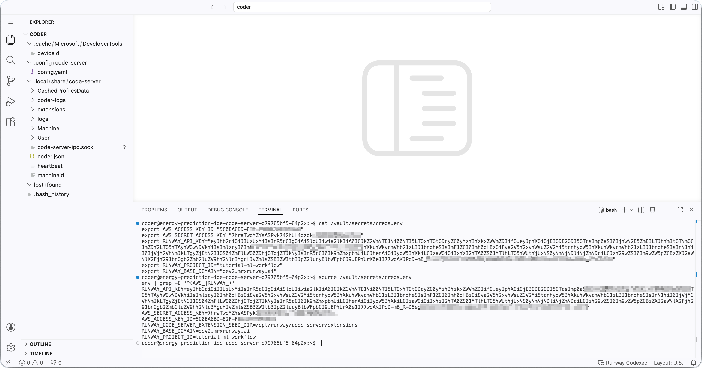
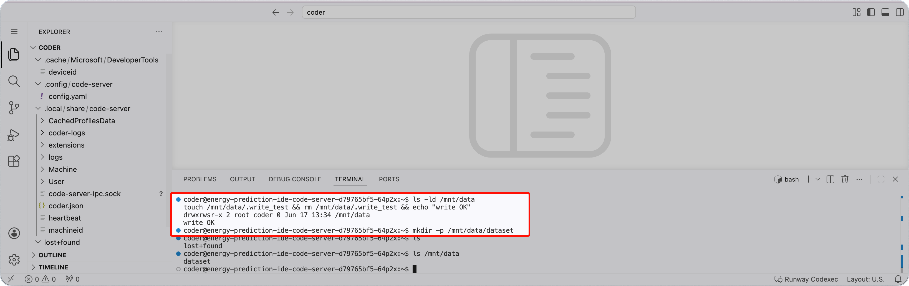

<!-- v2.2.0 에너지 수요 예측 MLOps 튜토리얼 신규 추가 | 2026-06-16 -->

# 1-3. 시크릿·PVC 확인 {#verify}

0단계에서 등록한 자격 증명(시크릿)이 Code Server에 정상 주입됐는지, 공유 스토리지(PVC)가 정상 연결됐는지 확인합니다.

## A. 시크릿 확인 {#secret}

Code Server 안에서 좌측 상단 **≡ → Terminal → New Terminal**을 클릭해 터미널을 열고, OpenBao가 주입한 시크릿 파일(`/vault/secrets/creds.env`)을 확인합니다.

```bash title="시크릿 파일 확인 - Code Server 터미널"
cat /vault/secrets/creds.env
```

기대 출력:

```
export AWS_ACCESS_KEY_ID="AKIA...."
export AWS_SECRET_ACCESS_KEY="...."
export RUNWAY_API_KEY="...."
export RUNWAY_PROJECT_ID="pdm-tutorial-energy"
export RUNWAY_BASE_DOMAIN="try.mrxrunway.ai"
```

**셸에 환경 변수로 적용**
```bash title="시크릿 환경 변수 적용 - Code Server 터미널"
source /vault/secrets/creds.env
env | grep -E '^(AWS_|RUNWAY_)'
```

5개 값이 모두 표시되면 Agent Injector가 정상 동작하는 것입니다.



!!! warning "`/vault/secrets/creds.env`가 없으면"
    시크릿 자동 주입을 위한 사전 설정이 필요합니다. **Runway 2.2.1 이상**에서는 프로젝트 생성 시 자동으로 이루어지지만, **2.2.1 미만**에서는 플랫폼 관리자가 별도로 설정해야 합니다.

    사용 중인 Runway 버전을 확인하고, 2.2.1 미만이라면 플랫폼 관리자에게 **[부록 A. OpenBao Agent Injector 선행 조건](../appendix/a-openbao.md)**의 설정을 요청하세요.

---

## B. 공용 PVC 마운트 확인 {#pvc}

**/mnt/data가 마운트되어 있고 쓰기 가능한지 확인**

```bash title="PVC 마운트 및 쓰기 확인 - Code Server 터미널"
ls -ld /mnt/data
touch /mnt/data/.write_test && rm /mnt/data/.write_test && echo "write OK"
```

**이후 단계에서 사용할 디렉토리 생성**

```bash title="데이터 디렉토리 생성 - Code Server 터미널"
mkdir -p /mnt/data/dataset
```

`write OK`가 출력되고 `dataset/` 디렉토리가 생성되면 PVC 마운트가 정상입니다.



---

:octicons-arrow-right-24: 다음 단계: **[2단계. 코드와 데이터 준비](../02-code-data/index.md)**
