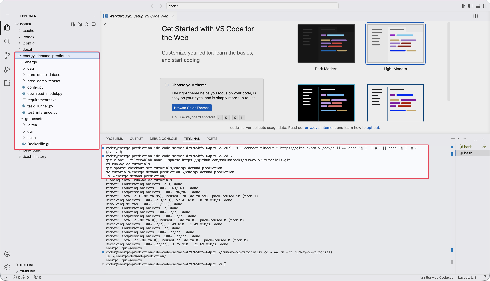
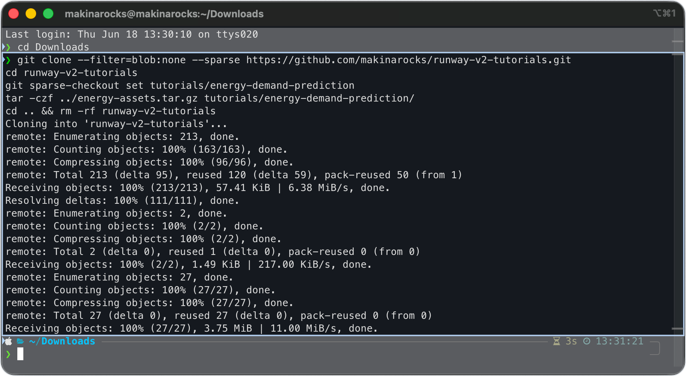
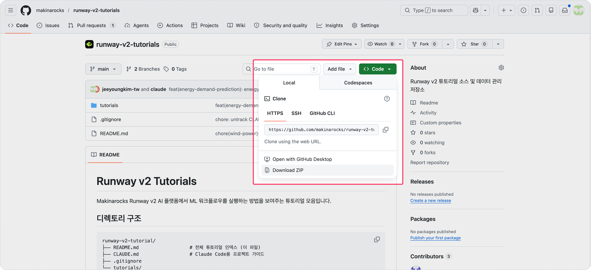

<!-- v2.2.0 에너지 수요 예측 MLOps 튜토리얼 신규 추가 | 2026-06-16 -->

# 2-1. 튜토리얼 파일 준비 {#assets}

튜토리얼에서 사용할 코드와 데이터는 GitHub 공개 리포지토리의 `tutorials/energy-demand-prediction/` 폴더에 준비되어 있습니다.

:octicons-mark-github-16: [makinarocks/runway-v2-tutorials](https://github.com/makinarocks/runway-v2-tutorials){ target="_blank" }


```
energy-demand-prediction/
│
├── energy/                             ← ML 파이프라인 코드 및 데이터
│   ├── config.py               ← 환경 변수에서 MLflow URI, S3 endpoint 등 자동 계산
│   ├── task_runner.py          ← 학습 파이프라인 (데이터 로드 → 학습 → 평가 → MLflow 기록 → PVC 복사)
│   ├── download_model.py       ← MLflow 모델 수동 다운로드 (DAG 실패 시 대체 수단)
│   ├── test_inference.py       ← KServe V2 API 호출 검증
│   ├── requirements.txt
│   ├── dag/
│   │   └── energy.py           ← Airflow DAG 파일
│   ├── pred-demo-dataset/
│   │   └── Q1.csv, Q2.csv, Q3.csv       ← 학습 데이터 (분기별)
│   └── pred-demo-testset/
│       └── Q1.csv, Q2.csv, Q3.csv, Q4.csv   ← 평가 데이터 (분기별)
│
└── gui-assets/                         ← 5단계 웹 대시보드 앱 소스
    ├── Dockerfile.gui
    ├── gui/                    ← React 앱 소스
    └── helm/                   ← Helm 차트 (배포용)
```

---

## Code Server로 파일 가져오기

두 가지 방법 중 하나를 선택합니다.

Code Server 터미널에서 아래 명령으로 클러스터의 GitHub 접근 가능 여부를 먼저 확인합니다.  
접근 가능하면 방법 A, 접근 불가면 방법 B로 진행합니다.

```bash title="GitHub 접근 확인 - Code Server 터미널"
curl -s --connect-timeout 5 https://github.com > /dev/null && echo "접근 가능" || echo "접근 불가"
```

=== "방법 A — Code Server에서 직접 clone (권장)"

    클러스터가 외부 인터넷에 접근 가능한 환경이라면 Code Server 터미널에서 직접 clone합니다.

    ```bash
    cd ~
    git clone --filter=blob:none --sparse https://github.com/makinarocks/runway-v2-tutorials.git
    cd runway-v2-tutorials
    git sparse-checkout set tutorials/energy-demand-prediction
    mv tutorials/energy-demand-prediction ~/energy-demand-prediction
    cd ~ && rm -rf runway-v2-tutorials
    ls ~/energy-demand-prediction/
    ```

    

=== "방법 B — 로컬에서 내려받아 업로드 (방화벽 환경)"

    클러스터에서 GitHub 접근이 차단된 경우, 로컬 PC에서 내려받아 Code Server로 업로드합니다.

    **1. 로컬 PC에서 내려받기**

    로컬 터미널에서 필요한 폴더만 내려받아 압축합니다.

    === "macOS / Linux"

        ```bash
        git clone --filter=blob:none --sparse https://github.com/makinarocks/runway-v2-tutorials.git
        cd runway-v2-tutorials
        git sparse-checkout set tutorials/energy-demand-prediction
        tar -czf ../energy-assets.tar.gz tutorials/energy-demand-prediction/
        cd .. && rm -rf runway-v2-tutorials
        ```

    === "Windows (PowerShell)"

        ```powershell
        git clone --filter=blob:none --sparse https://github.com/makinarocks/runway-v2-tutorials.git
        cd runway-v2-tutorials
        git sparse-checkout set tutorials/energy-demand-prediction
        Compress-Archive -Path tutorials\energy-demand-prediction -DestinationPath ..\energy-assets.zip
        cd ..
        Remove-Item -Recurse -Force runway-v2-tutorials
        ```

        
    
    **2. Code Server로 업로드**

    Code Server 브라우저 화면 좌측 파일 탐색기에 압축 파일을 **drag-drop**합니다.

    **3. Code Server 터미널에서 압축 해제**

    === "tar.gz (macOS / Linux)"

        ```bash
        cd ~
        tar -xzf energy-assets.tar.gz
        mv tutorials/energy-demand-prediction ~/energy-demand-prediction
        rm -rf tutorials
        ls ~/energy-demand-prediction/
        ```

    === "zip (Windows)"

        ```bash
        cd ~
        unzip energy-assets.zip
        mv tutorials/energy-demand-prediction ~/energy-demand-prediction
        rm -rf tutorials
        ls ~/energy-demand-prediction/
        ```

!!! note "방법 A, B가 모두 불가한 경우"
    git 또는 터미널 사용이 어려운 환경이라면, GitHub 웹 페이지에서 파일을 직접 내려받을 수 있습니다.  
    각 파일 페이지 우측 상단의 다운로드 버튼(:octicons-download-16:)을 클릭하여 개별 파일을 저장하세요.

    


---

:octicons-arrow-right-24: 다음 단계: **[2-2. 학습 데이터 배치](02-dataset.md)**
