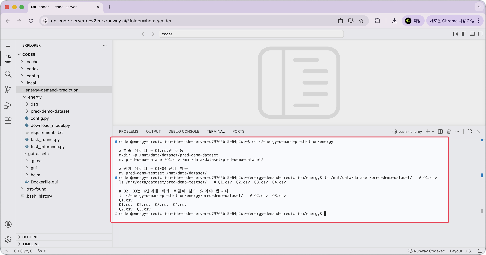

<!-- v2.2.0 에너지 수요 예측 MLOps 튜토리얼 신규 추가 | 2026-06-16 -->

# 2-2. 학습 데이터 배치 {#dataset}

Airflow DAG의 학습 Pod는 Code Server와 **같은 PVC**(`/mnt/data/`)를 마운트해서 데이터를 읽습니다.  
Code Server에서 PVC에 파일을 넣어두면 학습 Pod가 별도 전송 없이 그대로 사용할 수 있습니다.

Q1~Q4는 각각 1~4분기 에너지 수요 데이터 파일입니다. Q4는 학습 데이터에 포함되지 않으며, 평가 데이터로만 사용합니다.

이 튜토리얼은 데이터를 단계적으로 추가하는 흐름을 보여줍니다.

| 단계 | PVC에 있는 학습 데이터 | 결과 |
|------|----------------------|------|
| 3단계 초기 학습 | Q1.csv만 | Version 1 모델 (1개 분기) |
| 6단계 재학습 | Q1 + Q2 + Q3 | Version 2 모델 (3개 분기) |

지금은 **Q1.csv만** PVC로 이동합니다. Q2·Q3는 6단계를 위해 남겨둡니다. 평가 데이터는 전체(Q1~Q4)를 미리 이동합니다.

```bash title="데이터셋 PVC 이동 - Code Server 터미널"
cd ~/energy-demand-prediction/energy

# 학습 데이터 — Q1.csv만 이동
mkdir -p /mnt/data/dataset/pred-demo-dataset
mv pred-demo-dataset/Q1.csv /mnt/data/dataset/pred-demo-dataset/

# 평가 데이터 — Q1~Q4 전체 이동
mv pred-demo-testset /mnt/data/dataset/
```

이동 결과를 확인합니다.

```bash title="데이터셋 배치 결과 확인 - Code Server 터미널"
ls /mnt/data/dataset/pred-demo-dataset/   # Q1.csv
ls /mnt/data/dataset/pred-demo-testset/   # Q1.csv  Q2.csv  Q3.csv  Q4.csv

# Q2, Q3는 6단계를 위해 옮지기 않고 남겨둠
ls ~/energy-demand-prediction/energy/pred-demo-dataset/   # Q2.csv  Q3.csv
```



---

:octicons-arrow-right-24: 다음 단계: **[2-3. Python 환경 구성](03-python-env.md)**
