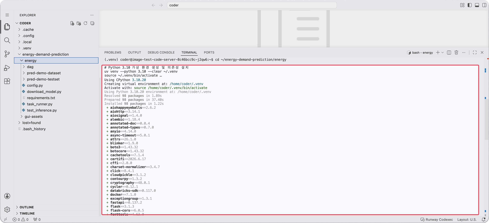
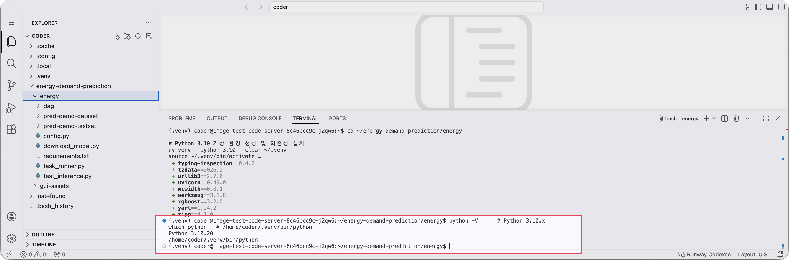

<!-- v2.2.0 에너지 수요 예측 MLOps 튜토리얼 신규 추가 | 2026-06-16 -->

# 2-3. Python 환경 구성 {#python-env}

Code Server에는 패키지 관리 도구 `uv`가 기본으로 설치되어 있습니다. `uv`를 사용해 Python 3.10 가상 환경을 생성하고, 튜토리얼에 필요한 패키지를 설치합니다. 시스템 Python에는 영향을 주지 않으며 sudo도 필요하지 않습니다.

```bash title="Python 환경 설치 - Code Server 터미널"
cd ~/energy-demand-prediction/energy

# Python 3.10 가상 환경 생성 및 의존성 설치
uv venv --python 3.10 --clear ~/.venv
source ~/.venv/bin/activate
uv pip install -r requirements.txt
```

의존성 설치는 네트워크 환경에 따라 수 분 정도 소요될 수 있습니다.

!!! note "`uv: command not found` 오류가 발생하면"
    사용 중인 Code Server 버전에 `uv`가 포함되어 있지 않을 수 있습니다. 아래 명령으로 먼저 설치한 뒤 다시 시도하세요.

    ```bash
    curl -LsSf https://astral.sh/uv/install.sh | sh
    export PATH="$HOME/.local/bin:$PATH"
    ```



---

<div class="pdf-pb"></div>

설치 후, 정상적으로 완료되었는지 확인합니다.

```bash title="Python 버전 확인 - Code Server 터미널"
python -V      # Python 3.10.x
which python   # /home/coder/.venv/bin/python
```

!!! note "Python 3.10을 사용하는 이유"
    4단계에서 사용하는 MLServer가 Python 3.10 기반 이미지로 제공됩니다.  
    동일한 버전으로 맞춰두면 의존성 호환성 문제를 줄일 수 있습니다.


---

:octicons-arrow-right-24: 다음 단계: **[2-4. 준비 상태 확인](04-verify.md)**
