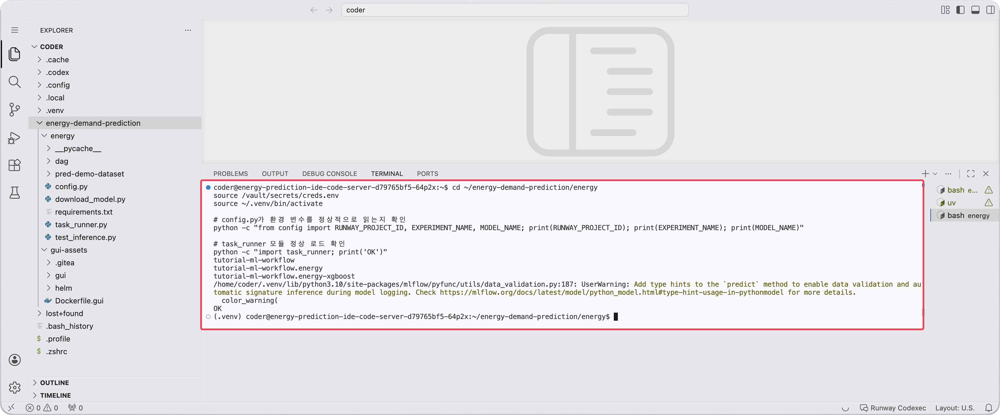

<!-- v2.2.0 에너지 수요 예측 MLOps 튜토리얼 신규 추가 | 2026-06-16 -->

# 2-4. 준비 상태 확인 {#verify}

시크릿을 셸에 적용하고, 코드와 모듈이 정상적으로 동작하는지 확인합니다.

```bash title="환경 변수 및 모듈 로드 확인 - Code Server 터미널"
cd ~/energy-demand-prediction/energy
source /vault/secrets/creds.env
source ~/.venv/bin/activate

# config.py가 환경 변수를 정상적으로 읽는지 확인
python -c "from config import RUNWAY_PROJECT_ID, EXPERIMENT_NAME, MODEL_NAME; print(RUNWAY_PROJECT_ID); print(EXPERIMENT_NAME); print(MODEL_NAME)"

# task_runner 모듈 정상 로드 확인
python -c "import task_runner; print('OK')"
```

기대 출력:

```
<프로젝트 ID>
<프로젝트 ID>.energy
<프로젝트 ID>.energy-xgboost
OK
```

세 줄이 모두 정상 출력되면 4단계 추론 검증을 바로 실행할 수 있는 상태입니다.



---

!!! tip "매 터미널 세션마다 자동으로 적용하려면"
    새 터미널을 열 때마다 `source` 명령을 반복하는 것이 번거롭다면 `.bashrc`에 추가합니다.

    ```bash title="bashrc에 자동 적용 설정 추가 - Code Server 터미널"
    cat >> ~/.bashrc <<'EOF'

    # Agent Injector 시크릿 자동 적용
    source /vault/secrets/creds.env

    # Python 가상 환경 자동 활성화
    source ~/.venv/bin/activate
    EOF
    ```

---

:octicons-arrow-right-24: 다음 단계: **[3단계. 모델 학습](../03-training/index.md)**
