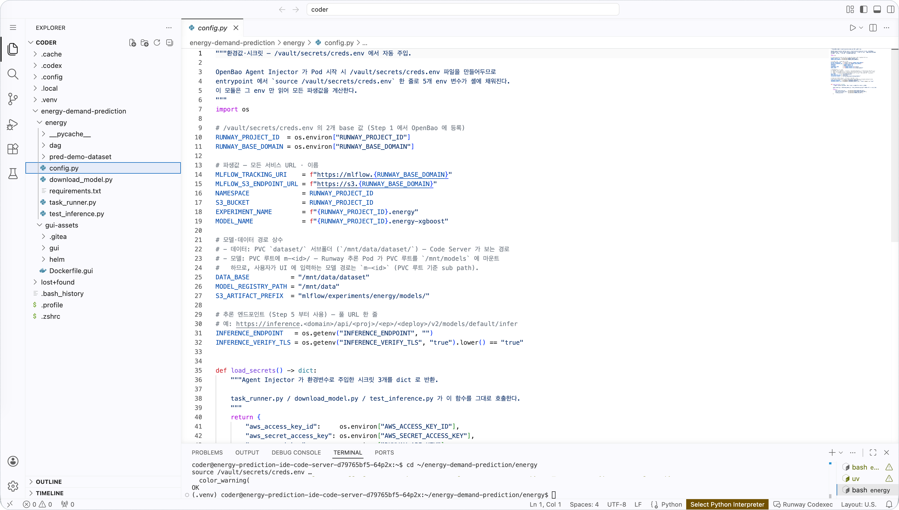
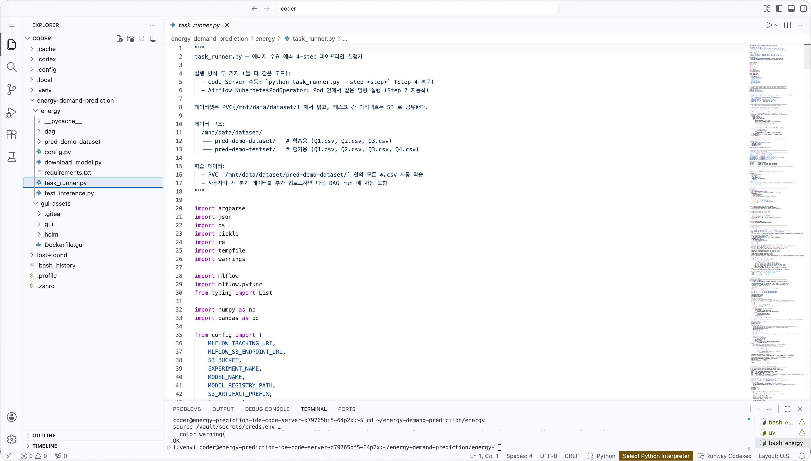
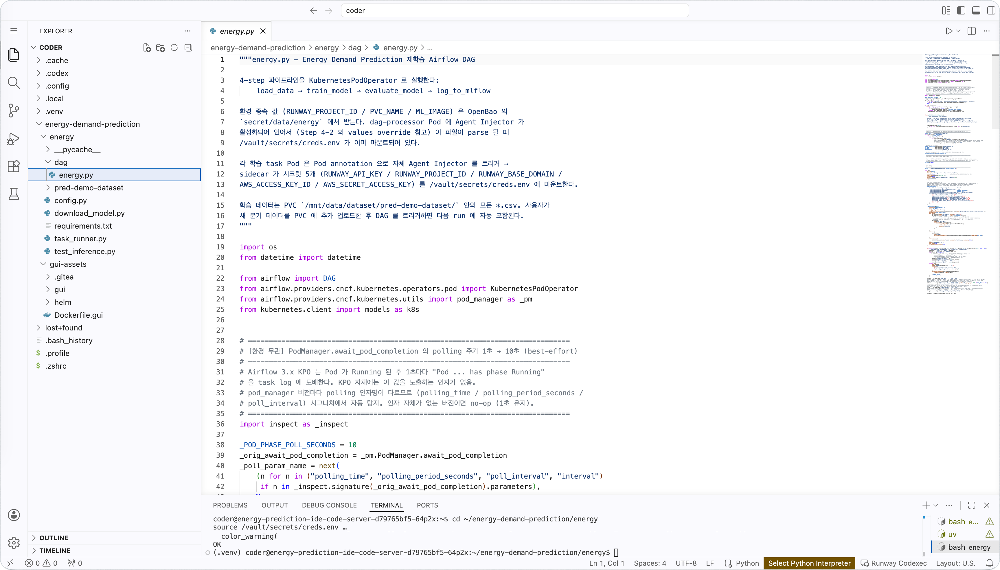
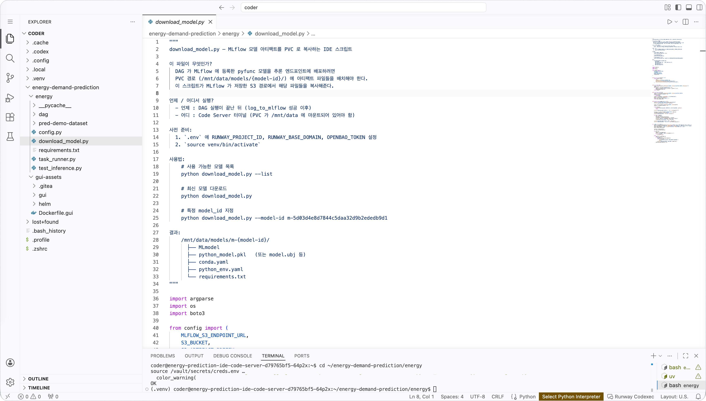
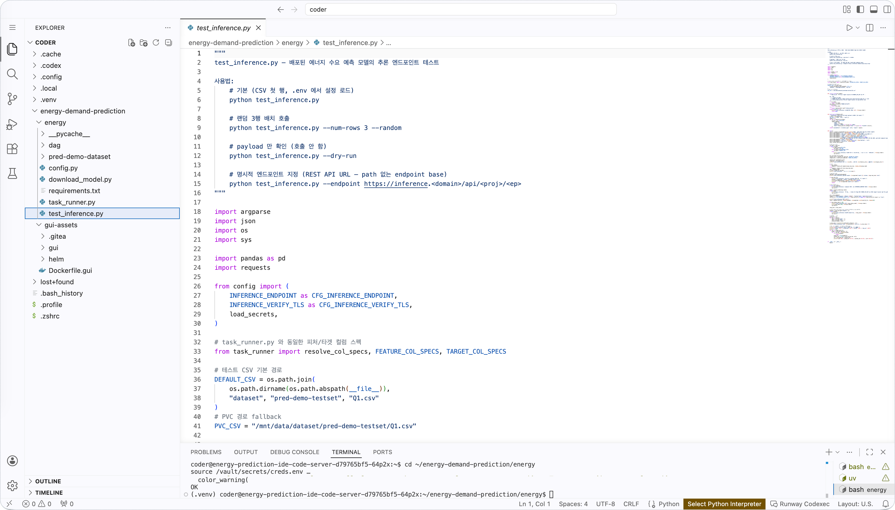

<!-- v2.2.0 에너지 수요 예측 MLOps 튜토리얼 신규 추가 | 2026-06-16 -->

# 2-5. 코드 파일 살펴보기 (선택) {#code-overview}

`~/energy-demand-prediction/energy/` 안의 Python 파일이 튜토리얼 각 단계에서 어떻게 맞물려 동작하는지 파악합니다.  
코드를 한 줄씩 이해할 필요는 없지만, 파일별 역할을 알아두면 이후 단계에서 오류 메시지나 로그를 해석하기 쉬워집니다.

플랫폼 기능을 간단히 확인하는 것이 목적이라면 이 챕터는 건너뛰고 바로 **[3단계](../03-training/index.md)**로 진행해도 됩니다.

| 파일 | 역할 | 사용 단계 |
|------|------|-----------|
| `config.py` | 환경변수에서 MLflow URI, S3 endpoint 등 공통 설정값 계산 | 전 단계 공통 |
| `task_runner.py` | 학습 파이프라인 단계별 실행기 | **3단계 학습** |
| `dag/energy.py` | Airflow DAG 정의 | **3단계 학습** |
| `download_model.py` | MLflow S3 → PVC 모델 수동 복사 (fallback) | **4단계 추론** |
| `test_inference.py` | 추론 엔드포인트 검증 스크립트 | **4단계 추론** |

---

## config.py — 공통 설정 모듈

환경변수 `RUNWAY_PROJECT_ID`와 `RUNWAY_BASE_DOMAIN` 두 값을 읽어, MLflow URI·S3 endpoint·버킷 이름·실험 이름 등 튜토리얼 전체에서 쓰이는 설정값을 자동으로 계산합니다.

나머지 스크립트가 모두 이 모듈을 `import`합니다. 환경변수가 올바르게 주입돼 있지 않으면 모든 스크립트가 실패합니다. 2-4단계의 준비 상태 확인이 이 부분을 미리 검증하는 목적입니다.



---

## task_runner.py — 학습 파이프라인 실행기

`--step` 인자를 받아 학습 파이프라인의 각 단계를 하나씩 실행합니다.

| step | 하는 일 |
|------|---------|
| `load_data` | PVC의 학습·평가 CSV를 읽어 피처/타겟으로 분리한 뒤 S3에 저장 |
| `train_model` | S3의 학습 데이터로 XGBoost 모델 72개를 병렬 학습 |
| `evaluate_model` | 분기별(Q1~Q4) RMSE·MAE·MAPE 계산 |
| `log_to_mlflow` | 모델과 메트릭을 MLflow에 등록 |
| `copy_model_to_pvc` | MLflow S3 아티팩트를 PVC(`/mnt/data/m-<id>/`)로 복사 |

각 step은 독립된 Pod에서 실행되기 때문에 메모리를 공유하지 않습니다. step 간 중간 결과는 S3에 pickle 파일로 저장되어 다음 step이 내려받는 방식으로 연결됩니다.

Code Server 터미널에서 `python task_runner.py --step load_data`처럼 수동 실행도 가능합니다. 3단계에서는 Airflow DAG(`dag/energy.py`)가 Pod 안에서 같은 명령을 자동으로 실행합니다.



---

## dag/energy.py — Airflow DAG 정의

`task_runner.py`의 각 step을 `KubernetesPodOperator`로 연결해 실행 순서를 정의합니다. 이 파일을 Gitea 저장소에 push하면 Airflow가 DAG를 자동 인식합니다.

파일 상단의 `USE_GPU = False`를 `True`로 변경하면 `train_model` step에 GPU가 할당됩니다. 클러스터에 GPU 자원이 충분하지 않다면 `False`로 유지합니다.



---

## download_model.py — 모델 수동 복사 (fallback)

`task_runner.py`의 마지막 step인 `copy_model_to_pvc`가 실패했을 때를 대비한 수동 스크립트입니다. Code Server 터미널에서 직접 실행해 MLflow S3의 모델 아티팩트를 PVC(`/mnt/data/`)로 복사합니다.

```bash
# 사용 가능한 모델 목록 확인
python download_model.py --list

# 최신 모델 복사
python download_model.py
```

4단계에서 모델 파일을 찾을 수 없을 때 이 스크립트로 수동 복사 후 진행합니다.



---

## test_inference.py — 추론 엔드포인트 검증

배포된 추론 엔드포인트에 테스트 CSV 데이터를 KServe V2 형식으로 전송하고, 72개 예측 타겟(시간별 열수요)의 예측값과 실측값을 나란히 출력합니다. 4단계에서 엔드포인트 배포 후 동작을 확인하는 데 사용합니다.

```bash
# 기본 실행 (Q1.csv 첫 행)
python test_inference.py

# 랜덤 3행 배치 호출
python test_inference.py --num-rows 3 --random

# 실제 호출 없이 전송 payload만 확인
python test_inference.py --dry-run
```



---

:octicons-arrow-right-24: 다음 단계: **[3단계. 모델 학습](../03-training/index.md)**
