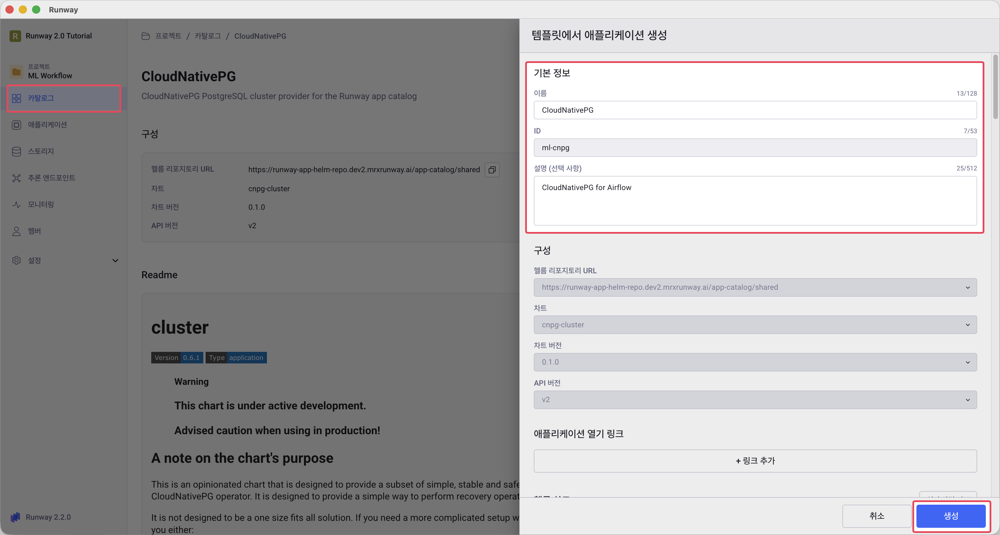
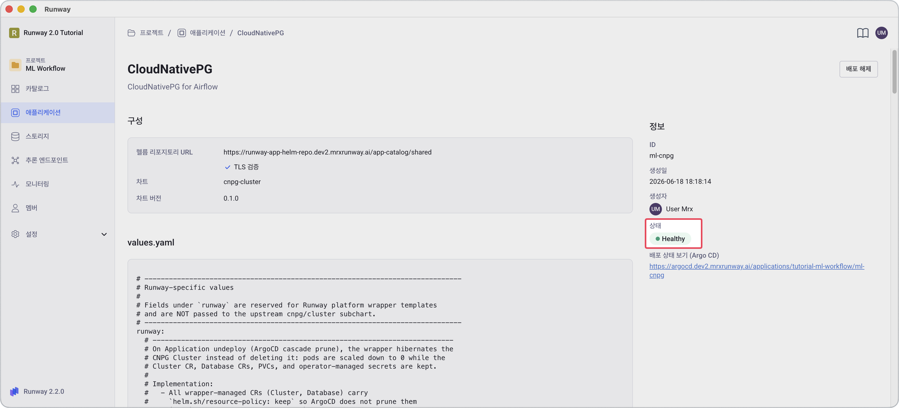
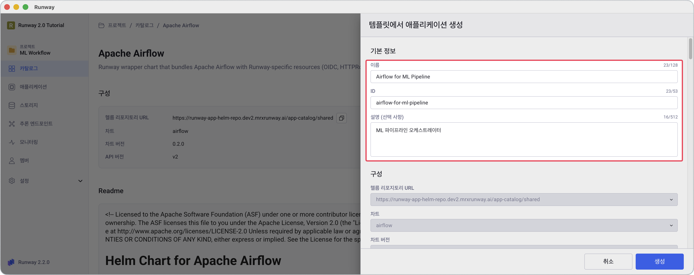
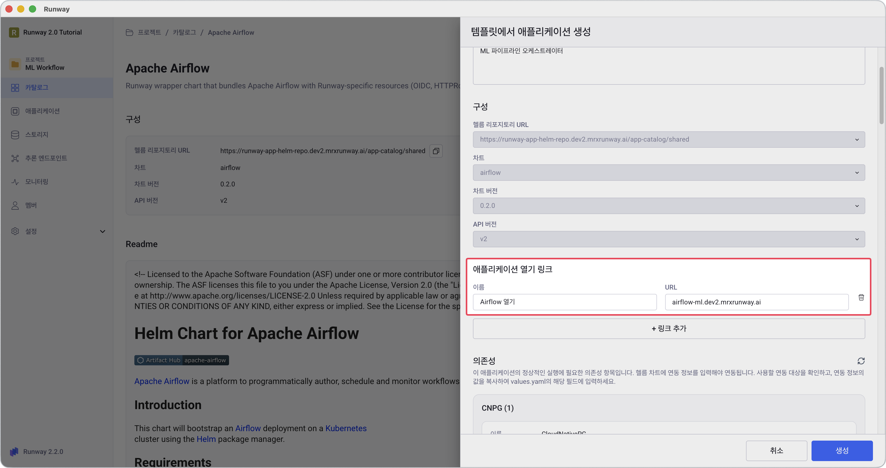
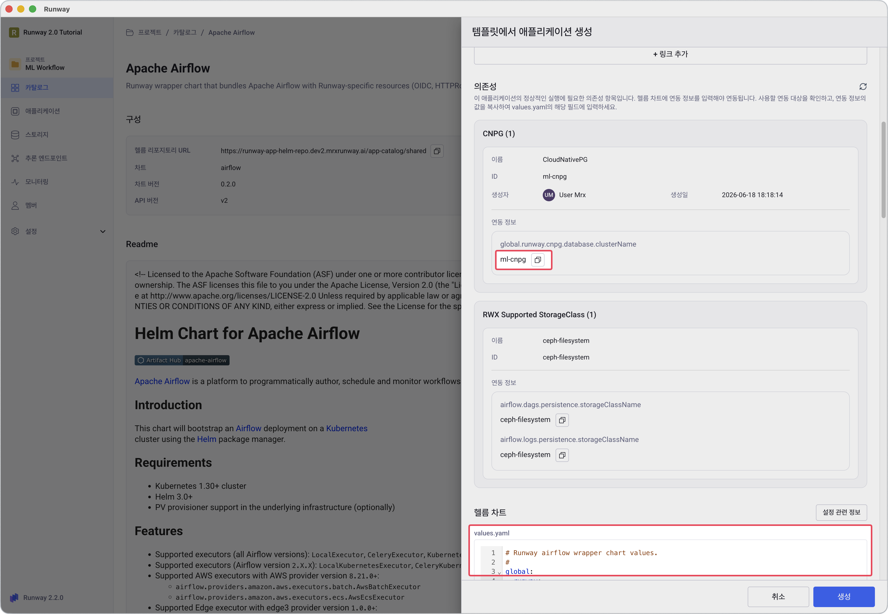
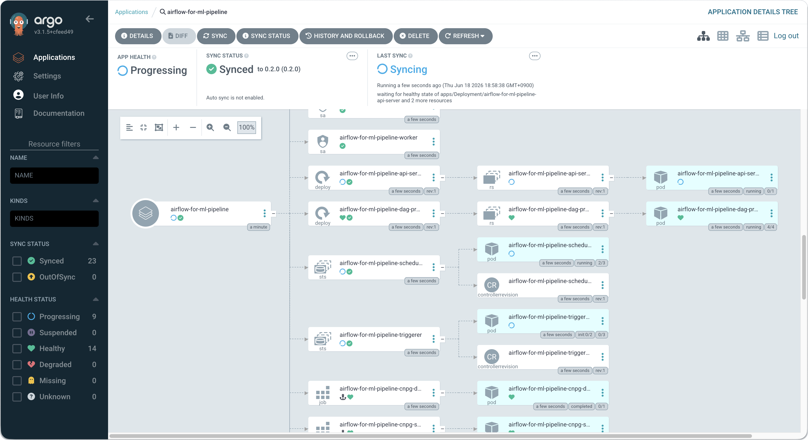
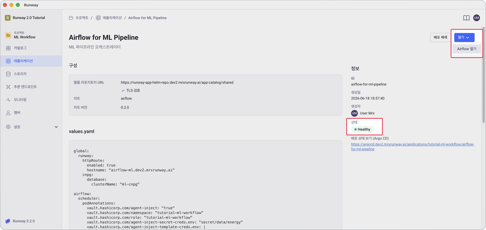
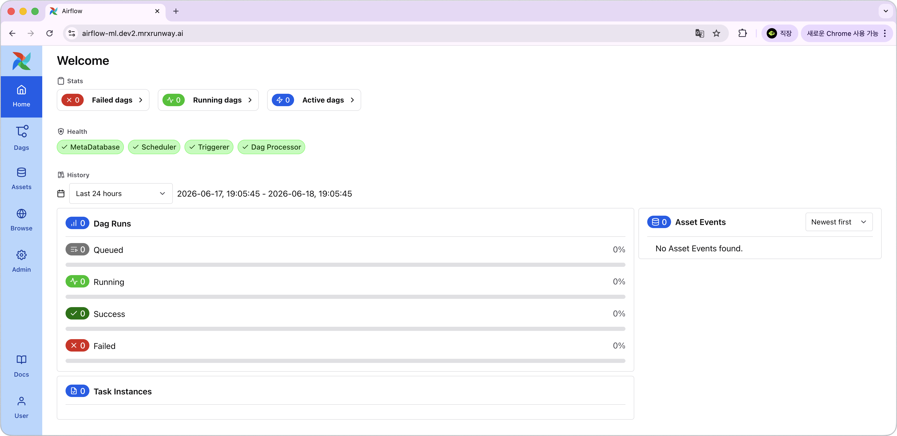

<!-- v2.2.0 에너지 수요 예측 MLOps 튜토리얼 신규 추가 | 2026-06-16 -->

# 3-1. CNPG 및 Airflow 배포 {#deploy}

학습 파이프라인을 실행할 Airflow를 배포합니다. Airflow는 내부적으로 PostgreSQL이 필요하므로, 먼저 **CloudNativePG(CNPG)**를 배포한 뒤 이를 의존성으로 연결합니다.

---

## A. CNPG 배포

> 본인 프로젝트 > **카탈로그** > **CloudNativePG** > **+ 애플리케이션 생성**



1. 아래 표를 참고해 기본 정보를 입력합니다.

    | 항목 | 값 |
    |------|----|
    | **이름** | 본인이 정하는 이름 (예: `CloudNativePG`) |
    | **ID** | 본인이 정하는 ID (예: `ml-cnpg`) — 이후 `<your-cnpg-name>`으로 표기 |
    | **헬름차트(values.yaml)** | 수정 불필요 |

2. **생성**을 클릭합니다.

3. 애플리케이션 상세 화면에서 **배포** 버튼을 클릭합니다.

    - 배포 버튼을 클릭하고 1~2분 뒤 배포 상태가 **Healthy**로 바뀌면 다음 단계로 진행합니다.
    - 상태가 바뀌지 않으면 **배포 상태 보기** URL을 클릭해 상태를 확인합니다.
    
    

---

## B. Airflow 배포

> 본인 프로젝트 > **카탈로그** > **Apache Airflow** > **+ 애플리케이션 생성**

1. 아래 표를 참고해 기본 정보를 입력합니다.

    | 항목 | 값 |
    |------|----|
    | **이름** | 본인이 정하는 이름 (예: `Airflow for ML Pipeline`) |
    | **ID** | 본인이 정하는 ID (예: `airflow-for-ml-pipeline`) |

    

2. **애플리케이션 열기 링크** 섹션에서 아래 표를 참고해 입력합니다.

    | 항목 | 값 |
    |------|----|
    | **이름** | `Airflow 열기` |
    | **URL** | `<your-airflow-hostname>.<your-runway-domain>` |

    

3. 사이드패널 **의존성** 섹션에서 연동 정보를 확인합니다. 확인한 값은 복사 버튼을 활용해서 다음 단계 values.yaml에 입력합니다.

    **CNPG 의존성**

    | 연동 대상 | 확인할 연동 정보 |
    |-----------|----------------|
    | A단계에서 만든 `<your-cnpg-name>` | `global.runway.cnpg.database.clusterName` |

    **RWX StorageClass 의존성**

    | 확인할 연동 정보 |
    |----------------|
    | `airflow.dags.persistence.storageClassName`, `airflow.logs.persistence.storageClassName` |

    

4. 아래 내용을 values.yaml에 붙여넣고 `<your-...>` 항목 5개를 사용자 환경에 맞는 값으로 교체합니다.

    | 항목 | 설명 |
    |------|------|
    | `<your-airflow-hostname>` | Airflow 서브도메인 (예: `airflow-ml-pipeline`) |
    | `<your-runway-domain>` | Runway 플랫폼 도메인 |
    | `<your-cnpg-name>` | A단계에서 생성한 CNPG 이름 |
    | `<your-project-id>` | 프로젝트 ID |
    | `<your-openbao-role>` | OpenBao 롤 이름 |

    !!! warning "플레이스홀더 미교체 시 배포 실패"
        `<your-...>` 형태의 플레이스홀더는 YAML 내 여러 위치에 반복 사용됩니다. 모든 위치를 빠짐없이 실제 값으로 교체하지 않으면 Airflow가 정상적으로 배포되지 않습니다.

    ```yaml
    global:
      runway:
        httpRoute:
          enabled: true
          hostname: "<your-airflow-hostname>.<your-runway-domain>"
        cnpg:
          database:
            clusterName: "<your-cnpg-name>"

    airflow:
      scheduler:
        podAnnotations:
          vault.hashicorp.com/agent-inject: "true"
          vault.hashicorp.com/namespace: "<your-project-id>"
          vault.hashicorp.com/role: "<your-openbao-role>"
          vault.hashicorp.com/agent-inject-secret-creds.env: "secret/data/energy"
          vault.hashicorp.com/agent-inject-template-creds.env: |
            {{- with secret "secret/data/energy" -}}
            export RUNWAY_PROJECT_ID="{{ .Data.data.runway_project_id }}"
            export PVC_NAME="{{ .Data.data.pvc_name }}"
            export ML_IMAGE="{{ .Data.data.ml_image }}"
            export OPENBAO_ROLE="{{ .Data.data.openbao_role }}"
            {{- end }}

      dagProcessor:
        podAnnotations:
          vault.hashicorp.com/agent-inject: "true"
          vault.hashicorp.com/namespace: "<your-project-id>"
          vault.hashicorp.com/role: "<your-openbao-role>"
          vault.hashicorp.com/agent-inject-secret-creds.env: "secret/data/energy"
          vault.hashicorp.com/agent-inject-template-creds.env: |
            {{- with secret "secret/data/energy" -}}
            export RUNWAY_PROJECT_ID="{{ .Data.data.runway_project_id }}"
            export PVC_NAME="{{ .Data.data.pvc_name }}"
            export ML_IMAGE="{{ .Data.data.ml_image }}"
            export OPENBAO_ROLE="{{ .Data.data.openbao_role }}"
            {{- end }}

      triggerer:
        podAnnotations:
          vault.hashicorp.com/agent-inject: "true"
          vault.hashicorp.com/namespace: "<your-project-id>"
          vault.hashicorp.com/role: "<your-openbao-role>"
          vault.hashicorp.com/agent-inject-secret-creds.env: "secret/data/energy"
          vault.hashicorp.com/agent-inject-template-creds.env: |
            {{- with secret "secret/data/energy" -}}
            export RUNWAY_PROJECT_ID="{{ .Data.data.runway_project_id }}"
            export PVC_NAME="{{ .Data.data.pvc_name }}"
            export ML_IMAGE="{{ .Data.data.ml_image }}"
            export OPENBAO_ROLE="{{ .Data.data.openbao_role }}"
            {{- end }}

      dags:
        persistence:
          storageClassName: "ceph-filesystem"

      logs:
        persistence:
          storageClassName: "ceph-filesystem"
    ```

5. **생성**을 클릭합니다.

6. 애플리케이션 상세 화면에서 **배포** 버튼을 클릭합니다.

    - 배포 후 3~5분 뒤 상태가 **Healthy**로 바뀌면 다음 단계로 진행합니다.

    !!! note "배포가 오래 걸리는 경우"
        **배포 상태 보기** 링크를 클릭하면 Argo CD에서 세부 배포 상태를 확인할 수 있습니다.

        

7. 오른쪽 상단 **열기** > **Airflow 열기**를 클릭해 Airflow 화면으로 연결되는지 확인합니다.

    

8. Airflow 로그인 화면에서 **Sign In with keycloak**을 클릭해 로그인합니다.

    

!!! info "프로젝트 생성 시 자동으로 준비되는 리소스"
    아래 리소스는 프로젝트 생성 시 자동으로 만들어집니다.  
    Airflow 차트 기본값이 이를 참조하므로 별도로 생성하거나 수정할 필요가 없습니다.

    | 리소스 | 역할 |
    |--------|------|
    | Gitea 레포 <p> `<your-project-id>/airflow-dags` | DAG 파일을 저장하는 Git 저장소입니다. git-sync가 30초마다 자동으로 pull합니다. |
    | `gitea-gitsync-runway-bot-token` | git-sync가 Gitea 레포에 접근할 때 사용하는 인증 토큰입니다. |
    | `gitea-image-pull-secret-runway-bot-token` | Airflow Pod이 ML 이미지를 pull할 때 사용하는 인증 토큰입니다. |
    | `airflow-oidc-secret` | Runway 계정으로 Airflow UI에 로그인할 수 있도록 Keycloak SSO를 연동합니다. |
---

:octicons-arrow-right-24: 다음 단계: **[3-2. DAG 파일 등록](02-dag-push.md)**
