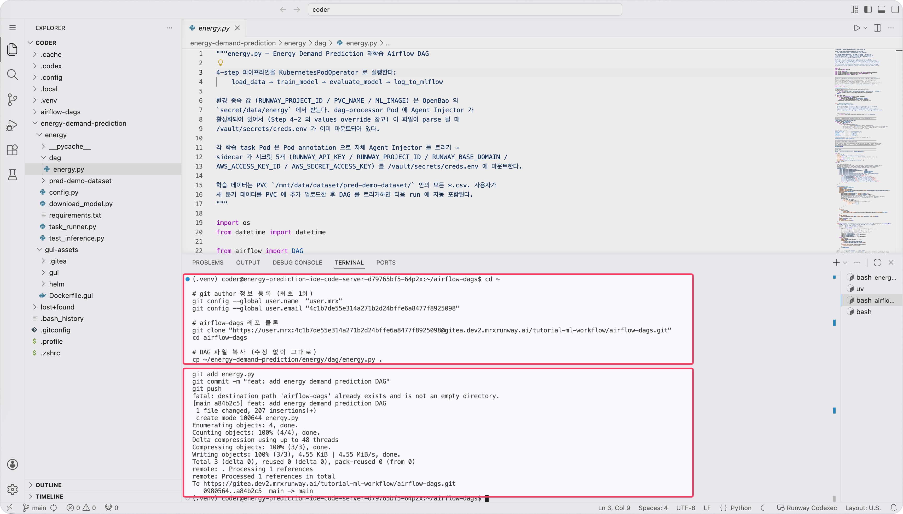
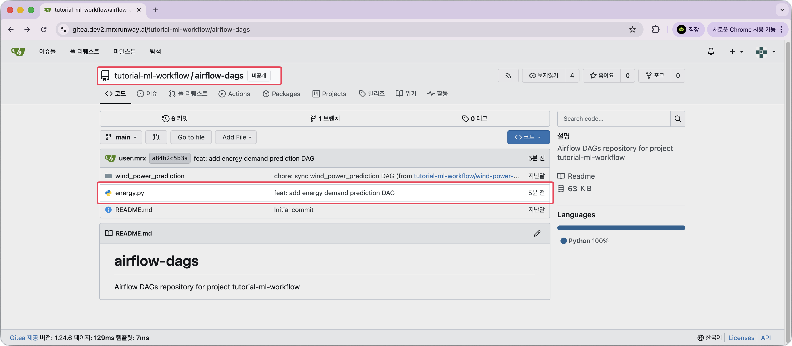

<!-- v2.2.0 에너지 수요 예측 MLOps 튜토리얼 신규 추가 | 2026-06-16 -->

# 3-2. DAG 파일 등록 {#dag-push}

`dag/energy.py` 파일을 Gitea 저장소에 push하면 Airflow가 에너지 수요 예측 학습 파이프라인을 실행하는 DAG를 자동으로 인식합니다.  

!!! note "airflow-dags 폴더"
     프로젝트 별로 Gitea에 저장소(레포)가 생성되고, airflow-dags 폴더(`<your-project-id>/airflow-dags`)가 자동으로 만들어지며, git-sync가 30초마다 airflow-dags 폴더의 변경 사항을 확인하고 Airflow에 반영합니다.

`dag/energy.py`는 수정 없이 그대로 push합니다. 시크릿과 환경 값은 OpenBao가 자동으로 주입합니다.

!!! tip "GPU 가속 (선택 사항)"
    `dag/energy.py` 상단의 `USE_GPU = False`를 `True`로 바꾸면 `train_model` task에 HAMi vGPU 4GB가 할당됩니다. GPU 자원이 부족한 환경에서는 `False`로 유지합니다.

```bash title="DAG 파일 Gitea 등록 - Code Server 터미널"
cd ~

# git author 정보 등록 (최초 1회)
git config --global user.name  "<your-gitea-username>"
git config --global user.email "<your-gitea-email>"

# airflow-dags 레포 클론
git clone "https://<your-gitea-username>:<your-gitea-pat>@gitea.<your-runway-domain>/<your-project-id>/airflow-dags.git"
cd airflow-dags

# DAG 파일 복사 (수정 없이 그대로)
cp ~/energy-demand-prediction/energy/dag/energy.py .

git add energy.py
git commit -m "feat: add energy demand prediction DAG"
git push
```



---

## DAG 인식 확인

Gitea에 push된 파일은 git-sync가 자동으로 Airflow에 동기화합니다. 30초~1분 뒤 Airflow UI에서 DAG가 나타납니다.

1. `https://<your-airflow-hostname>.<your-runway-domain>`에 접속합니다.
2. 30초 ~ 1분 대기합니다 (git-sync 주기).
3. DAG 목록에 `energy_demand_prediction_<your-project-id>`가 나타납니다.


!!! tip "DAG가 보이지 않는다면"

    Gitea 웹 UI에서 `airflow-dags` 레포의 `main` 브랜치에 `energy.py`가 있는지 확인합니다.  
    파일이 없으면 Code Server 터미널에서 push가 정상적으로 되었는지 확인합니다.

    - 접속 주소: `https://gitea.<your-runway-domain>/<your-project-id>/airflow-dags/`
    
    
---

:octicons-arrow-right-24: 다음 단계: **[3-3. DAG 실행 및 모니터링](03-dag-anatomy.md)**
