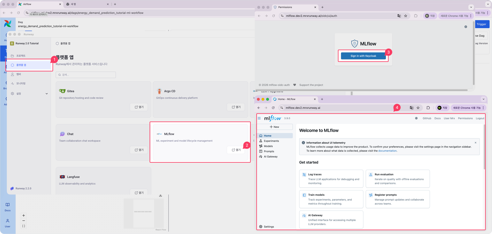
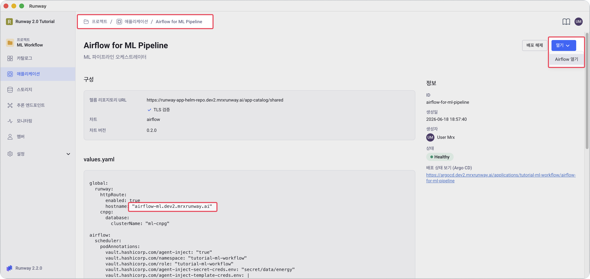
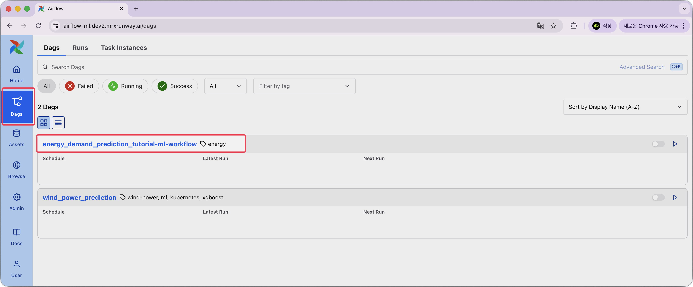
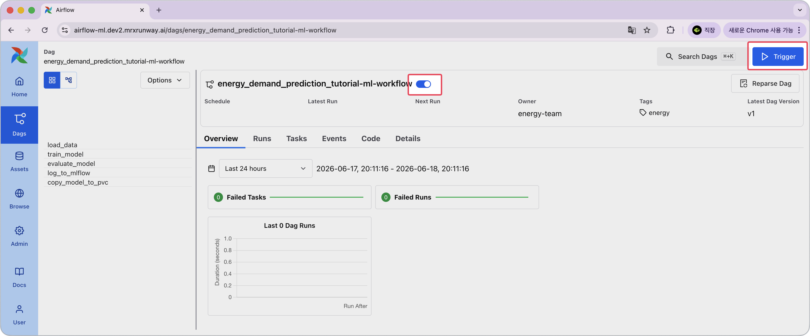
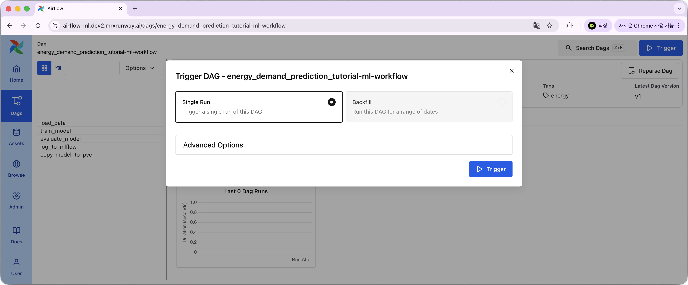
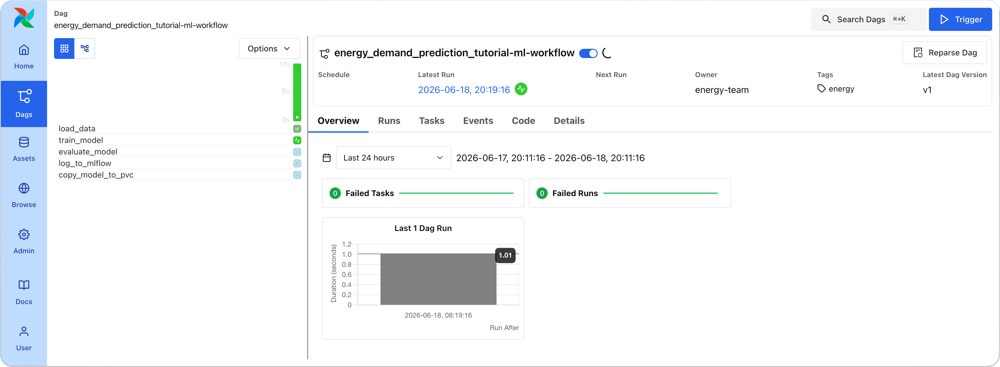
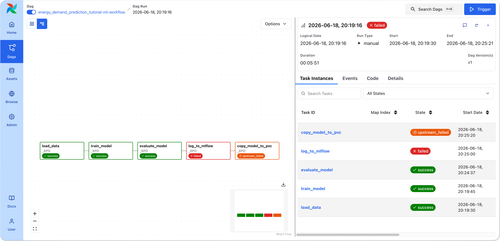
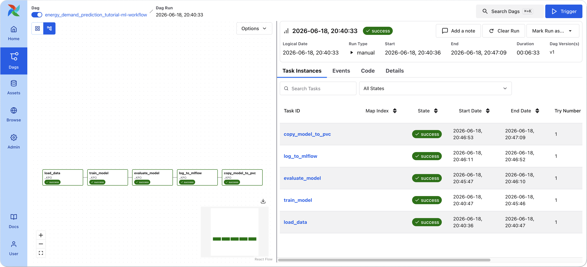
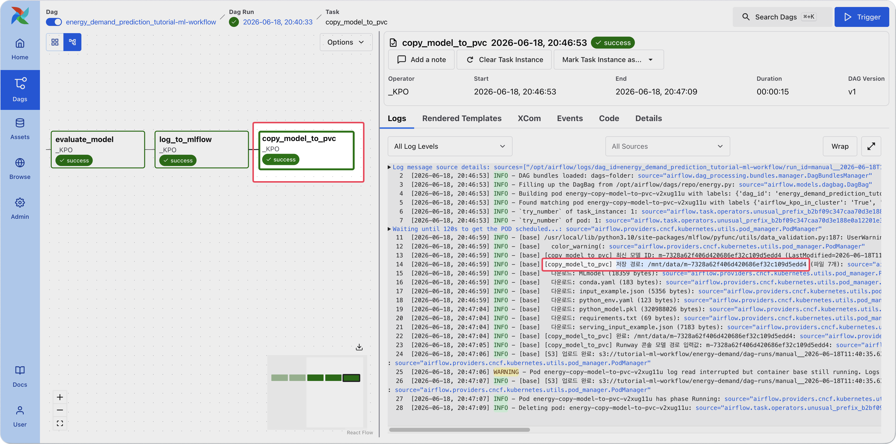

<!-- v2.2.0 에너지 수요 예측 MLOps 튜토리얼 신규 추가 | 2026-06-16 -->

# 3-3. DAG 실행 및 모니터링 {#trigger}

Airflow UI에서 에너지 수요 예측 학습 파이프라인 DAG를 실행하고 진행 상황을 모니터링합니다.  
2단계에서 Q1.csv만 배치했으므로, 지금 트리거하면 Q1 데이터만으로 Version 1 모델이 학습됩니다.

!!! warning "DAG 실행 전: MLflow에 먼저 로그인하세요"
    신규 프로젝트 생성 후 MLflow 권한이 즉시 적용되지 않습니다.  
    **MLflow에 최초 로그인**해야 권한이 반영되며, 이 단계를 건너뛰면 DAG 실행 시 `log_to_mlflow` task가 403 오류로 실패합니다.

    1. Runway 워크스페이스(홈 화면)의 좌측 메뉴에서 **플랫폼 앱**을 클릭합니다.
    2. **MLflow** 카드의 **열기**를 클릭합니다.
    3. **Sign in with Keycloak** 버튼을 클릭합니다.
    4. MLflow 홈 화면이 표시되면 로그인이 완료된 것입니다.

    

<div class="pdf-pb"></div>

## Airflow UI 접속

`https://<your-airflow-hostname>.<your-runway-domain>`에 접속합니다.

!!! note "Runway 콘솔에서 접속하는 방법"
    본인 프로젝트 > **애플리케이션** > 본인이 생성한 Airflow 앱 > **열기** > 본인이 등록한 링크 이름

    

---

## DAG 활성화 및 트리거

1. 좌측 메뉴에서 Dags 메뉴를 선택하고, DAG 목록에서 내가 생성한 DAG를 클릭합니다.

    

2. DAG 이름 오른쪽의 **토글을 클릭하여 DAG를 활성화**합니다. 우측 상단 **▶ Trigger**를 클릭합니다.

    

3. 팝업에서 **Single Run**을 선택하고, **Trigger** 버튼을 클릭해 DAG를 실행합니다.

    

---

<div class="pdf-pb"></div>

## 실행 상태 확인

DAG 트리거 후 Overview 탭에서 각 task의 실행 상태를 확인합니다. 전체 소요 시간은 약 6~10분입니다.



각 task의 예상 소요 시간은 다음과 같습니다.

```
load_data           ← PVC CSV 읽기 + S3 업로드 (수십 초)
└─ train_model      ← CPU 8코어 기준 약 5분 (가장 오래 걸림)
   └─ evaluate_model    ← Q1~Q4 추론 + 메트릭 계산 (수십 초)
      └─ log_to_mlflow  ← MLflow Registry 등록 (수십 초)
         └─ copy_model_to_pvc  ← S3 → PVC 복사 (수십 초)
```

---

<div class="pdf-pb"></div>

### ❌ 실패 예시 및 문제 해결

실패한 task는 빨간색, 선행 task 실패로 건너뛴 task는 주황색(upstream failed)으로 표시됩니다.



**문제 해결**

| 증상 | 원인 및 해결 |
|------|------------|
| `log_to_mlflow` 403 오류 | MLflow 미로그인. [MLflow 로그인 안내](#trigger)를 참고해 MLflow에 로그인한 뒤 DAG를 재실행 |
| `ImagePullBackOff` | OpenBao의 `ml_image` 값 오타·tag 누락. 0단계 0-2-C에서 `ml_image` 키 확인 |
| `/vault/secrets/creds.env: No such file` | [부록 A](../appendix/a-openbao.md)의 셋업 재확인 후 `vault-agent-init` 컨테이너 로그 확인 |
| `OOMKilled` 또는 task `Pending` | `train_model` 기본 cpu=8 / mem=4Gi가 부족한 환경. `dag/energy.py`의 cpu 제한값을 낮춰 재 push |

---

<div class="pdf-pb"></div>

### ✅ 성공 예시

Graph view에서 모든 task가 초록색으로 표시되면 정상 완료입니다.

DAG가 성공적으로 완료되면 학습된 모델이 MLflow Model Registry에 Version 1으로 등록되고, PVC에 저장됩니다.  
이제 이 모델로 4단계에서 추론 엔드포인트를 생성할 수 있습니다.



---

<div class="pdf-pb"></div>

## 모델 저장 경로 확인 {#check-model-path}

`copy_model_to_pvc` task를 클릭하고 **Logs** 탭을 열면 아래와 같은 출력을 확인할 수 있습니다.  
저장 경로에서 `/mnt/data/` 뒤의 `m-` 으로 시작하는 값이 모델 ID입니다. 이 값을 메모합니다.

- 모델 ID는 Runway가 학습된 모델 파일에 부여한 고유 식별자입니다. 4단계 추론 엔드포인트 생성 시 **모델 경로** 입력값으로 사용합니다.

```
[copy_model_to_pvc] 저장 경로: /mnt/data/m-xxxxxxxxxxxxxxxxxxxxxxxxxxxxxxxx
```



---

:octicons-arrow-right-24: 다음 단계: **[3-4. 학습 결과 확인](04-mlflow.md)**
