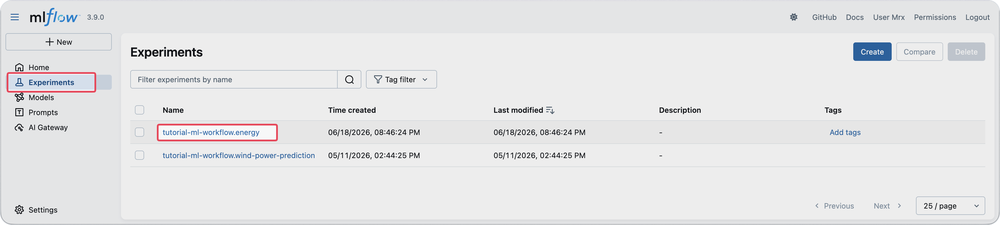
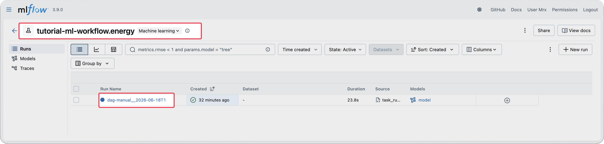
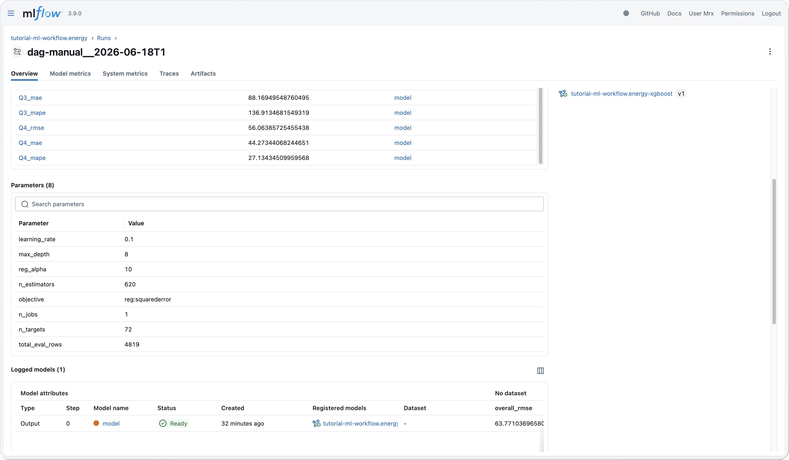
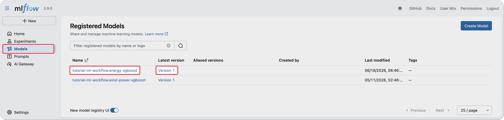

<!-- v2.2.0 에너지 수요 예측 MLOps 튜토리얼 신규 추가 | 2026-06-16 -->

# 3-4. 학습 결과 확인 {#mlflow}

학습이 완료되면 MLflow에서 실험 메트릭과 등록된 모델을 확인합니다.  
MLflow는 학습 결과(파라미터, 지표, 모델 파일)를 기록하고 버전별로 관리하는 도구입니다.

`https://mlflow.<your-runway-domain>`에 접속합니다.

## Experiment 확인

학습이 의도한 대로 실행되었는지, 메트릭과 파라미터가 올바르게 기록되었는지 확인합니다.

1. 좌측 사이드바에서 `<your-project-id>.energy`를 클릭합니다.

    

2. 방금 만든 Run을 클릭합니다.

    

3. Run 상세 화면에서 다음 항목을 확인합니다.
    - **Metrics**: 분기별 RMSE·MAE·MAPE
    - **Parameters**: XGBoost 하이퍼파라미터 값
    - **Logged models**: 모델이 정상적으로 기록되었는지 확인

    

---

## Registered Model 확인

모델이 MLflow Model Registry에 정상적으로 등록되었는지 확인합니다. 이후 추론 배포 시 모델 버전을 참조하는 데 사용됩니다.

1. 좌측 상단 **Models** 탭을 클릭합니다.
 
2. `<your-project-id>.energy-xgboost` 행에서 첫 번째 버전(Version 1)을 확인합니다.

     

---

:octicons-arrow-right-24: 다음 단계: **[4단계. 추론 엔드포인트 배포](../04-inference/index.md)**
