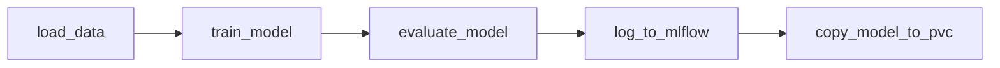

<!-- v2.2.0 에너지 수요 예측 MLOps 튜토리얼 신규 추가 | 2026-06-16 -->

# 3단계. 모델 학습

이 단계에서는 Airflow를 배포하고 학습 파이프라인을 등록하고, 실행합니다. DAG 실행이 완료되면 첫 번째 모델 버전(Version 1)이 학습되어 PVC와 MLflow Model Registry에 저장됩니다.

## 이 단계에서 하는 일

| 하위 페이지 | 내용 |
|------------|------|
| **3-1. CNPG 및 Airflow 배포** | CloudNativePG와 Airflow를 카탈로그 앱으로 배포합니다. |
| **3-2. DAG 파일 등록** | `airflow-dags` Gitea 레포에 DAG 파일을 push해 Airflow에 등록합니다. |
| **3-3. DAG 실행 및 모니터링** | Airflow UI에서 DAG를 트리거하고 각 task 상태를 확인합니다. |
| **3-4. 학습 결과 확인** | MLflow에서 Model Registry에 모델이 등록되었는지 확인합니다. |

## 실행할 파이프라인 구성
파이프라인은 데이터 로드부터 모델 저장까지 5개 task로 구성되며, 각 task는 사전 빌드된 ML 이미지를 사용해 독립된 Kubernetes Pod(KubernetesPodOperator)에서 실행됩니다.

| Task | 역할 |
|------|------|
| `load_data` | PVC에서 CSV 파일을 읽어 S3(오브젝트 스토리지)에 업로드합니다. |
| `train_model` | S3 데이터로 예측 모델을 학습합니다. |
| `evaluate_model` | 학습된 모델로 추론하고 메트릭을 계산합니다. |
| `log_to_mlflow` | 학습 결과(메트릭·모델 아티팩트)를 MLflow에 기록하고 Model Registry에 등록합니다. |
| `copy_model_to_pvc` | S3에 저장된 모델 파일을 PVC로 복사합니다. |

!!! note "Apache Airflow"
    작업(task)의 실행 순서와 의존성을 DAG(Directed Acyclic Graph, 방향성 비순환 그래프)로 정의하는 워크플로우 오케스트레이터입니다.
