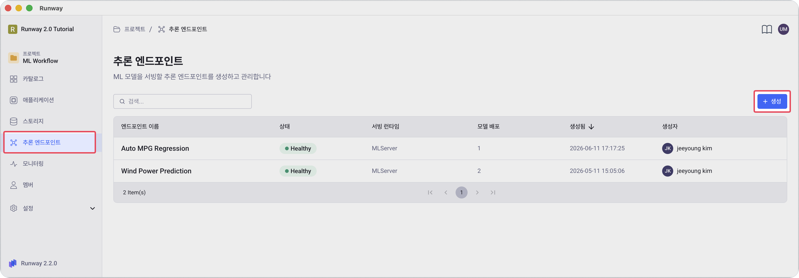
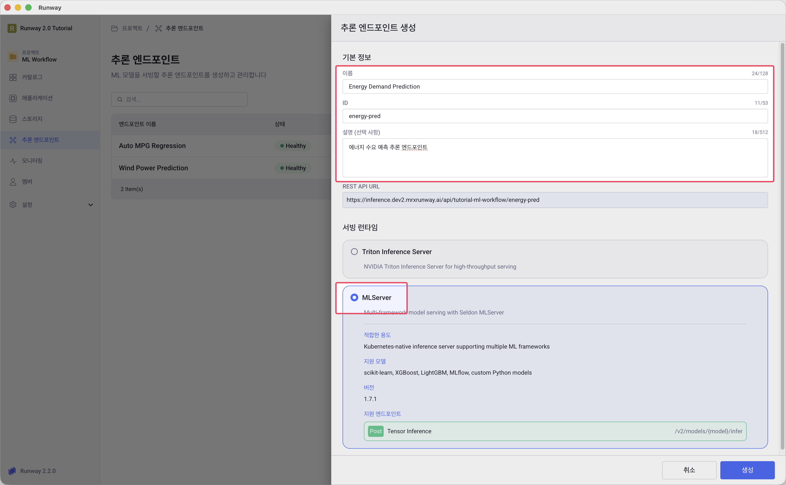

<!-- v2.2.0 에너지 수요 예측 MLOps 튜토리얼 신규 추가 | 2026-06-16 -->

# 4-1. 엔드포인트 생성 {#create-endpoint}

학습된 모델을 외부에서 호출할 수 있도록 추론 엔드포인트를 생성합니다.

> 본인 프로젝트 > **추론 엔드포인트** > **+ 생성**

1. 프로젝트 왼쪽 사이드바에서 **추론 엔드포인트** 메뉴를 클릭하고 오른쪽 상단 **+ 생성** 버튼을 클릭합니다.

     

2. **기본 정보**를 입력합니다.

    | 항목 | 값 |
    |------|----|
    | **이름** | 본인이 정하는 이름 (예: `Energy Demand Prediction`) |
    | **ID** | 본인이 정하는 ID (예: `energy-pred`) — 이후 `<endpoint-id>`로 표기 |

    !!! info "엔드포인트 ID"
        ID는 추론 URL에 포함되며, **생성 후 변경할 수 없습니다.**

    

3. **서빙 런타임**으로 `MLServer`를 선택합니다.

    !!! warning "런타임 변경 불가"
        서빙 런타임은 엔드포인트 생성 후 변경할 수 없습니다. 이 튜토리얼은 MLflow pyfunc 모델을 사용하므로 **MLServer**를 선택합니다.

4. **생성** 버튼을 클릭합니다. 상태가 **Healthy**로 표시되면 모델을 배포할 수 있습니다.

    

---

:octicons-arrow-right-24: 다음 단계: **[4-2. 모델 배포](02-deployment.md)**
