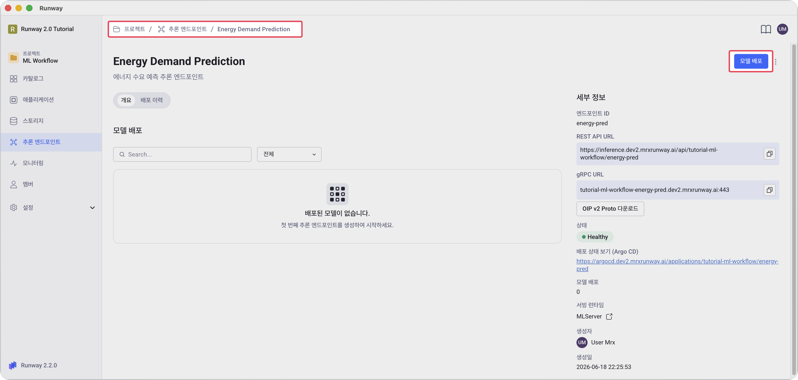
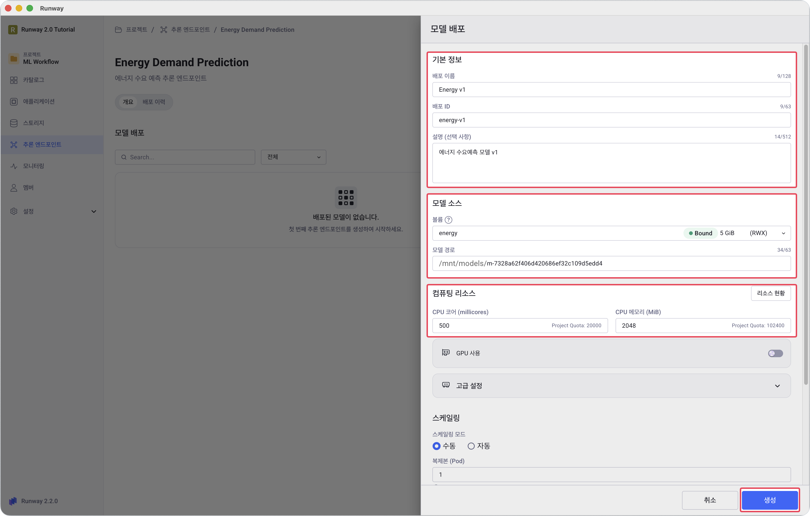
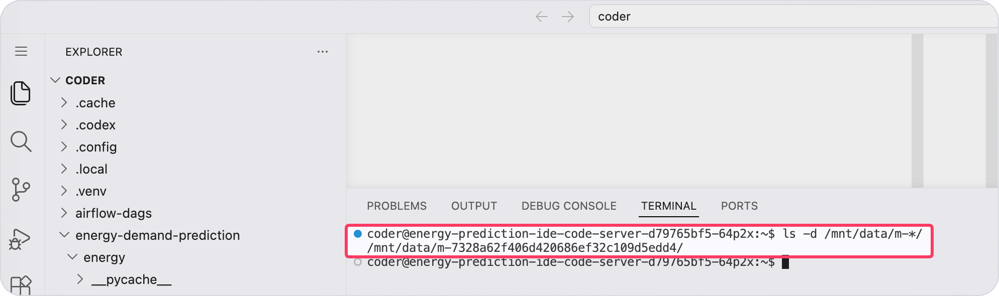
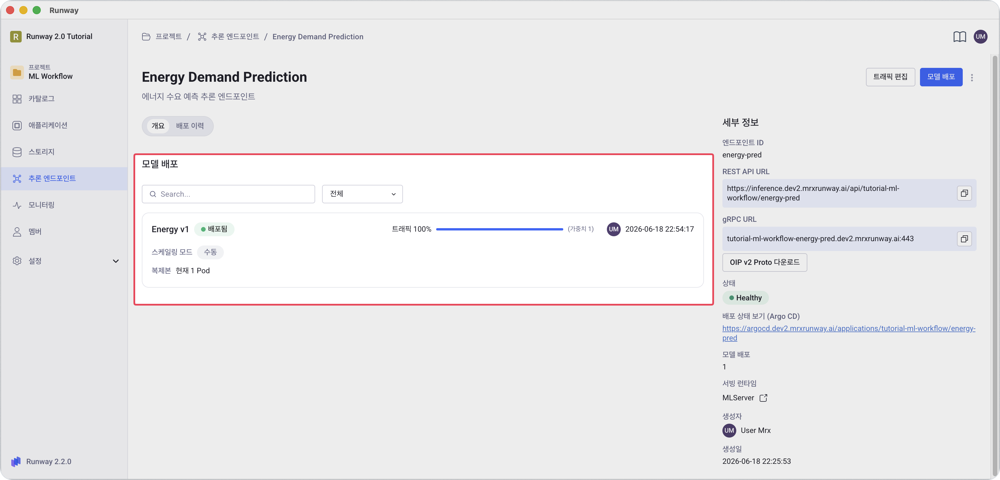

<!-- v2.2.0 에너지 수요 예측 MLOps 튜토리얼 신규 추가 | 2026-06-16 -->

# 4-2. 모델 배포 {#create-deployment}

생성한 엔드포인트에 학습 모델을 배포합니다. DAG가 PVC에 복사해둔 모델 파일을 경로로 지정합니다.

> 본인 프로젝트 > **추론 엔드포인트** > 본인이 생성한 추론 서비스 > **모델 배포** 버튼

1. 엔드포인트 상세 화면에서 오른쪽 상단의 **모델 배포** 버튼을 클릭합니다.

     

2. 배포 정보를 입력합니다.

     

    - **이름**: 본인이 정하는 이름 (예: `Energy v1`)
    - **ID**: 본인이 정하는 ID (예: `energy-v1`)
    - **볼륨**: `<your-pvc-name>` (1단계 1-1에서 만든 PVC)
    - **모델 경로**: `m-<your-model-id>`

        !!! note "모델 경로 확인 방법"
            **방법 1** — [3-3. DAG 실행 및 모니터링](../03-training/03-dag-anatomy.md#check-model-path)에서 메모한 모델 ID 사용

            **방법 2** — Code Server 터미널에서 확인

            ```bash
            ls -d /mnt/data/m-*/
            ```

            {width=90%}

    - **CPU**: `500` millicores
    - **Memory**: `2048` MiB

3. **생성** 버튼을 클릭합니다.

---

## 배포 상태 확인

모델 배포 카드의 상태 라벨이 **배포됨**으로 바뀌면 완료입니다. Pod이 준비될 때까지 수십 초~수 분이 걸립니다.

**배포됨** 상태가 오래 나타나지 않으면:

- 콘솔을 새로고침합니다.
- 그래도 바뀌지 않으면 모델 경로·볼륨·리소스 입력값을 재확인한 후 재편집·재배포합니다.



---

:octicons-arrow-right-24: 다음 단계: **[4-3. 추론 테스트](03-test.md)**
