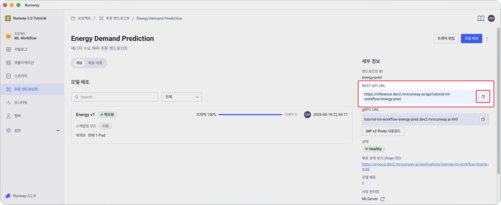
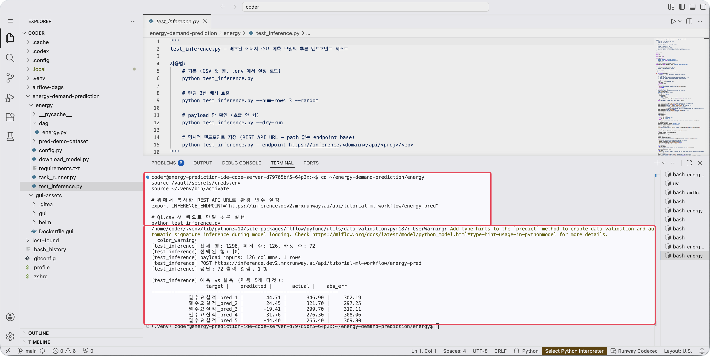
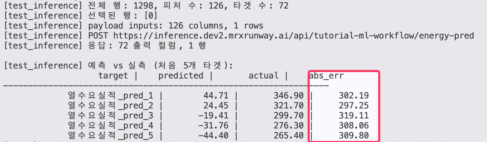

<!-- v2.2.0 에너지 수요 예측 MLOps 튜토리얼 신규 추가 | 2026-06-16 -->

# 4-3. 추론 테스트 {#test}

배포된 엔드포인트에 실제 추론 요청을 보내 정상 동작을 확인합니다.

## 추론 URL 확인

엔드포인트 상세 화면에서 **REST API URL**을 복사합니다.

> 본인 프로젝트 > **추론 엔드포인트** > 본인이 생성한 추론 서비스 > 오른쪽 **세부 정보** 영역의 **REST API URL**



```
https://inference.<your-runway-domain>/api/<your-project-id>/<endpoint-id>
```

이 URL은 다음 두 곳에서 재사용합니다.

- 아래 `test_inference.py` 호출 시 `INFERENCE_ENDPOINT` 환경 변수
- 5단계의 웹 대시보드 엔드포인트 입력

---

## REST API를 이용한 추론 테스트

미리 작성된 `test_inference.py`를 사용해 테스트 CSV 데이터를 엔드포인트에 전송하고 예측값과 실측값을 비교합니다.  
코드 내용은 :octicons-arrow-right-24: [2-5 코드 파일 살펴보기](../02-code-data/05-code-overview.md)를 참고하세요.

```bash title="추론 엔드포인트 검증 - Code Server 터미널"
cd ~/energy-demand-prediction/energy
source /vault/secrets/creds.env
source ~/.venv/bin/activate

# 위에서 복사한 REST API URL로 환경 변수 설정
export INFERENCE_ENDPOINT="https://inference.<your-runway-domain>/api/<your-project-id>/<endpoint-id>"

# Q1.csv 첫 행으로 단일 추론 실행
python test_inference.py
```

기대 출력:

```
[test_inference] 전체 행: 1298, 피처 수: 126, 타겟 수: 72
[test_inference] 선택된 행: [0]
[test_inference] POST https://inference.dev2.mrxrunway.ai/api/pdm-tutorial-energy/energy
[test_inference] 응답: 72 출력 컬럼, 1 행

[test_inference] 예측 vs 실측 (처음 5개 타겟):
                   target |    predicted |       actual |    abs_err
-----------------------------------------------------------------
       열수요실적_pred_1 |       XXX.XX |       YYY.YY |       Z.ZZ
       ...
```



## 옵션

| 옵션 | 설명 |
|------|------|
| `--num-rows 3 --random` | 랜덤 3행 배치 추론 |
| `--csv /mnt/data/dataset/pred-demo-testset/Q4.csv` | 다른 분기 데이터로 호출 |
| `--dry-run` | 실제 호출 없이 payload만 확인 |
| `--endpoint <url>` | 명시적 URL 지정 |

## 문제 해결 - 503/500 응답

MLServer가 모델 로드에 실패한 상태입니다.

| 원인 | 확인 방법 |
|------|----------|
| 모델 경로 오류 | 4-2에서 `m-<id>` 형태로 입력했는지 재확인 |
| 볼륨 오류 | DAG가 모델을 복사한 PVC와 동일한 `<your-pvc-name>`인지 확인 |
| OOMKilled | 4-2의 Memory를 2048 MiB 이상으로 늘려 재배포 |

위와 같은 오류가 발생한 경우:

1. [4-2. 모델 배포](02-deployment.md)로 돌아가 위 표를 참고해 잘못된 값을 수정한 후 재배포합니다.
2. 배포 상태가 **배포됨**으로 바뀌는지 확인합니다.
3. 이 페이지로 돌아와 추론 명령을 다시 실행합니다.

!!! info "Version 1 모델의 낮은 정확도"
    Version 1 모델은 Q1.csv 하나로만 학습한 의도적인 under-train 상태입니다. 5단계 웹 대시보드에서 분기별 정확도를 확인하고, 6단계에서 데이터를 추가해 재학습한 뒤 오차가 줄어드는 과정을 직접 확인합니다.

    

---

:octicons-arrow-right-24: 다음 단계: **[5단계. 웹 대시보드 배포](../05-gui/index.md)**
