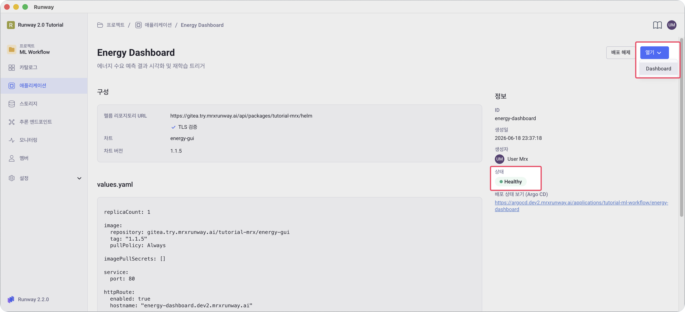
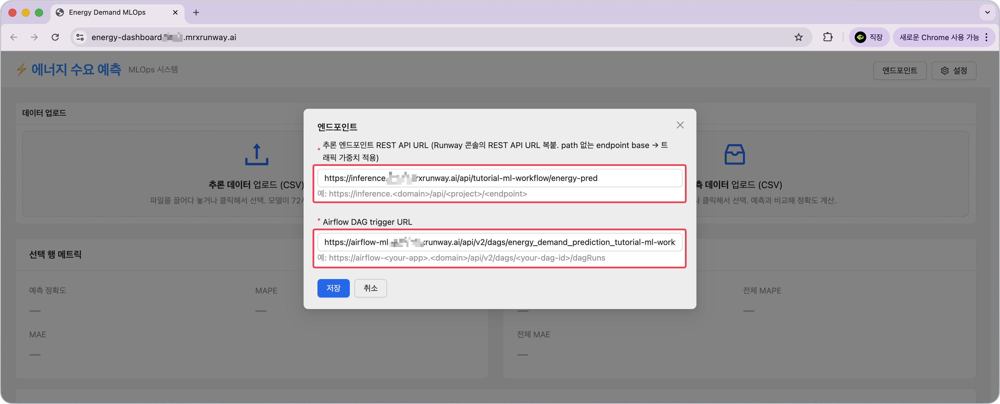

<!-- v2.2.0 에너지 수요 예측 MLOps 튜토리얼 신규 추가 | 2026-06-16 -->

# 5-2. 대시보드 접속 및 추론 설정 {#setup}

배포한 웹 대시보드에 접속하고, 추론 엔드포인트 URL을 등록합니다.

## 대시보드 접속

> `https://<your-gui-hostname>.<your-runway-domain>`에 접속합니다.

(또는)

> 본인 프로젝트 > **애플리케이션** > **Energy Dashboard** > **열기** > **Dashboard**

---

## 추론 및 파이프라인 실행 URL 설정 (최초 1회)

첫 접속 시에는 URL을 입력하는 팝업 창이 자동으로 표시됩니다.  

아래 URL을 본인의 환경 정보에 맞게 변경하여 입력하고, **저장**을 클릭합니다.

| 항목 | 값 |
|------|----|
| **추론 엔드포인트 URL** | 4-3단계에서 복사한 REST API URL `https://inference.<your-runway-domain>/api/<your-project-id>/<endpoint-id>` |
| **Airflow DAG trigger URL** | `https://<your-airflow-hostname>.<your-runway-domain>/api/v2/dags/energy_demand_prediction_<your-project-id>/dagRuns` |

!!! note "엔드포인트 설정 저장 및 변경"

     설정한 URL은 브라우저에 저장됩니다.  
     이 후 방문 시에는 이 팝업 창이 표시되지 않으며, 화면 오른쪽 상단의 **엔드포인트** 버튼을 클릭하여 URL을 수정할 수 있습니다.

---

:octicons-arrow-right-24: 다음 단계: **[5-3. Version 1 모델 정확도 확인](03-verify.md)**
