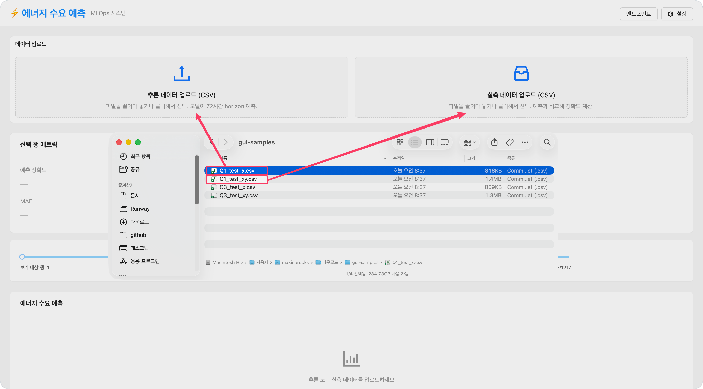
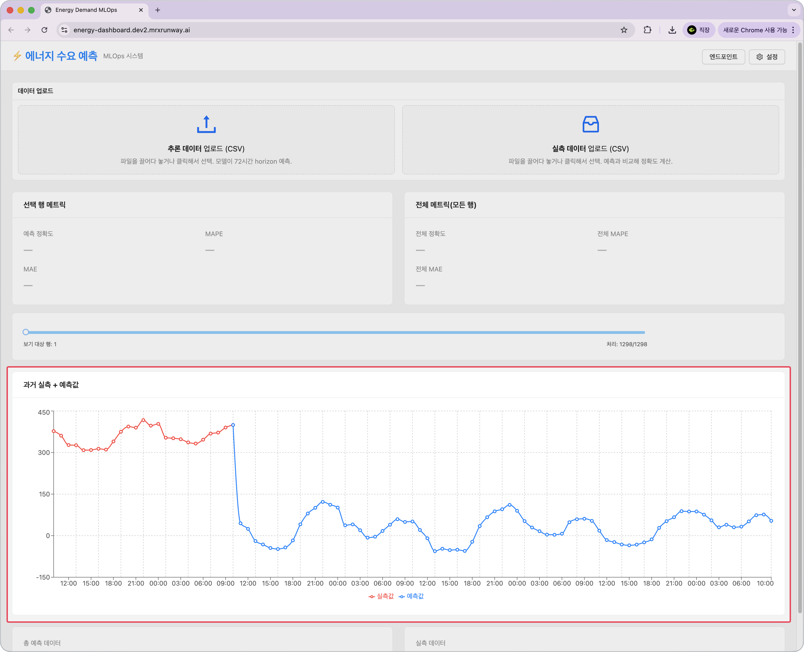
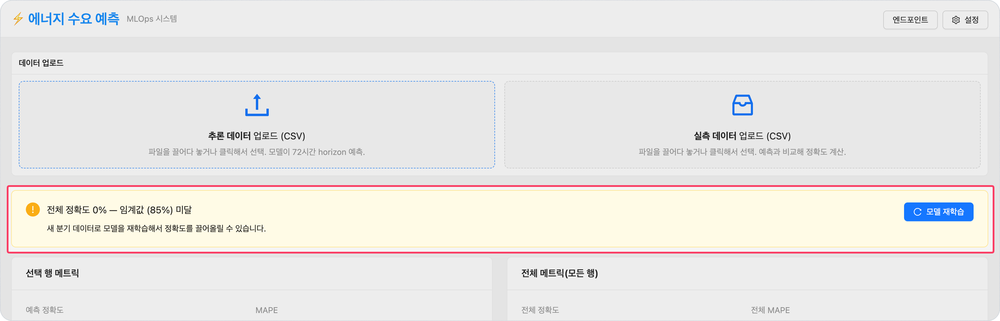
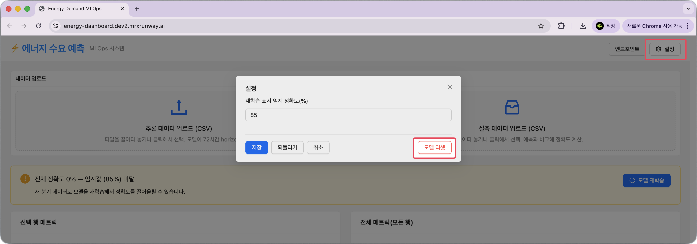
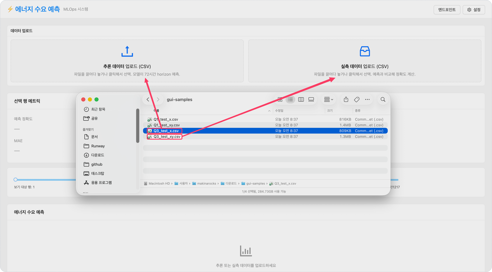

<!-- v2.2.0 에너지 수요 예측 MLOps 튜토리얼 신규 추가 | 2026-06-16 -->

# 5-3. 최초 모델 정확도 확인 {#test}

샘플 데이터를 업로드해 일부 데이터로만 학습된 Version 1 모델의 분기별 예측 정확도를 확인합니다.

샘플 CSV 파일은 아래 링크에서 다운로드하거나, 코드서버의 `tutorials/energy-demand-prediction/energy/gui-samples/` 폴더에서 저장하여 사용할 수 있습니다.

[:octicons-download-16: gui-samples.zip 다운로드](https://github.com/makinarocks/runway-v2-tutorials/raw/main/tutorials/energy-demand-prediction/energy/gui-samples/gui-samples.zip)

| 파일 | 내용 |
|------|------|
| `Q1_test_x.csv` | Q1 분기 피처만 (추론 데이터) |
| `Q1_test_xy.csv` | Q1 분기 피처 + 실측 타겟 (정확도 비교용) |
| `Q3_test_x.csv` | Q3 분기 피처만 (추론 데이터) |
| `Q3_test_xy.csv` | Q3 분기 피처 + 실측 타겟 (정확도 비교용) |

이 파일들은 다운로드하여 **로컬 PC에서** 브라우저로 직접 업로드합니다.

--- 

## Q1 테스트 (모델이 학습한 분기)

1. **추론 데이터 업로드** 영역에 `Q1_test_x.csv`를 drag-drop합니다.

    -  nginx가 추론 엔드포인트로 요청을 전달하고 72시간 예측 차트가 표시됩니다.
        
     

2. **실측 데이터 업로드** 영역에 `Q1_test_xy.csv`를 drag-drop합니다.

    -  차트에 실측 라인이 겹쳐 표시되고 **정확도 / MAPE / MAE** 메트릭이 계산됩니다.
    
     

     | 지표 | 설명 |
     |------|------|
     | **정확도** | `(1 - MAPE) × 100`으로 계산한 값입니다. 높을수록 예측이 실측에 가깝습니다. |
     | **MAPE** | 예측값과 실측값의 차이를 실측값 대비 비율로 나타낸 평균 오차입니다. 낮을수록 좋습니다. |
     | **MAE** | 예측값과 실측값의 절대 차이 평균입니다. 단위는 열수요 실적과 동일하며, 낮을수록 좋습니다. |

!!! note "임계값 및 재학습 배너"
    정확도가 임계값(85%) 미만이면 화면에 **모델 재학습** 배너가 표시됩니다.  
    임계값은 화면 오른쪽 상단의 **설정** 버튼을 클릭하여 변경할 수 있습니다.

    

---

## Q3 테스트 (모델이 학습하지 않은 분기)

1. 오른쪽 상단의 **설정** → **모델 리셋**으로 Q1 결과를 초기화합니다.

    

2. `Q3_test_x.csv` → `Q3_test_xy.csv` 순서로 업로드합니다.

    

3. 결과: Q1보다 정확도가 더 낮게 나옵니다. Version 1은 Q3 분기 데이터를 본 적이 없기 때문입니다.

    

!!! info "초기 모델 정확도가 낮은 이유"
    Version 1은 Q1 데이터 하나로만 학습한 상태입니다. 약 5,000행으로 72시간 multi-output regression을 학습하기에는 데이터가 부족합니다. Q1(학습한 분기)도 일반화가 어렵고, Q3(학습하지 않은 분기)는 더욱 낮게 나옵니다.

    이 결과가 자연스럽게 6단계로 이어집니다 — 데이터를 추가하고 재학습하면 어떻게 달라지는지 확인합니다.

---

:octicons-arrow-right-24: 다음 단계: **[6단계. 재학습 및 트래픽 전환](../06-retrain/index.md)**
