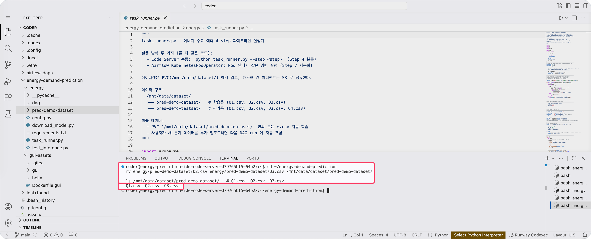

<!-- v2.2.0 에너지 수요 예측 MLOps 튜토리얼 신규 추가 | 2026-06-16 -->

# 6-1. 학습 데이터 추가 {#add-data}

Airflow는 파이프라인을 실행할 때 PVC의 모든 `*.csv`를 학습 데이터로 사용합니다. Q2·Q3 파일을 PVC에 추가하면 재학습 시 세 분기 데이터를 모두 반영할 수 있습니다.

2단계에서 Code Server에 남겨둔 Q2·Q3 파일을 PVC로 이동합니다.


```bash title="학습 데이터 추가 이동 - Code Server 터미널"
cd ~/energy-demand-prediction
mv energy/pred-demo-dataset/Q2.csv energy/pred-demo-dataset/Q3.csv /mnt/data/dataset/pred-demo-dataset/

ls /mnt/data/dataset/pred-demo-dataset/   # Q1.csv  Q2.csv  Q3.csv
```



---

:octicons-arrow-right-24: 다음 단계: **[6-2. 재학습 실행](02-trigger.md)**
