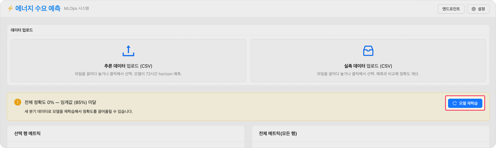
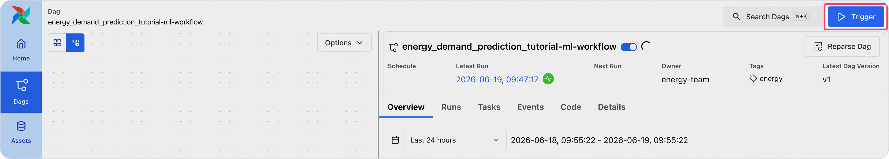

<!-- v2.2.0 에너지 수요 예측 MLOps 튜토리얼 신규 추가 | 2026-06-16 -->

# 6-2. 재학습 실행 {#trigger}

추가된 Q2·Q3 데이터로 모델을 재학습합니다. 두 가지 방법 중 하나를 선택합니다.

## 방법 A — 웹 대시보드 재학습 버튼 (권장)

1. 웹 대시보드에서 5단계와 동일하게 Q1 데이터를 업로드합니다.
2. 정확도가 임계값(85%) 미만이면 **재학습** 버튼이 표시됩니다.
3. **재학습** 버튼을 클릭합니다.

!!! note "동작 원리 및 소요 시간"
    
    - 웹 대시보드 → nginx → Airflow REST API에 새 DAG Run 생성 요청을 보냅니다.  
    Airflow는 PVC의 모든 `*.csv`(Q1+Q2+Q3)를 포함해 학습을 실행합니다.

    - 재학습은 초기 학습보다 데이터량이 많아 **5~10분 정도 소요**될 수 있습니다. 진행 상황은 **본인이 생성한 Airflow(`<your-airflow-hostname>.<your-runway-domain>`)에서 확인**할 수 있습니다.

---

## 방법 B — Airflow UI 직접 트리거

Airflow DAG는 `/mnt/data/dataset/pred-demo-dataset/`의 모든 `*.csv`를 자동으로 학습합니다. **데이터 파일을 추가하는 것이 곧 학습 범위를 늘리는 것**입니다.

> Airflow UI → `<your-airflow-hostname>.<your-runway-domain>` → 우측 상단 **▶ Trigger DAG** (별도 config 없음)

- 재학습은 초기 학습보다 데이터량이 많아 **5~10분 정도 소요**될 수 있습니다.

---

:octicons-arrow-right-24: 다음 단계: **[6-3. Version 2 학습 결과 확인](03-monitor.md)**
