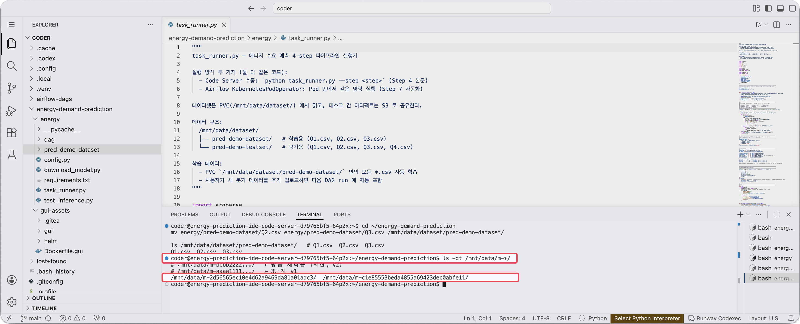
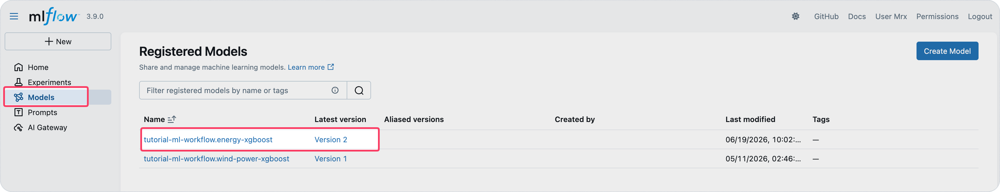

<!-- v2.2.0 에너지 수요 예측 MLOps 튜토리얼 신규 추가 | 2026-06-16 -->

# 6-3. Version 2 학습 결과 확인 {#monitor}

재학습 진행 상황을 확인하고, 완료 후 새 모델이 PVC와 MLflow에 정상 등록됐는지 검증합니다.

Airflow UI **Grid view**에서 진행 현황을 확인합니다. 데이터가 3배로 늘어나 `train_model`이 3단계보다 더 오래 걸립니다.

## 재학습 모델 폴더 확인

완료 후, Code Server 터미널에서 PVC에 새 모델 폴더가 있는지 확인합니다.

```bash title="재학습 모델 폴더 확인 - Code Server 터미널"
ls -dt /mnt/data/m-*/
# /mnt/data/m-bbbb2222.../   ← 방금 재학습 (최신, v2)
# /mnt/data/m-aaaa1111.../   ← 3단계 v1
```



## MLflow에서 확인

> `mlflow.<your-runway-domain>` 접속

MLflow → Models → `<your-project-id>.energy-xgboost`에서도 새 버전(Version 2)이 등록된 것을 확인합니다.



---

:octicons-arrow-right-24: 다음 단계: **[6-4. Version 2 배포 추가](04-add-v2.md)**
