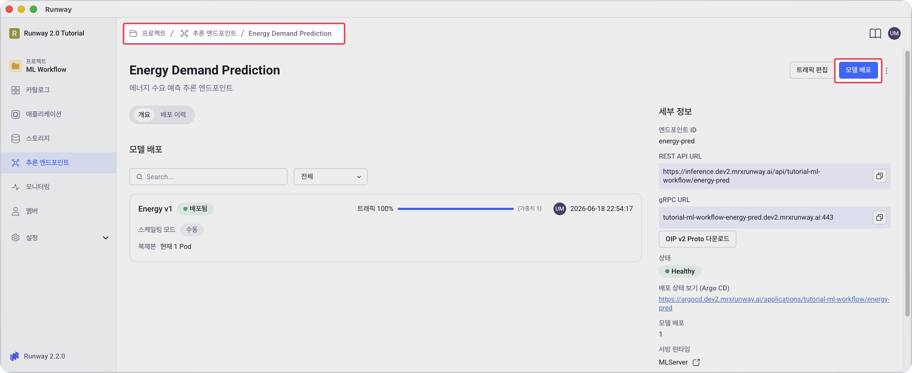
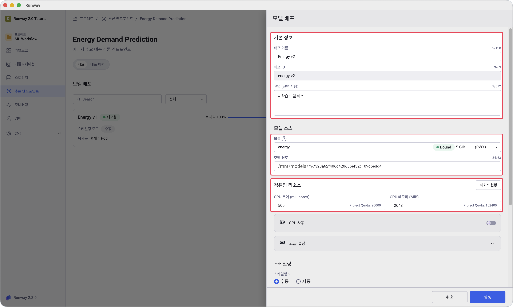
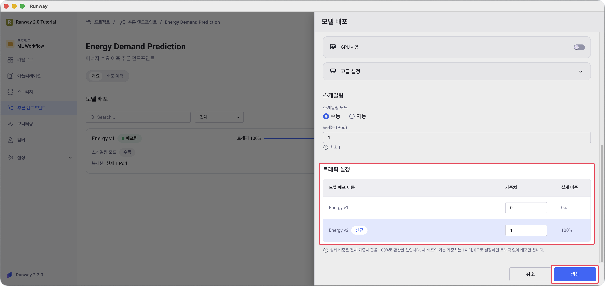
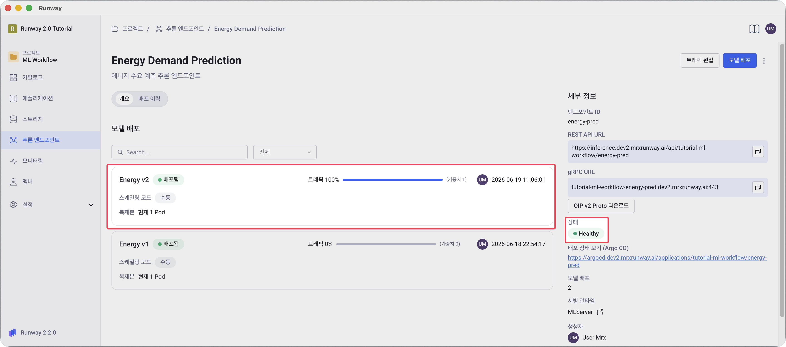

<!-- v2.2.0 에너지 수요 예측 MLOps 튜토리얼 신규 추가 | 2026-06-16 -->

# 6-4. Version 2 배포 추가 {#add-v2}

4단계와 동일한 엔드포인트에 두 번째 배포를 추가합니다.

> 본인 프로젝트 > **추론 엔드포인트** > 본인이 생성한 추론 서비스 > **모델 배포** 버튼

1. 추론 엔드포인트 상세 화면 우측 상단 **모델 배포** 버튼을 클릭합니다.

    

2. 기본 정보와 모델 소스를 입력합니다.

    | 항목 | 값 |
    |------|-----|
    | **배포 이름** | 본인이 정하는 이름 (예: `Energy v2`) |
    | **배포 ID** | 본인이 정하는 ID (예: `energy-v2`) |
    | **볼륨** | `<your-pvc-name>` (동일 PVC) |
    | **모델 경로** | 6-3에서 확인한 새 `m-<id>` 폴더 경로 |
    | **CPU / Memory** | Version 1과 동일 |

    

3. 트래픽 설정에서 **Energy v1**을 `0`, **Energy v2**를 `1`로 입력한 후 **생성**을 클릭합니다.

    

    - 1~2분 뒤 Version 2 배포 카드 상태가 **배포됨**으로 바뀌면 완료입니다.

        

:octicons-arrow-right-24: 다음 단계: **[6-5. Version 1 vs Version 2 비교](05-compare.md)**