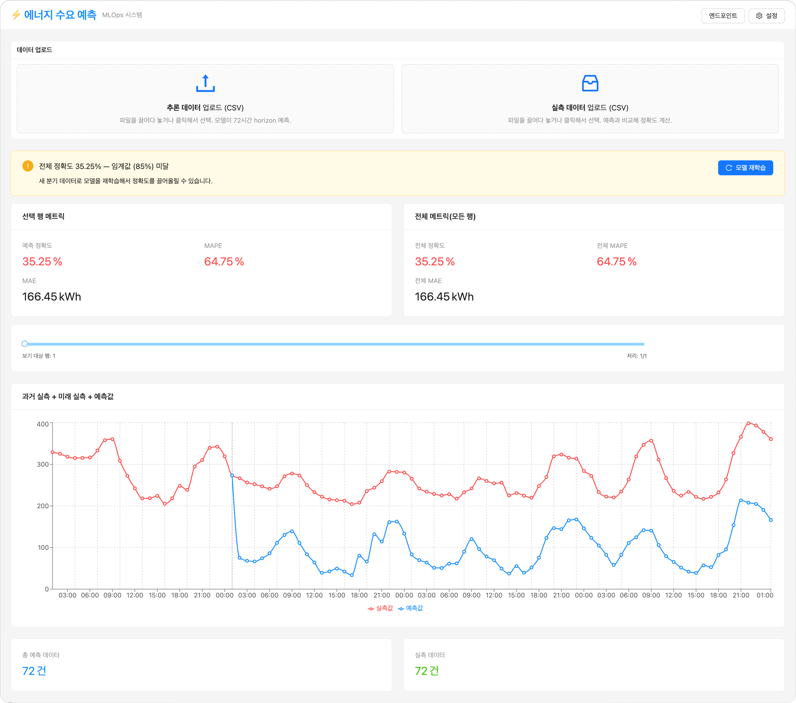
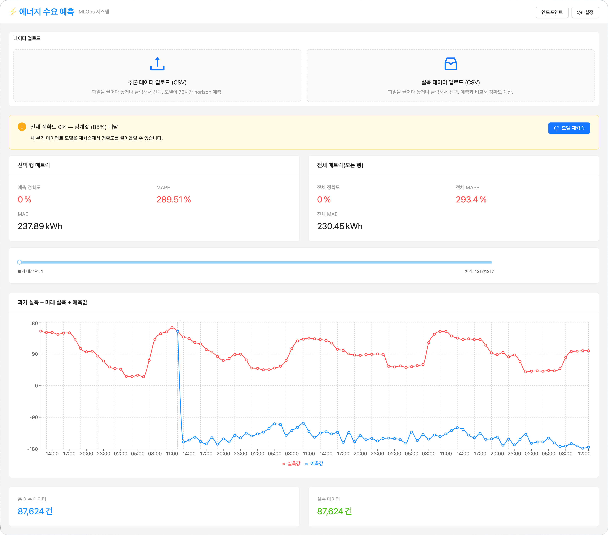
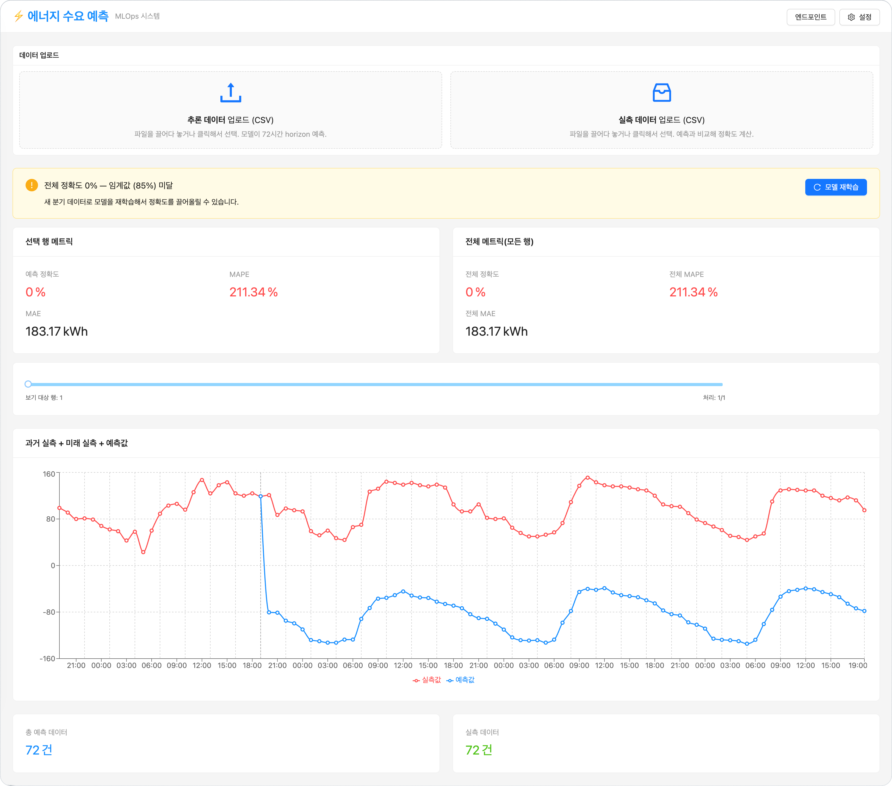

<!-- v2.2.0 에너지 수요 예측 MLOps 튜토리얼 신규 추가 | 2026-06-16 -->

# 6-5. Version 1 vs Version 2 비교 {#compare}

웹 대시보드에서 Version 1과 Version 2 모델의 분기별 예측 정확도를 비교합니다.

## 재학습 후 결과 확인
웹 대시보드 새로고침 → 설정 → **모델 리셋** 후 [5-3단계](../05-gui/03-verify.md)와 동일한 방법으로 각 분기를 테스트합니다.

| 테스트 | 기대 결과 |
|--------|----------|
| 1분기 Q1 (`Q1_test_x.csv`와 `Q1_test_xy.csv`) | Version 1 대비 **개선** — Q2·Q3 데이터가 모델 안정성에 기여 |
| Q3 (`Q3_test_x.csv`와 `Q3_test_xy.csv`) | Version 1 대비 개선되나 임계값 미만일 수 있음 |

## 분기별 재학습 전과 후 비교

**1분기 Version 1 및 Version 2 결과 비교**

재학습 전 (Version 1)

재학습 후 (Version 2)

**3분기 Version 1 및 Version 2 결과 비교**

재학습 전 (Version 1)

재학습 후 (Version 2)

!!! info "3분기(Q3) 정확도가 1분기(Q1)보다 낮은 이유"
    Version 2가 Q3 데이터를 학습했음에도 Q1만큼 회복되지 않을 수 있습니다. 냉방·전환기 수요는 실제 기온·습도에 크게 의존하는데, 현재 데이터셋에는 **기상 변수가 없어** 모델이 학습할 신호가 부족합니다. Q3 정확도를 높이려면 기상 피처 추가가 우선적으로 필요합니다.

!!! note "문제 해결"
    트래픽이 Version 2로 전달되는지 의심된다면 아래 항목을 확인합니다.

    - 추론 엔드포인트 상세의 트래픽 분배에서 Version 2가 100%인지 확인합니다.
    - Version 2 배포 카드의 모델 경로가 새 `m-<id>`와 일치하는지 확인합니다.
    - 웹 대시보드 엔드포인트 modal의 URL이 REST API URL(path 없는 base) 형태인지 재확인합니다.

---

## 튜토리얼 완료 {#done}

여기까지 완료했다면 Runway 위에서 end-to-end ML 워크플로우를 처음부터 끝까지 경험한 것입니다.

**이 튜토리얼에서 경험한 것:**

- OpenBao Agent Injector를 사용한 시크릿 관리 — 코드에 하드코딩 없이 모든 Pod이 자동으로 시크릿을 받아가는 패턴
- Runway 카탈로그 앱(Code Server, CNPG, Airflow)을 values.yaml로 배포하고 의존성을 구성하는 방법
- Airflow DAG + KubernetesPodOperator를 사용한 ML 학습 파이프라인 자동화
- MLflow Model Registry를 통한 모델 버전 관리
- Runway 추론 엔드포인트에서의 트래픽 비중 기반 A/B 배포
- React + nginx 기반 커스텀 앱 배포 (외부 Helm 차트)
- 데이터 추가 → 재학습 → 트래픽 전환의 반복 가능한 MLOps 사이클

