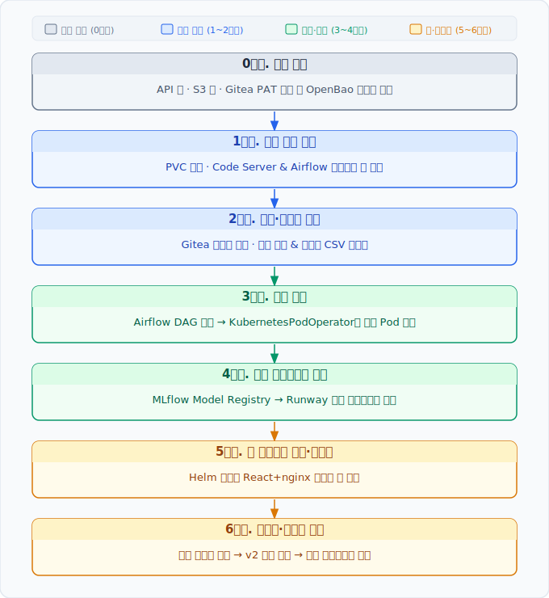
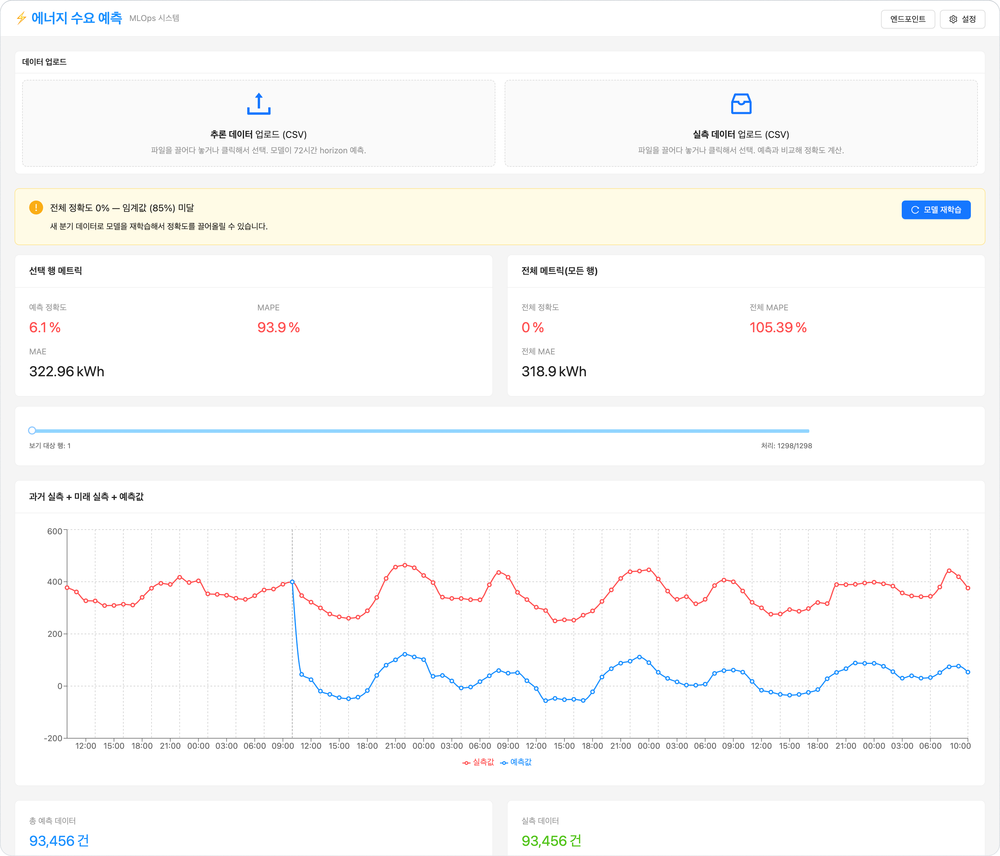

<!-- v2.2.0 에너지 수요 예측 MLOps 튜토리얼 신규 추가 | 2026-06-16 -->

# 무엇을 만드나요?

과거 25시간의 열수요·기온 실적과 향후 72시간의 기온 예보를 입력받아,  
**향후 72시간의 열수요(Gcal/h)를 예측**하는 ML 서비스를 Runway 위에 구성합니다.

| 항목 | 내용 |
|------|------|
| **입력 피처** | 시간·요일 등 메타 4개 + 과거 25시간 열수요 + 과거 25시간 기온 + 미래 72시간 기온 예보 = **총 126개** |
| **예측 대상** | 미래 72시간 열수요 — 시간당 1개 XGBoost 모델 × 72개를 `MultiOutputRegressor`로 묶어 사용 |
| **학습 데이터** | 분기별 CSV (Q1 → Q1+Q2+Q3 순으로 단계적으로 추가) |

---

## 전체 흐름

Runway에서 필요한 작업 환경을 구성하는 것부터, 추론 결과와 정확도를 확인하고, 재학습을 실행할 수 있는 웹 대시보드를 직접 배포하고 활용하는 것까지, MLOps의 핵심 패턴을 Runway 플랫폼에서 어떻게 구현하는지 단계별로 안내합니다.

7단계까지 완료하면 데이터 추가 → 재학습 → 트래픽 전환으로 이어지는 반복 가능한 MLOps 사이클을 경험하게 됩니다.

---

## 최종 산출물 대시보드

튜토리얼을 완료하면 아래와 같은 예측 대시보드를 직접 배포하고 사용하게 됩니다.  
학습된 모델의 72시간 열수요 예측 결과와 실적 대비 정확도를 확인하고, 새 분기 데이터를 추가해 재학습을 트리거하는 것까지 이 대시보드에서 수행합니다.

---

:octicons-arrow-right-24: 시작: **[0단계. 사전 준비](../00-preparation/index.md)**