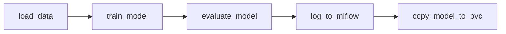

<!-- source: intro/index.md -->

<!-- v2.2.0 에너지 수요 예측 MLOps 튜토리얼 신규 추가 | 2026-06-16 -->

# 에너지 수요 예측 MLOps 튜토리얼

지역난방 열수요 예측 시나리오를 예제로,  
**데이터 준비부터 모델 학습·서비스 배포·재학습까지 ML 기본 워크플로우 전체를 처음부터 끝까지 수행**합니다.  

---

## 이 튜토리얼의 초점

**머신러닝 알고리즘이나 코드 자체는 다루지 않습니다.** Runway 자체 사용 경험에 집중하기 위해 사전 빌드된 이미지와 코드를 그대로 사용하며, Runway 플랫폼에서 다음을 구성하는 방법을 익히는 데 집중합니다.

- OpenBao를 통한 시크릿 중앙 관리 — Pod이 시작 시 자동으로 시크릿을 주입받는 패턴
- Runway 카탈로그 앱(Code Server, Airflow)을 values.yaml로 배포하고 의존성을 구성하는 방법
- Airflow DAG + KubernetesPodOperator를 사용한 ML 학습 파이프라인 실행
- MLflow Model Registry를 통한 모델 버전 관리
- Runway 추론 엔드포인트 배포 및 트래픽 비중 기반 A/B 전환
- 외부 Helm 차트를 사용한 웹 대시보드(React+nginx) 배포 및 재학습 활용

---

## 사전 지식

이 튜토리얼을 시작하기 전에 아래 수준의 지식이 있으면 막힘 없이 진행할 수 있습니다.

| 영역 | 필요한 수준 |
|------|------------|
| **MLOps 기본 개념** | 데이터 준비 → 학습 → 평가 → 배포 → 재학습의 흐름을 이해하고 있음 |
| **Kubernetes 기초** | PVC, Pod, namespace, annotation 개념을 들어본 적 있음 |
| **Git / 터미널** | `git clone`, `git push`, bash 기본 명령을 사용할 수 있음 |
| **Runway 플랫폼 접근** | Runway 콘솔에 로그인 가능하고 프로젝트가 생성된 상태 |

---

!!! warning "튜토리얼 작성 환경 및 버전 안내"
    이 튜토리얼은 **Runway v2.2.1 / macOS** 환경을 기준으로 작성되었습니다. 이전 버전이나 다른 운영체제 환경에서도 수행할 수 있으나, 일부 단계에서 환경에 맞는 수정이 필요할 수 있습니다.

    v2.2.1 미만 버전을 사용 중이라면, [부록 A. OpenBao Agent Injector 선행 조건](../appendix/a-openbao.md)에 설명된 설정이 플랫폼 관리자에 의해 사전에 완료되어 있어야 합니다. 진행 전 플랫폼 관리자에게 확인하세요.

:octicons-arrow-right-24: 다음: **[무엇을 만드나요?](what-we-build.md)**


---


<!-- source: intro/runway.md -->

<!-- v2.2.0 에너지 수요 예측 MLOps 튜토리얼 신규 추가 | 2026-06-16 -->

# Runway에서 애플리케이션은?

Runway에서는 코드 편집기, 파이프라인 도구, 실험 추적 도구, 대시보드와 같이 필요한 도구를 **애플리케이션(앱)** 단위로 생성하여 사용합니다.

Runway는 Kubernetes 기반으로 동작하며 다양한 오픈소스를 Helm 차트로 배포할 수 있어, **원하는 도구를 조합하는 작업 환경을 자유롭게 구성**할 수 있습니다. 대신 각 앱에서 자체 UI와 CLI(Command Line Interface)를 가지고 있기 때문에 **실제 많은 작업이 Runway 콘솔이 아닌 각 앱의 화면**에서 이루어집니다.

---

## 애플리케이션 유형

앱은 배포 방식에 따라 세 가지로 구분됩니다.

| 유형 | 배포 방식 | 설명 | 이 튜토리얼에서 |
|------|----------|------|----------------|
| **플랫폼 앱** | 플랫폼 제공 | 별도 배포 없이 로그인하여 사용 | Gitea, MLflow |
| **카탈로그 앱** | 카탈로그에서 배포 | 사용자가 카탈로그 메뉴의 <p> 앱 목록(템플릿)에서 선택해 배포 | Code Server, Airflow |
| **커스텀 앱** | 직접 배포 | 사용자가 직접 구성하거나 <p> 공개된 헬름 차트로 배포 | 에너지 수요 예측 대시보드 |

이 세 가지 배포 방식을 모두 이 튜토리얼에서 직접 경험합니다.

---

<div class="pdf-pb"></div>

## 튜토리얼에서 사용하는 앱 목록

이 튜토리얼에서 배포하거나 접속하는 앱 전체 목록입니다.  
접속 URL의 `<your-...>` 플레이스홀더는 환경마다 다르며, `<your-runway-domain>`을 제외한 실제 값은 각 단계에 따라 생성됩니다.

| 앱 | 배포 방식 | 용도 | 접속 URL | 접속 가능 단계 |
|----|------|------|----------|---------------|
| **OpenBao** | 플랫폼 제공 | 시크릿 중앙 관리 | `https://openbao.<your-runway-domain>` | 프로젝트 생성 후 |
| **Gitea** | 플랫폼 제공 | DAG 코드 저장소 | `https://gitea.<your-runway-domain>` | 프로젝트 생성 후 |
| **Code Server** | 카탈로그에서 배포 | 코드 편집·실행 IDE | `https://<your-ide-hostname>.<your-runway-domain>` | 1단계 배포 완료 후 |
| **Apache Airflow** | 카탈로그에서 배포 | ML 학습 파이프라인 실행 및 스케줄링 | `https://<your-airflow-hostname>.<your-runway-domain>` | 3단계 배포 완료 후 |
| **MLflow** | 플랫폼 제공 | 실험 결과 조회 및 모델 레지스트리 | `https://mlflow.<your-runway-domain>` | 3단계 학습 완료 후 |
| **에너지 수요 예측 대시보드** | 커스텀 앱 | 추론 결과 조회 및 재학습 트리거 | `https://<your-gui-hostname>.<your-runway-domain>` | 5단계 배포 완료 후 |

사용 편의를 위해 아래 내용을 복사해 메모장에 붙여넣고, 배포 후 실제 URL을 채워두세요.

```
OpenBao: https://openbao.<your-runway-domain>
Gitea: https://gitea.<your-runway-domain>
Code Server: https://<your-ide-hostname>.<your-runway-domain>
Apache Airflow: https://<your-airflow-hostname>.<your-runway-domain>
MLflow: https://mlflow.<your-runway-domain>
에너지 수요 예측 대시보드: https://<your-gui-hostname>.<your-runway-domain>
```


---


<!-- source: intro/what-we-build.md -->

<!-- v2.2.0 에너지 수요 예측 MLOps 튜토리얼 신규 추가 | 2026-06-16 -->

# 무엇을 만드나요?

과거 25시간의 열수요·기온 실적과 향후 72시간의 기온 예보를 입력받아,  
**향후 72시간의 열수요(Gcal/h)를 예측**하는 ML 서비스를 Runway 위에 구성합니다.

| 항목 | 내용 |
|------|------|
| **입력 피처** | 시간·요일 등 메타 4개 + 과거 25시간 열수요 + 과거 25시간 기온 + 미래 72시간 기온 예보 = **총 126개** |
| **예측 대상** | 미래 72시간 열수요 — 시간당 1개 XGBoost 모델 × 72개를 `MultiOutputRegressor`로 묶어 사용 |
| **학습 데이터** | 분기별 CSV (Q1 → Q1+Q2+Q3 순으로 단계적으로 추가) |

---

<div class="pdf-pb"></div>

## 전체 흐름

Runway에서 필요한 작업 환경을 구성하는 것부터, 추론 결과와 정확도를 확인하고, 재학습을 실행할 수 있는 웹 대시보드를 직접 배포하고 활용하는 것까지, MLOps의 핵심 패턴을 Runway 플랫폼에서 어떻게 구현하는지 단계별로 안내합니다.

7단계까지 완료하면 데이터 추가 → 재학습 → 트래픽 전환으로 이어지는 반복 가능한 MLOps 사이클을 경험하게 됩니다.

---

<div class="pdf-pb"></div>

## 최종 산출물 대시보드

튜토리얼을 완료하면 아래와 같은 예측 대시보드를 직접 배포하고 사용하게 됩니다.  
학습된 모델의 72시간 열수요 예측 결과와 실적 대비 정확도를 확인하고, 새 분기 데이터를 추가해 재학습을 트리거하는 것까지 이 대시보드에서 수행합니다.

---

:octicons-arrow-right-24: 시작: **[0단계. 사전 준비](../00-preparation/index.md)**


---


<!-- source: 00-preparation/index.md -->

<!-- v2.2.0 에너지 수요 예측 MLOps 튜토리얼 신규 추가 | 2026-06-16 -->

# 0단계. 사전 준비

이후 모든 단계에서 사용하는 값들을 먼저 확보하고, OpenBao에 등록합니다.

!!! info "시작 전 확인"
    튜토리얼을 진행할 프로젝트에 **멤버 이상의 역할**로 가입되어 있는지 확인하세요.  
    가입된 프로젝트가 없다면, 직접 [프로젝트를 생성](../../guide/manage/workspace/project-create.md#create-project)(워크스페이스 멤버 이상)하거나 기존 프로젝트에 가입 요청하세요.

## 이 단계에서 하는 일

| 하위 페이지 | 내용 |
|------------|------|
| **0-1. 환경 정보 확인 및 인증 키 발급** | Runway 도메인·프로젝트 ID 확인, API 키·S3 키·Gitea PAT 발급, OpenBao에 등록할 8개 값 정리 |
| **0-2. OpenBao 시크릿 등록** | OpenBao UI에서 `secret/energy` 경로에 8개 키-값을 실제로 입력 |

0-2까지 완료하면 이후 모든 Pod(Code Server, Airflow, GUI)이 시작될 때 필요한 시크릿을 자동으로 받아갑니다.

---


---


<!-- source: 00-preparation/01-keys.md -->

<!-- v2.2.0 에너지 수요 예측 MLOps 튜토리얼 신규 추가 | 2026-06-16 -->

# 0-1. 환경 정보 및 인증 키 발급 {#keys}

이후 단계에서 사용하는 베이스 도메인, id, 인증 키 값들을 확보합니다.

!!! note "표기 규약"
    이 튜토리얼 전체에서 `<your-project-id>`, `<your-runway-domain>` 형태의 값은 사용자 환경에 맞게 교체해서 사용합니다.

## :material-information-outline: 이 단계에서 준비할 값 {#overview}

| 값 | 어디서 | 용도 |
|----|--------|------|
| Runway 베이스 도메인 | 브라우저 주소창 | 모든 서비스 URL의 host suffix  <your-runway-domain> |
| Runway 프로젝트 ID | Runway 콘솔 | K8s namespace, S3 버킷, MLflow 실험명, DAG ID |
| Runway API 키 | Runway 콘솔 | MLflow 인증, 추론 엔드포인트 호출, Airflow REST API |
| Runway S3 Access Key / Secret Key | Runway 콘솔 | 학습 데이터·모델 S3 읽기/쓰기 |
| OpenBao K8s auth role 이름 | 프로젝트 ID와 동일 | Agent Injector Pod annotation |
| Gitea 사용자명 | Gitea 프로필 | Git push, 이미지 레지스트리 인증 |
| Gitea 개인 액세스 토큰 | Gitea 설정 | DAG 파일 push, 이미지 push |

---

## 값 채우기 템플릿 {#template}

아래 **두 코드 블록을 메모장에 복사**해 각 항목을 확인하면서 채워두세요. 이후 단계에서 바로 활용할 수 있습니다.

아래 JSON은 다음 단계(0-2)에서 OpenBao UI에 붙여넣습니다.

```json
{
  "runway_base_domain": "<your-runway-domain>",
  "runway_project_id": "<your-project-id>",
  "runway_api_key": "<your-runway-api-key>",
  "aws_access_key_id": "<your-s3-access-key>",
  "aws_secret_access_key": "<your-s3-secret-key>",
  "openbao_role": "<your-project-id>",
  "pvc_name": "energy",
  "ml_image": "gitea.try.mrxrunway.ai/tutorial-mrx/energy-ml:1.3.2"
}
```

- `pvc_name`은 1단계에서 만들 PVC 이름으로, 기본값 `energy`를 그대로 써도 됩니다.  
- `ml_image`는 튜토리얼 제공 이미지이므로 그대로 사용합니다.

<br>

Gitea 값은 코드 저장소·이미지 레지스트리 인증에 직접 사용합니다.

```
Gitea User Name: <your-gitea-username>
Gitea Access Token: <your-gitea-pat>
```

<br>

아래는 샘플 이미지 입니다. 실제 값은 본인 환경에서 확인한 값으로 채워야 합니다.

{width=60%}

??? tip "각 항목 빠르게 찾아가기"

    이미 사용 경험이 있다면 아래 내용을 참고하여 빠르게 항목을 찾고, 아래에서 차례대로 안내하는 자세한 확인/발급 방법은 보지 않아도 됩니다.

    - **베이스 도메인**: 브라우저 주소창에서 확인 `https://runway.<your-runway-domain>/` 
    - **프로젝트 ID**: 프로젝트 화면 → **설정 → 일반** → **ID** 항목
    - **Runway API 키 · S3 키**: (우측 상단) 내 프로필 아이콘 → **계정 설정 → 액세스 키**    
    - **Gitea 사용자명**: `https://gitea.<your-runway-domain>` 로그인 → 우측 상단 프로필 아이콘 → **프로필** → 표시 이름 아래 사용자명 확인
    - **Gitea 개인 액세스 토큰**: 우측 상단 프로필 아이콘 → **설정 → 어플리케이션 → 새 토큰을 생성**

---

<div class="pdf-pb"></div>

## Runway 베이스 도메인

Runway 콘솔 접속 URL에서 추출합니다.

- 접속 URL이 `https://runway.try.mrxrunway.ai`라면 베이스 도메인은 `try.mrxrunway.ai`입니다.

이후 본문의 `<your-runway-domain>`은 이 값을 가리킵니다.

---

<div class="pdf-pb"></div>

## Runway 프로젝트 ID

튜토리얼을 진행할 프로젝트의 고유 ID 입니다.

> 본인 프로젝트 > **설정** > **일반** > **ID**

이후 본문의 `<your-project-id>`는 항상 이 값을 가리킵니다.

이 값은 이후 단계에서 다음과 같이 동일하게 사용됩니다.

- Kubernetes / OpenBao namespace
- S3 버킷 이름
- MLflow 실험·모델명 prefix
- Airflow DAG ID

---

## OpenBao K8s auth role 이름

이 튜토리얼에서는 OpenBao K8s auth role 이름으로 **프로젝트 ID와 동일한 값**을 사용합니다.  
기술적으로 다른 이름을 쓸 수 있지만, 충돌 방지를 위해 프로젝트 ID로 통일합니다.

| 플레이스홀더 | 값 | 예시 |
|------------|-----|------|
| `<your-project-id>` | Kubernetes / OpenBao namespace | `pdm-tutorial-energy` |
| `<your-openbao-role>` | OpenBao K8s auth role 이름 | `pdm-tutorial-energy` (프로젝트 ID와 동일) |

---

## Runway API 키

> 우측 상단 프로필 아이콘 > **계정 설정** > **액세스 키** > **API 키**

Key 문자열은 발급 시 **1회만** 표시됩니다. 키를 발급하고 문자열을 안전하게 저장합니다.

이 키 하나로 세 가지 인증을 처리합니다.

- MLflow 인증 (Bearer)
- 추론 엔드포인트 호출 인증 (Bearer)
- 웹 대시보드가 Airflow REST API를 호출할 때 인증 (Bearer)

---

<div class="pdf-pb"></div>

## Runway S3 Access Key / Secret Key

> 우측 상단 프로필 아이콘 > **계정 설정** > **액세스 키** > **S3 키**

Access Key와 Secret Key를 발급합니다. Key 문자열은 발급 시 **1회만** 표시됩니다. 키를 발급하고 문자열을 안전하게 저장합니다.

이 키는 학습 데이터·모델 아티팩트의 S3 읽기/쓰기와 MLflow 인증에 사용됩니다.

---

<div class="pdf-pb"></div>

## Gitea 사용자명

1. `https://gitea.<your-runway-domain>`에 접속해 SSO 로그인합니다.
2. 우측 상단 프로필 아이콘 → **프로필**을 클릭합니다. 표시 이름 아래에 사용자명이 표시됩니다.

---

## Gitea 개인 액세스 토큰(PAT)

1. `https://gitea.<your-runway-domain>`에 접속해 SSO 로그인합니다.
2. 우측 상단 프로필 아이콘 → **설정** → 좌측 **어플리케이션**으로 이동합니다.
3. **새 토큰을 생성** 섹션에서 아래와 같이 설정합니다.

    | 항목 | 값 |
    |------|----|
    | **토큰 이름** | 본인이 정하는 이름 (예: `energy-tutorial`) |
    | **repository** | Read and Write |
    | **package** | Read and Write |

4. **토큰 생성**을 클릭합니다.
5. 표시된 토큰 값을 즉시 안전한 곳에 저장합니다. 이 창을 닫으면 다시 확인할 수 없습니다.

!!! note "각 권한의 용도"
    - `repository`: 3단계에서 Airflow DAG 파일을 `airflow-dags` 레포에 push할 때 필요합니다.
    - `package`: 부록 B에서 ML 이미지와 Helm 차트를 직접 빌드·push할 때 필요합니다.

---

## 준비 완료 체크리스트

아래 항목이 모두 준비됐는지 확인합니다.

- [ ] Runway 베이스 도메인 (`<your-runway-domain>`)
- [ ] Runway 프로젝트 ID (`<your-project-id>`)
- [ ] Runway API 키 (`<your-runway-api-key>`)
- [ ] Runway S3 Access Key (`<your-s3-access-key>`)
- [ ] Runway S3 Secret Key (`<your-s3-secret-key>`)
- [ ] OpenBao K8s auth role 이름 (`<your-openbao-role>` = `<your-project-id>`)
- [ ] Gitea 사용자명 (`<your-gitea-username>`)
- [ ] Gitea 개인 액세스 토큰 (`<your-gitea-pat>`)

---

:octicons-arrow-right-24: 다음 단계: **[0-2. OpenBao 시크릿 등록](02-openbao.md)**


---


<!-- source: 00-preparation/02-openbao.md -->

<!-- v2.2.0 에너지 수요 예측 MLOps 튜토리얼 신규 추가 | 2026-06-16 -->

# 0-2. OpenBao 시크릿 등록 {#register}

이전 단계에서 채운 JSON을 OpenBao에 등록합니다.  
OpenBao는 Kubernetes 기반 시크릿 관리 솔루션으로, 이후 단계에서 필요한 키와 환경 정보를 안전하게 저장하고 Pod에 주입하는 역할을 합니다. 
등록이 완료되면 이후 모든 Pod(Code Server, Airflow, GUI)이 시작될 때 필요한 값을 자동으로 주입받습니다.

!!! note "0-1 단계에서 값 채우기를 아직 완료하지 않았다면"
    [0-1. 환경 정보 및 인증 키 발급](01-keys.md#template)으로 돌아가 JSON 템플릿을 먼저 채워두세요.

??? note "OpenBao를 사용하는 이유"
    접속 정보나 API 키를 코드에 직접 넣으면 Git에 노출될 위험이 있고, 값이 바뀔 때마다 코드·설정 파일을 수정하고 재배포해야 합니다. OpenBao는 이 문제를 해결합니다.

    - **중앙 관리**: 키와 환경 정보를 암호화된 저장소 한 곳에서 관리합니다.
    - **변경 용이**: 값이 바뀌면 OpenBao만 수정하면 되고, DAG 파일이나 코드는 그대로입니다.
    - **최소 노출**: Pod이 시작될 때 해당 Pod에 필요한 값만 선택적으로 주입합니다.

---

## A. OpenBao 로그인

1. `https://openbao.<your-runway-domain>`에 접속합니다.

2. 로그인 화면에서 아래와 같이 설정합니다.

    | 항목 | 값 |
    |------|----|
    | **Namespace** | `<your-project-id>` |
    | **Method** | `OIDC` |

    

3. **Sign in with OIDC Provider** 버튼을 클릭합니다.

4. Keycloak SSO 페이지에서 Runway 계정으로 인증합니다. 
    - 브라우저에서 Runway에 로그인된 상태라면 바로 로그인됩니다.

5. OpenBao에 로그인이 완료되면 좌측 하단에 현재 namespace(`<your-project-id>`)가 표시되는지 확인합니다.

---

<div class="pdf-pb"></div>

## B. (최초 1회) KV v2 Secrets Engine 활성화

좌측 메뉴 **Secrets engines**에 `secret/` 경로가 이미 보이면 이 단계는 건너뜁니다.

보이지 않으면 아래 절차를 진행합니다.

1. 좌측 **Secrets engines → Enable new engine +**를 클릭합니다.

    

2. **Type**: `KV`를 선택하고, **Next**를 클릭합니다.

    

3. **Path**: `secret`를 입력하고, **Enable Engine**을 클릭합니다.

    

---

<div class="pdf-pb"></div>

## C. 시크릿 생성 및 값 등록

1. **Secrets engines → `secret/` → Create secret +**를 클릭합니다.

    

2. **Path for this secret**에 `energy`를 입력합니다.

    !!! warning "경로를 그대로 사용하세요"
        이 튜토리얼은 경로를 `energy`로 고정합니다. 다른 이름을 사용하면 values.yaml annotation, DAG 파일 등 이 경로를 참조하는 모든 곳을 직접 수정해야 합니다.

3. **Secret data** 섹션에서 값을 입력합니다. 두 가지 방법 중 하나를 사용하세요.

    === "JSON으로 한 번에 입력 (권장)"

        **JSON** 탭을 클릭하고 0-1에서 채워둔 JSON을 붙여넣습니다.

        

    === "키-값으로 하나씩 입력"

        **Secret data** 기본 폼에서 8개의 키-값을 하나씩 입력합니다.

        | 키 | 값 |
        |----|----|
        | `runway_base_domain` | 베이스 도메인 |
        | `runway_project_id` | 프로젝트 ID |
        | `runway_api_key` | Runway API 키 |
        | `aws_access_key_id` | Runway S3 Access Key |
        | `aws_secret_access_key` | Runway S3 Secret Key |
        | `openbao_role` | 프로젝트 ID (예: `pdm-tutorial-energy`) |
        | `pvc_name` | 1단계에서 만들 PVC 이름 (예: `energy`) |
        | `ml_image` | `gitea.try.mrxrunway.ai/tutorial-mrx/energy-ml:1.3.2` |

        

4. **Save**를 클릭합니다.

---

## D. 등록 확인 {#verify}

**Secrets engines → `secret/` → `energy`**를 클릭해 8개 키가 모두 표시되는지 확인합니다.

- 등록 경로는 `secret/energy`지만, 이후 단계 설정 파일에서는 `secret/data/energy`로 참조합니다. (KV v2 컨벤션에 따름)

!!! note "Pod에 어떻게 전달되나요?"
    1단계에서 Code Server를 배포할 때 values.yaml에 Agent Injector annotation을 추가합니다. Pod이 시작될 때 Injector가 annotation을 읽고, `secret/data/energy`의 값을 `/vault/secrets/creds.env` 파일로 마운트합니다. 각 컴포넌트(Code Server, Airflow, 웹 대시보드)마다 마운트하는 키 조합이 조금씩 다르며, 이후 각 단계에서 확인할 수 있습니다.

---

:octicons-arrow-right-24: 다음 단계: **[1단계. 개발 환경 설정](../01-dev-env/index.md)**


---


<!-- source: 01-dev-env/index.md -->

<!-- v2.2.0 에너지 수요 예측 MLOps 튜토리얼 신규 추가 | 2026-06-16 -->

# 1단계. 개발 환경 설정

이 단계에서 두 가지를 준비합니다.

1. **공용 PVC 생성** — PVC(Persistent Volume Claim)는 여러 앱이 함께 사용하는 파일 저장 공간입니다. Code Server, 학습 Pod, 추론 엔드포인트가 모두 같은 PVC를 통해 데이터셋과 모델 아티팩트(학습 결과 파일)를 주고받습니다.
2. **Code Server 카탈로그 앱 배포** — 0단계에서 등록한 시크릿이 Agent Injector를 통해 Pod에 자동 마운트되는지 실제로 검증합니다. 이 annotation 패턴이 이후 Airflow, GUI에도 동일하게 적용됩니다.

## 이 단계에서 하는 일

| 하위 페이지 | 내용 |
|------------|------|
| **1-1. PVC 생성** | 공용 ReadWriteMany PVC를 Runway 스토리지에서 생성합니다. |
| **1-2. Code Server 배포** | 카탈로그에서 Code Server를 배포하고 OpenBao annotation을 values.yaml에 설정합니다. |
| **1-3. 시크릿 주입 및 마운트 확인** | `/vault/secrets/creds.env` 파일과 PVC 마운트(`/mnt/data`)를 검증합니다. |


---


<!-- source: 01-dev-env/01-pvc.md -->

<!-- v2.2.0 에너지 수요 예측 MLOps 튜토리얼 신규 추가 | 2026-06-16 -->

# 1-1. PVC 생성 {#pvc}

학습 데이터와 모델 파일을 저장할 공유 스토리지(PVC)를 만듭니다. 이후 단계의 모든 앱이 이 공간을 함께 사용합니다.

> 본인 프로젝트 > **스토리지** > **+ 생성**

| 항목 | 값 |
|------|----|
| **볼륨 ID** | 본인이 정하는 이름 (예: `energy`) — 0단계에서 `pvc_name`으로 등록한 값과 동일하게 |
| **스토리지 클래스** | `ceph-filesystem` |
| **접근 모드** | `ReadWriteMany` |
| **크기** | `5` GiB |

!!! warning "접근 모드는 ReadWriteMany(RWX) 필수"
    `ReadWriteOnce(RWO)`로 설정하면 여러 Pod이 동시에 마운트할 때 Multi-Attach 에러가 발생합니다. 반드시 `ReadWriteMany`로 설정하세요.

생성 후 목록에서 상태가 **Bound**인지 확인합니다.

---

:octicons-arrow-right-24: 다음 단계: **[1-2. Code Server 배포](02-code-server.md)**


---


<!-- source: 01-dev-env/02-code-server.md -->

<!-- v2.2.0 에너지 수요 예측 MLOps 튜토리얼 신규 추가 | 2026-06-16 -->

# 1-2. Code Server 배포 {#code-server}

브라우저에서 VS Code처럼 사용할 수 있는 개발 환경을 배포합니다. 0단계에서 등록한 시크릿이 자동 주입되고, 공유 스토리지(PVC)가 연결되도록 설정합니다.

> 본인 프로젝트 > **카탈로그** > **Code Server** > **+ 애플리케이션 생성** 버튼 클릭

1. **기본 정보** 입력합니다.

    

    | 항목 | 값 |
    |------|----|
    | **이름** | 본인이 정하는 이름 (예: `Energy IDE`) |
    | **ID** | 본인이 정하는 ID (예: `energy-ide`) |

2. 아래 차트에서 `<your-...>` 항목 5개를 사용자 환경에 맞는 값으로 교체하고, **values.yaml**에 붙입니다.

    
    | 항목 | 설명 |
    |------|------|
    | `<your-ide-hostname>` | IDE 서브도메인 (예: `energy-ide`) - 사용자 지정 |
    | `<your-runway-domain>` | Runway 플랫폼 도메인 | 
    | `<your-project-id>` | 프로젝트 ID |
    | `<your-openbao-role>` | OpenBao 롤 이름 |
    | `<your-pvc-name>` | 1-1에서 생성한 PVC 이름 |

      
    ```yaml
    runway:
      httpRoute:
        enabled: true
        hostname: "<your-ide-hostname>.<your-runway-domain>"   # 본인이 정하는 서브도메인 (예: energy-ide)

    code-server:
      podAnnotations:
        vault.hashicorp.com/agent-inject: "true"
        vault.hashicorp.com/namespace: "<your-project-id>"
        vault.hashicorp.com/role: "<your-openbao-role>"
        vault.hashicorp.com/agent-inject-secret-creds.env: "secret/data/energy"
        vault.hashicorp.com/agent-inject-template-creds.env: |
          {{- with secret "secret/data/energy" -}}
          export AWS_ACCESS_KEY_ID="{{ .Data.data.aws_access_key_id }}"
          export AWS_SECRET_ACCESS_KEY="{{ .Data.data.aws_secret_access_key }}"
          export RUNWAY_API_KEY="{{ .Data.data.runway_api_key }}"
          export RUNWAY_PROJECT_ID="{{ .Data.data.runway_project_id }}"
          export RUNWAY_BASE_DOMAIN="{{ .Data.data.runway_base_domain }}"
          {{- end }}

      resources:
        requests:
          cpu: 500m
          memory: 2Gi
        limits:
          cpu: 4000m
          memory: 8Gi

      persistence:
        enabled: true
        accessMode: ReadWriteOnce
        size: 5Gi
        annotations:
          argocd.argoproj.io/sync-options: Delete=false

      extraPVCs:
        - name: data-fs
          mountPath: /mnt/data
          existingClaim: <your-pvc-name>   # 1-1에서 만든 PVC 이름
          readOnly: false

      extraInitContainers: |
        - name: seed-vscode-settings
          image: busybox:latest
          imagePullPolicy: IfNotPresent
          command:
            - sh
            - -c
            - |
              mkdir -p /home/coder/.local/share/code-server/User
              if [ ! -f /home/coder/.local/share/code-server/User/settings.json ]; then
                cat > /home/coder/.local/share/code-server/User/settings.json <<'EOF'
              {
                "workbench.welcomePage.experimentalOnboarding": false,
                "chat.disableAIFeatures": true
              }
              EOF
              fi
              chown -R 1000:1000 /home/coder/.local
          volumeMounts:
            - name: data
              mountPath: /home/coder
    ```

      **스토리지 구성 요약**

      | 경로 | 스토리지 | 용도 |
      |------|---------|------|
      | `/home/coder` | `persistence` 블록이 자동 생성하는 PVC (5GiB, RWO) | VS Code 설정·확장·Python venv |
      | `/mnt/data` | 1-1에서 만든 공용 PVC (RWX) | 데이터셋·모델 <p> — Airflow 학습 Pod, 추론 Pod과 공유 |

3. **생성** 버튼을 클릭하여 애플리케이션 설정을 저장합니다.

4. 애플리케이션 상세 화면에서 **배포** 버튼을 클릭하여 Code Server를 배포합니다.

    

    - Pod가 준비될 때까지 1~2분 대기합니다.

    !!! warning "배포 후 Pod가 계속 `Init` 상태에 머물러 있디가 배포에 실패하는 경우"
        values.yaml의 OpenBao Agent Injector annotation을 읽어 시크릿을 자동으로 주입하는 사전 설정이 필요합니다.  
        **Runway 2.2.1 이상**에서는 프로젝트 생성 시 자동으로 이루어지지만, **2.2.1 미만**에서는 플랫폼 관리자가 별도로 설정해야 합니다.

        사용 중인 Runway 버전을 확인하고, 2.2.1 미만이라면 플랫폼 관리자에게 **[부록 A. OpenBao Agent Injector 선행 조건](../appendix/a-openbao.md)**의 설정을 요청하세요.

5. 브라우저에서 `https://<your-ide-hostname>.<your-runway-domain>`에 접속합니다.

    

---

:octicons-arrow-right-24: 다음 단계: **[1-3. 시크릿·PVC 확인](03-verify.md)**


---


<!-- source: 01-dev-env/03-verify.md -->

<!-- v2.2.0 에너지 수요 예측 MLOps 튜토리얼 신규 추가 | 2026-06-16 -->

# 1-3. 시크릿·PVC 확인 {#verify}

0단계에서 등록한 자격 증명(시크릿)이 Code Server에 정상 주입됐는지, 공유 스토리지(PVC)가 정상 연결됐는지 확인합니다.

## A. 시크릿 확인 {#secret}

Code Server 안에서 좌측 상단 **≡ → Terminal → New Terminal**을 클릭해 터미널을 열고, OpenBao가 주입한 시크릿 파일(`/vault/secrets/creds.env`)을 확인합니다.

```bash title="시크릿 파일 확인 - Code Server 터미널"
cat /vault/secrets/creds.env
```

기대 출력:

```
export AWS_ACCESS_KEY_ID="AKIA...."
export AWS_SECRET_ACCESS_KEY="...."
export RUNWAY_API_KEY="...."
export RUNWAY_PROJECT_ID="pdm-tutorial-energy"
export RUNWAY_BASE_DOMAIN="try.mrxrunway.ai"
```

**셸에 환경 변수로 적용**
```bash title="시크릿 환경 변수 적용 - Code Server 터미널"
source /vault/secrets/creds.env
env | grep -E '^(AWS_|RUNWAY_)'
```

5개 값이 모두 표시되면 Agent Injector가 정상 동작하는 것입니다.

!!! warning "`/vault/secrets/creds.env`가 없으면"
    시크릿 자동 주입을 위한 사전 설정이 필요합니다. **Runway 2.2.1 이상**에서는 프로젝트 생성 시 자동으로 이루어지지만, **2.2.1 미만**에서는 플랫폼 관리자가 별도로 설정해야 합니다.

    사용 중인 Runway 버전을 확인하고, 2.2.1 미만이라면 플랫폼 관리자에게 **[부록 A. OpenBao Agent Injector 선행 조건](../appendix/a-openbao.md)**의 설정을 요청하세요.

---

## B. 공용 PVC 마운트 확인 {#pvc}

**/mnt/data가 마운트되어 있고 쓰기 가능한지 확인**

```bash title="PVC 마운트 및 쓰기 확인 - Code Server 터미널"
ls -ld /mnt/data
touch /mnt/data/.write_test && rm /mnt/data/.write_test && echo "write OK"
```

**이후 단계에서 사용할 디렉토리 생성**

```bash title="데이터 디렉토리 생성 - Code Server 터미널"
mkdir -p /mnt/data/dataset
```

`write OK`가 출력되고 `dataset/` 디렉토리가 생성되면 PVC 마운트가 정상입니다.

---

:octicons-arrow-right-24: 다음 단계: **[2단계. 코드와 데이터 준비](../02-code-data/index.md)**


---


<!-- source: 02-code-data/index.md -->

<!-- v2.2.0 에너지 수요 예측 MLOps 튜토리얼 신규 추가 | 2026-06-16 -->

# 2단계. 코드와 데이터 준비

튜토리얼 파일을 Code Server로 가져오고, 학습에 필요한 데이터와 Python 환경을 준비합니다.  
모든 준비가 끝나면 3단계에서 모델 학습을 바로 시작할 수 있습니다.

## 이 단계에서 하는 일

| 하위 페이지 | 내용 |
|------------|------|
| **2-1. 튜토리얼 파일 준비** | Gitea에서 튜토리얼 저장소를 클론하고 Code Server에 파일을 배치합니다. |
| **2-2. 학습 데이터 배치** | Q1 데이터셋을 PVC `/mnt/data/dataset/`에 업로드합니다. |
| **2-3. Python 환경 구성** | 가상 환경을 생성하고 추론 테스트용 패키지를 설치합니다. |
| **2-4. 준비 상태 확인** | 시크릿·PVC 마운트·Python 환경이 모두 정상인지 최종 확인합니다. |
| **2-5. 코드 파일 살펴보기 (선택)** | 튜토리얼에서 사용하는 Python 파일의 역할과 실행 흐름을 파악합니다. |


---


<!-- source: 02-code-data/01-assets.md -->

<!-- v2.2.0 에너지 수요 예측 MLOps 튜토리얼 신규 추가 | 2026-06-16 -->

# 2-1. 튜토리얼 파일 준비 {#assets}

튜토리얼에서 사용할 코드와 데이터는 GitHub 공개 리포지토리의 `tutorials/energy-demand-prediction/` 폴더에 준비되어 있습니다.

:octicons-mark-github-16: [makinarocks/runway-v2-tutorials](https://github.com/makinarocks/runway-v2-tutorials){ target="_blank" }

```
energy-demand-prediction/
│
├── energy/                             ← ML 파이프라인 코드 및 데이터
│   ├── config.py               ← 환경 변수에서 MLflow URI, S3 endpoint 등 자동 계산
│   ├── task_runner.py          ← 학습 파이프라인 (데이터 로드 → 학습 → 평가 → MLflow 기록 → PVC 복사)
│   ├── download_model.py       ← MLflow 모델 수동 다운로드 (DAG 실패 시 대체 수단)
│   ├── test_inference.py       ← KServe V2 API 호출 검증
│   ├── requirements.txt
│   ├── dag/
│   │   └── energy.py           ← Airflow DAG 파일
│   ├── pred-demo-dataset/
│   │   └── Q1.csv, Q2.csv, Q3.csv       ← 학습 데이터 (분기별)
│   └── pred-demo-testset/
│       └── Q1.csv, Q2.csv, Q3.csv, Q4.csv   ← 평가 데이터 (분기별)
│
└── gui-assets/                         ← 5단계 웹 대시보드 앱 소스
    ├── Dockerfile.gui
    ├── gui/                    ← React 앱 소스
    └── helm/                   ← Helm 차트 (배포용)
```

---

## Code Server로 파일 가져오기

두 가지 방법 중 하나를 선택합니다.

Code Server 터미널에서 아래 명령으로 클러스터의 GitHub 접근 가능 여부를 먼저 확인합니다.  
접근 가능하면 방법 A, 접근 불가면 방법 B로 진행합니다.

```bash title="GitHub 접근 확인 - Code Server 터미널"
curl -s --connect-timeout 5 https://github.com > /dev/null && echo "접근 가능" || echo "접근 불가"
```

=== "방법 A — Code Server에서 직접 clone (권장)"

    클러스터가 외부 인터넷에 접근 가능한 환경이라면 Code Server 터미널에서 직접 clone합니다.

    ```bash
    cd ~
    git clone --filter=blob:none --sparse https://github.com/makinarocks/runway-v2-tutorials.git
    cd runway-v2-tutorials
    git sparse-checkout set tutorials/energy-demand-prediction
    mv tutorials/energy-demand-prediction ~/energy-demand-prediction
    cd ~ && rm -rf runway-v2-tutorials
    ls ~/energy-demand-prediction/
    ```

    

=== "방법 B — 로컬에서 내려받아 업로드 (방화벽 환경)"

    클러스터에서 GitHub 접근이 차단된 경우, 로컬 PC에서 내려받아 Code Server로 업로드합니다.

    **1. 로컬 PC에서 내려받기**

    로컬 터미널에서 필요한 폴더만 내려받아 압축합니다.

    === "macOS / Linux"

        ```bash
        git clone --filter=blob:none --sparse https://github.com/makinarocks/runway-v2-tutorials.git
        cd runway-v2-tutorials
        git sparse-checkout set tutorials/energy-demand-prediction
        tar -czf ../energy-assets.tar.gz tutorials/energy-demand-prediction/
        cd .. && rm -rf runway-v2-tutorials
        ```

    === "Windows (PowerShell)"

        ```powershell
        git clone --filter=blob:none --sparse https://github.com/makinarocks/runway-v2-tutorials.git
        cd runway-v2-tutorials
        git sparse-checkout set tutorials/energy-demand-prediction
        Compress-Archive -Path tutorials\energy-demand-prediction -DestinationPath ..\energy-assets.zip
        cd ..
        Remove-Item -Recurse -Force runway-v2-tutorials
        ```

        
    
    **2. Code Server로 업로드**

    Code Server 브라우저 화면 좌측 파일 탐색기에 압축 파일을 **drag-drop**합니다.

    **3. Code Server 터미널에서 압축 해제**

    === "tar.gz (macOS / Linux)"

        ```bash
        cd ~
        tar -xzf energy-assets.tar.gz
        mv tutorials/energy-demand-prediction ~/energy-demand-prediction
        rm -rf tutorials
        ls ~/energy-demand-prediction/
        ```

    === "zip (Windows)"

        ```bash
        cd ~
        unzip energy-assets.zip
        mv tutorials/energy-demand-prediction ~/energy-demand-prediction
        rm -rf tutorials
        ls ~/energy-demand-prediction/
        ```

!!! note "방법 A, B가 모두 불가한 경우"
    git 또는 터미널 사용이 어려운 환경이라면, GitHub 웹 페이지에서 파일을 직접 내려받을 수 있습니다.  
    각 파일 페이지 우측 상단의 다운로드 버튼(:octicons-download-16:)을 클릭하여 개별 파일을 저장하세요.

    

---

:octicons-arrow-right-24: 다음 단계: **[2-2. 학습 데이터 배치](02-dataset.md)**


---


<!-- source: 02-code-data/02-dataset.md -->

<!-- v2.2.0 에너지 수요 예측 MLOps 튜토리얼 신규 추가 | 2026-06-16 -->

# 2-2. 학습 데이터 배치 {#dataset}

Airflow DAG의 학습 Pod는 Code Server와 **같은 PVC**(`/mnt/data/`)를 마운트해서 데이터를 읽습니다.  
Code Server에서 PVC에 파일을 넣어두면 학습 Pod가 별도 전송 없이 그대로 사용할 수 있습니다.

Q1~Q4는 각각 1~4분기 에너지 수요 데이터 파일입니다. Q4는 학습 데이터에 포함되지 않으며, 평가 데이터로만 사용합니다.

이 튜토리얼은 데이터를 단계적으로 추가하는 흐름을 보여줍니다.

| 단계 | PVC에 있는 학습 데이터 | 결과 |
|------|----------------------|------|
| 3단계 초기 학습 | Q1.csv만 | Version 1 모델 (1개 분기) |
| 6단계 재학습 | Q1 + Q2 + Q3 | Version 2 모델 (3개 분기) |

지금은 **Q1.csv만** PVC로 이동합니다. Q2·Q3는 6단계를 위해 남겨둡니다. 평가 데이터는 전체(Q1~Q4)를 미리 이동합니다.

```bash title="데이터셋 PVC 이동 - Code Server 터미널"
cd ~/energy-demand-prediction/energy

# 학습 데이터 — Q1.csv만 이동
mkdir -p /mnt/data/dataset/pred-demo-dataset
mv pred-demo-dataset/Q1.csv /mnt/data/dataset/pred-demo-dataset/

# 평가 데이터 — Q1~Q4 전체 이동
mv pred-demo-testset /mnt/data/dataset/
```

이동 결과를 확인합니다.

```bash title="데이터셋 배치 결과 확인 - Code Server 터미널"
ls /mnt/data/dataset/pred-demo-dataset/   # Q1.csv
ls /mnt/data/dataset/pred-demo-testset/   # Q1.csv  Q2.csv  Q3.csv  Q4.csv

# Q2, Q3는 6단계를 위해 옮지기 않고 남겨둠
ls ~/energy-demand-prediction/energy/pred-demo-dataset/   # Q2.csv  Q3.csv
```

---

:octicons-arrow-right-24: 다음 단계: **[2-3. Python 환경 구성](03-python-env.md)**


---


<!-- source: 02-code-data/03-python-env.md -->

<!-- v2.2.0 에너지 수요 예측 MLOps 튜토리얼 신규 추가 | 2026-06-16 -->

# 2-3. Python 환경 구성 {#python-env}

Code Server에는 패키지 관리 도구 `uv`가 기본으로 설치되어 있습니다. `uv`를 사용해 Python 3.10 가상 환경을 생성하고, 튜토리얼에 필요한 패키지를 설치합니다. 시스템 Python에는 영향을 주지 않으며 sudo도 필요하지 않습니다.

```bash title="Python 환경 설치 - Code Server 터미널"
cd ~/energy-demand-prediction/energy

# Python 3.10 가상 환경 생성 및 의존성 설치
uv venv --python 3.10 --clear ~/.venv
source ~/.venv/bin/activate
uv pip install -r requirements.txt
```

의존성 설치는 네트워크 환경에 따라 수 분 정도 소요될 수 있습니다.

!!! note "`uv: command not found` 오류가 발생하면"
    사용 중인 Code Server 버전에 `uv`가 포함되어 있지 않을 수 있습니다. 아래 명령으로 먼저 설치한 뒤 다시 시도하세요.

    ```bash
    curl -LsSf https://astral.sh/uv/install.sh | sh
    export PATH="$HOME/.local/bin:$PATH"
    ```

---

<div class="pdf-pb"></div>

설치 후, 정상적으로 완료되었는지 확인합니다.

```bash title="Python 버전 확인 - Code Server 터미널"
python -V      # Python 3.10.x
which python   # /home/coder/.venv/bin/python
```

!!! note "Python 3.10을 사용하는 이유"
    4단계에서 사용하는 MLServer가 Python 3.10 기반 이미지로 제공됩니다.  
    동일한 버전으로 맞춰두면 의존성 호환성 문제를 줄일 수 있습니다.

---

:octicons-arrow-right-24: 다음 단계: **[2-4. 준비 상태 확인](04-verify.md)**


---


<!-- source: 02-code-data/04-verify.md -->

<!-- v2.2.0 에너지 수요 예측 MLOps 튜토리얼 신규 추가 | 2026-06-16 -->

# 2-4. 준비 상태 확인 {#verify}

시크릿을 셸에 적용하고, 코드와 모듈이 정상적으로 동작하는지 확인합니다.

```bash title="환경 변수 및 모듈 로드 확인 - Code Server 터미널"
cd ~/energy-demand-prediction/energy
source /vault/secrets/creds.env
source ~/.venv/bin/activate

# config.py가 환경 변수를 정상적으로 읽는지 확인
python -c "from config import RUNWAY_PROJECT_ID, EXPERIMENT_NAME, MODEL_NAME; print(RUNWAY_PROJECT_ID); print(EXPERIMENT_NAME); print(MODEL_NAME)"

# task_runner 모듈 정상 로드 확인
python -c "import task_runner; print('OK')"
```

기대 출력:

```
<프로젝트 ID>
<프로젝트 ID>.energy
<프로젝트 ID>.energy-xgboost
OK
```

세 줄이 모두 정상 출력되면 4단계 추론 검증을 바로 실행할 수 있는 상태입니다.

---

!!! tip "매 터미널 세션마다 자동으로 적용하려면"
    새 터미널을 열 때마다 `source` 명령을 반복하는 것이 번거롭다면 `.bashrc`에 추가합니다.

    ```bash title="bashrc에 자동 적용 설정 추가 - Code Server 터미널"
    cat >> ~/.bashrc <<'EOF'

    # Agent Injector 시크릿 자동 적용
    source /vault/secrets/creds.env

    # Python 가상 환경 자동 활성화
    source ~/.venv/bin/activate
    EOF
    ```

---

:octicons-arrow-right-24: 다음 단계: **[3단계. 모델 학습](../03-training/index.md)**


---


<!-- source: 02-code-data/05-code-overview.md -->

<!-- v2.2.0 에너지 수요 예측 MLOps 튜토리얼 신규 추가 | 2026-06-16 -->

# 2-5. 코드 파일 살펴보기 (선택) {#code-overview}

`~/energy-demand-prediction/energy/` 안의 Python 파일이 튜토리얼 각 단계에서 어떻게 맞물려 동작하는지 파악합니다.  
코드를 한 줄씩 이해할 필요는 없지만, 파일별 역할을 알아두면 이후 단계에서 오류 메시지나 로그를 해석하기 쉬워집니다.

플랫폼 기능을 간단히 확인하는 것이 목적이라면 이 챕터는 건너뛰고 바로 **[3단계](../03-training/index.md)**로 진행해도 됩니다.

| 파일 | 역할 | 사용 단계 |
|------|------|-----------|
| `config.py` | 환경변수에서 MLflow URI, S3 endpoint 등 공통 설정값 계산 | 전 단계 공통 |
| `task_runner.py` | 학습 파이프라인 단계별 실행기 | **3단계 학습** |
| `dag/energy.py` | Airflow DAG 정의 | **3단계 학습** |
| `download_model.py` | MLflow S3 → PVC 모델 수동 복사 (fallback) | **4단계 추론** |
| `test_inference.py` | 추론 엔드포인트 검증 스크립트 | **4단계 추론** |

---

## config.py — 공통 설정 모듈

환경변수 `RUNWAY_PROJECT_ID`와 `RUNWAY_BASE_DOMAIN` 두 값을 읽어, MLflow URI·S3 endpoint·버킷 이름·실험 이름 등 튜토리얼 전체에서 쓰이는 설정값을 자동으로 계산합니다.

나머지 스크립트가 모두 이 모듈을 `import`합니다. 환경변수가 올바르게 주입돼 있지 않으면 모든 스크립트가 실패합니다. 2-4단계의 준비 상태 확인이 이 부분을 미리 검증하는 목적입니다.

---

## task_runner.py — 학습 파이프라인 실행기

`--step` 인자를 받아 학습 파이프라인의 각 단계를 하나씩 실행합니다.

| step | 하는 일 |
|------|---------|
| `load_data` | PVC의 학습·평가 CSV를 읽어 피처/타겟으로 분리한 뒤 S3에 저장 |
| `train_model` | S3의 학습 데이터로 XGBoost 모델 72개를 병렬 학습 |
| `evaluate_model` | 분기별(Q1~Q4) RMSE·MAE·MAPE 계산 |
| `log_to_mlflow` | 모델과 메트릭을 MLflow에 등록 |
| `copy_model_to_pvc` | MLflow S3 아티팩트를 PVC(`/mnt/data/m-<id>/`)로 복사 |

각 step은 독립된 Pod에서 실행되기 때문에 메모리를 공유하지 않습니다. step 간 중간 결과는 S3에 pickle 파일로 저장되어 다음 step이 내려받는 방식으로 연결됩니다.

Code Server 터미널에서 `python task_runner.py --step load_data`처럼 수동 실행도 가능합니다. 3단계에서는 Airflow DAG(`dag/energy.py`)가 Pod 안에서 같은 명령을 자동으로 실행합니다.

---

## dag/energy.py — Airflow DAG 정의

`task_runner.py`의 각 step을 `KubernetesPodOperator`로 연결해 실행 순서를 정의합니다. 이 파일을 Gitea 저장소에 push하면 Airflow가 DAG를 자동 인식합니다.

파일 상단의 `USE_GPU = False`를 `True`로 변경하면 `train_model` step에 GPU가 할당됩니다. 클러스터에 GPU 자원이 충분하지 않다면 `False`로 유지합니다.

---

## download_model.py — 모델 수동 복사 (fallback)

`task_runner.py`의 마지막 step인 `copy_model_to_pvc`가 실패했을 때를 대비한 수동 스크립트입니다. Code Server 터미널에서 직접 실행해 MLflow S3의 모델 아티팩트를 PVC(`/mnt/data/`)로 복사합니다.

```bash
# 사용 가능한 모델 목록 확인
python download_model.py --list

# 최신 모델 복사
python download_model.py
```

4단계에서 모델 파일을 찾을 수 없을 때 이 스크립트로 수동 복사 후 진행합니다.

---

## test_inference.py — 추론 엔드포인트 검증

배포된 추론 엔드포인트에 테스트 CSV 데이터를 KServe V2 형식으로 전송하고, 72개 예측 타겟(시간별 열수요)의 예측값과 실측값을 나란히 출력합니다. 4단계에서 엔드포인트 배포 후 동작을 확인하는 데 사용합니다.

```bash
# 기본 실행 (Q1.csv 첫 행)
python test_inference.py

# 랜덤 3행 배치 호출
python test_inference.py --num-rows 3 --random

# 실제 호출 없이 전송 payload만 확인
python test_inference.py --dry-run
```

---

:octicons-arrow-right-24: 다음 단계: **[3단계. 모델 학습](../03-training/index.md)**


---


<!-- source: 03-training/index.md -->

<!-- v2.2.0 에너지 수요 예측 MLOps 튜토리얼 신규 추가 | 2026-06-16 -->

# 3단계. 모델 학습

이 단계에서는 Airflow를 배포하고 학습 파이프라인을 등록하고, 실행합니다. DAG 실행이 완료되면 첫 번째 모델 버전(Version 1)이 학습되어 PVC와 MLflow Model Registry에 저장됩니다.

## 이 단계에서 하는 일

| 하위 페이지 | 내용 |
|------------|------|
| **3-1. CNPG 및 Airflow 배포** | CloudNativePG와 Airflow를 카탈로그 앱으로 배포합니다. |
| **3-2. DAG 파일 등록** | `airflow-dags` Gitea 레포에 DAG 파일을 push해 Airflow에 등록합니다. |
| **3-3. DAG 실행 및 모니터링** | Airflow UI에서 DAG를 트리거하고 각 task 상태를 확인합니다. |
| **3-4. 학습 결과 확인** | MLflow에서 Model Registry에 모델이 등록되었는지 확인합니다. |

## 실행할 파이프라인 구성
파이프라인은 데이터 로드부터 모델 저장까지 5개 task로 구성되며, 각 task는 사전 빌드된 ML 이미지를 사용해 독립된 Kubernetes Pod(KubernetesPodOperator)에서 실행됩니다.



| Task | 역할 |
|------|------|
| `load_data` | PVC에서 CSV 파일을 읽어 S3(오브젝트 스토리지)에 업로드합니다. |
| `train_model` | S3 데이터로 예측 모델을 학습합니다. |
| `evaluate_model` | 학습된 모델로 추론하고 메트릭을 계산합니다. |
| `log_to_mlflow` | 학습 결과(메트릭·모델 아티팩트)를 MLflow에 기록하고 Model Registry에 등록합니다. |
| `copy_model_to_pvc` | S3에 저장된 모델 파일을 PVC로 복사합니다. |

!!! note "Apache Airflow"
    작업(task)의 실행 순서와 의존성을 DAG(Directed Acyclic Graph, 방향성 비순환 그래프)로 정의하는 워크플로우 오케스트레이터입니다.


---


<!-- source: 03-training/01-deploy.md -->

<!-- v2.2.0 에너지 수요 예측 MLOps 튜토리얼 신규 추가 | 2026-06-16 -->

# 3-1. CNPG 및 Airflow 배포 {#deploy}

학습 파이프라인을 실행할 Airflow를 배포합니다. Airflow는 내부적으로 PostgreSQL이 필요하므로, 먼저 **CloudNativePG(CNPG)**를 배포한 뒤 이를 의존성으로 연결합니다.

---

## A. CNPG 배포

> 본인 프로젝트 > **카탈로그** > **CloudNativePG** > **+ 애플리케이션 생성**

1. 아래 표를 참고해 기본 정보를 입력합니다.

    | 항목 | 값 |
    |------|----|
    | **이름** | 본인이 정하는 이름 (예: `CloudNativePG`) |
    | **ID** | 본인이 정하는 ID (예: `ml-cnpg`) — 이후 `<your-cnpg-name>`으로 표기 |
    | **헬름차트(values.yaml)** | 수정 불필요 |

2. **생성**을 클릭합니다.

3. 애플리케이션 상세 화면에서 **배포** 버튼을 클릭합니다.

    - 배포 버튼을 클릭하고 1~2분 뒤 배포 상태가 **Healthy**로 바뀌면 다음 단계로 진행합니다.
    - 상태가 바뀌지 않으면 **배포 상태 보기** URL을 클릭해 상태를 확인합니다.
    
    

---

## B. Airflow 배포

> 본인 프로젝트 > **카탈로그** > **Apache Airflow** > **+ 애플리케이션 생성**

1. 아래 표를 참고해 기본 정보를 입력합니다.

    | 항목 | 값 |
    |------|----|
    | **이름** | 본인이 정하는 이름 (예: `Airflow for ML Pipeline`) |
    | **ID** | 본인이 정하는 ID (예: `airflow-for-ml-pipeline`) |

    

2. **애플리케이션 열기 링크** 섹션에서 아래 표를 참고해 입력합니다.

    | 항목 | 값 |
    |------|----|
    | **이름** | `Airflow 열기` |
    | **URL** | `<your-airflow-hostname>.<your-runway-domain>` |

    

3. 사이드패널 **의존성** 섹션에서 연동 정보를 확인합니다. 확인한 값은 복사 버튼을 활용해서 다음 단계 values.yaml에 입력합니다.

    **CNPG 의존성**

    | 연동 대상 | 확인할 연동 정보 |
    |-----------|----------------|
    | A단계에서 만든 `<your-cnpg-name>` | `global.runway.cnpg.database.clusterName` |

    **RWX StorageClass 의존성**

    | 확인할 연동 정보 |
    |----------------|
    | `airflow.dags.persistence.storageClassName`, `airflow.logs.persistence.storageClassName` |

    

4. 아래 내용을 values.yaml에 붙여넣고 `<your-...>` 항목 5개를 사용자 환경에 맞는 값으로 교체합니다.

    | 항목 | 설명 |
    |------|------|
    | `<your-airflow-hostname>` | Airflow 서브도메인 (예: `airflow-ml-pipeline`) |
    | `<your-runway-domain>` | Runway 플랫폼 도메인 |
    | `<your-cnpg-name>` | A단계에서 생성한 CNPG 이름 |
    | `<your-project-id>` | 프로젝트 ID |
    | `<your-openbao-role>` | OpenBao 롤 이름 |

    !!! warning "플레이스홀더 미교체 시 배포 실패"
        `<your-...>` 형태의 플레이스홀더는 YAML 내 여러 위치에 반복 사용됩니다. 모든 위치를 빠짐없이 실제 값으로 교체하지 않으면 Airflow가 정상적으로 배포되지 않습니다.

    ```yaml
    global:
      runway:
        httpRoute:
          enabled: true
          hostname: "<your-airflow-hostname>.<your-runway-domain>"
        cnpg:
          database:
            clusterName: "<your-cnpg-name>"

    airflow:
      scheduler:
        podAnnotations:
          vault.hashicorp.com/agent-inject: "true"
          vault.hashicorp.com/namespace: "<your-project-id>"
          vault.hashicorp.com/role: "<your-openbao-role>"
          vault.hashicorp.com/agent-inject-secret-creds.env: "secret/data/energy"
          vault.hashicorp.com/agent-inject-template-creds.env: |
            {{- with secret "secret/data/energy" -}}
            export RUNWAY_PROJECT_ID="{{ .Data.data.runway_project_id }}"
            export PVC_NAME="{{ .Data.data.pvc_name }}"
            export ML_IMAGE="{{ .Data.data.ml_image }}"
            export OPENBAO_ROLE="{{ .Data.data.openbao_role }}"
            {{- end }}

      dagProcessor:
        podAnnotations:
          vault.hashicorp.com/agent-inject: "true"
          vault.hashicorp.com/namespace: "<your-project-id>"
          vault.hashicorp.com/role: "<your-openbao-role>"
          vault.hashicorp.com/agent-inject-secret-creds.env: "secret/data/energy"
          vault.hashicorp.com/agent-inject-template-creds.env: |
            {{- with secret "secret/data/energy" -}}
            export RUNWAY_PROJECT_ID="{{ .Data.data.runway_project_id }}"
            export PVC_NAME="{{ .Data.data.pvc_name }}"
            export ML_IMAGE="{{ .Data.data.ml_image }}"
            export OPENBAO_ROLE="{{ .Data.data.openbao_role }}"
            {{- end }}

      triggerer:
        podAnnotations:
          vault.hashicorp.com/agent-inject: "true"
          vault.hashicorp.com/namespace: "<your-project-id>"
          vault.hashicorp.com/role: "<your-openbao-role>"
          vault.hashicorp.com/agent-inject-secret-creds.env: "secret/data/energy"
          vault.hashicorp.com/agent-inject-template-creds.env: |
            {{- with secret "secret/data/energy" -}}
            export RUNWAY_PROJECT_ID="{{ .Data.data.runway_project_id }}"
            export PVC_NAME="{{ .Data.data.pvc_name }}"
            export ML_IMAGE="{{ .Data.data.ml_image }}"
            export OPENBAO_ROLE="{{ .Data.data.openbao_role }}"
            {{- end }}

      dags:
        persistence:
          storageClassName: "ceph-filesystem"

      logs:
        persistence:
          storageClassName: "ceph-filesystem"
    ```

5. **생성**을 클릭합니다.

6. 애플리케이션 상세 화면에서 **배포** 버튼을 클릭합니다.

    - 배포 후 3~5분 뒤 상태가 **Healthy**로 바뀌면 다음 단계로 진행합니다.

    !!! note "배포가 오래 걸리는 경우"
        **배포 상태 보기** 링크를 클릭하면 Argo CD에서 세부 배포 상태를 확인할 수 있습니다.

        

7. 오른쪽 상단 **열기** > **Airflow 열기**를 클릭해 Airflow 화면으로 연결되는지 확인합니다.

    

8. Airflow 로그인 화면에서 **Sign In with keycloak**을 클릭해 로그인합니다.

    

!!! info "프로젝트 생성 시 자동으로 준비되는 리소스"
    아래 리소스는 프로젝트 생성 시 자동으로 만들어집니다.  
    Airflow 차트 기본값이 이를 참조하므로 별도로 생성하거나 수정할 필요가 없습니다.

    | 리소스 | 역할 |
    |--------|------|
    | Gitea 레포 <p> `<your-project-id>/airflow-dags` | DAG 파일을 저장하는 Git 저장소입니다. git-sync가 30초마다 자동으로 pull합니다. |
    | `gitea-gitsync-runway-bot-token` | git-sync가 Gitea 레포에 접근할 때 사용하는 인증 토큰입니다. |
    | `gitea-image-pull-secret-runway-bot-token` | Airflow Pod이 ML 이미지를 pull할 때 사용하는 인증 토큰입니다. |
    | `airflow-oidc-secret` | Runway 계정으로 Airflow UI에 로그인할 수 있도록 Keycloak SSO를 연동합니다. |
---

:octicons-arrow-right-24: 다음 단계: **[3-2. DAG 파일 등록](02-dag-push.md)**


---


<!-- source: 03-training/02-dag-push.md -->

<!-- v2.2.0 에너지 수요 예측 MLOps 튜토리얼 신규 추가 | 2026-06-16 -->

# 3-2. DAG 파일 등록 {#dag-push}

`dag/energy.py` 파일을 Gitea 저장소에 push하면 Airflow가 에너지 수요 예측 학습 파이프라인을 실행하는 DAG를 자동으로 인식합니다.  

!!! note "airflow-dags 폴더"
     프로젝트 별로 Gitea에 저장소(레포)가 생성되고, airflow-dags 폴더(`<your-project-id>/airflow-dags`)가 자동으로 만들어지며, git-sync가 30초마다 airflow-dags 폴더의 변경 사항을 확인하고 Airflow에 반영합니다.

`dag/energy.py`는 수정 없이 그대로 push합니다. 시크릿과 환경 값은 OpenBao가 자동으로 주입합니다.

!!! tip "GPU 가속 (선택 사항)"
    `dag/energy.py` 상단의 `USE_GPU = False`를 `True`로 바꾸면 `train_model` task에 HAMi vGPU 4GB가 할당됩니다. GPU 자원이 부족한 환경에서는 `False`로 유지합니다.

```bash title="DAG 파일 Gitea 등록 - Code Server 터미널"
cd ~

# git author 정보 등록 (최초 1회)
git config --global user.name  "<your-gitea-username>"
git config --global user.email "<your-gitea-email>"

# airflow-dags 레포 클론
git clone "https://<your-gitea-username>:<your-gitea-pat>@gitea.<your-runway-domain>/<your-project-id>/airflow-dags.git"
cd airflow-dags

# DAG 파일 복사 (수정 없이 그대로)
cp ~/energy-demand-prediction/energy/dag/energy.py .

git add energy.py
git commit -m "feat: add energy demand prediction DAG"
git push
```

---

## DAG 인식 확인

Gitea에 push된 파일은 git-sync가 자동으로 Airflow에 동기화합니다. 30초~1분 뒤 Airflow UI에서 DAG가 나타납니다.

1. `https://<your-airflow-hostname>.<your-runway-domain>`에 접속합니다.
2. 30초 ~ 1분 대기합니다 (git-sync 주기).
3. DAG 목록에 `energy_demand_prediction_<your-project-id>`가 나타납니다.

!!! tip "DAG가 보이지 않는다면"

    Gitea 웹 UI에서 `airflow-dags` 레포의 `main` 브랜치에 `energy.py`가 있는지 확인합니다.  
    파일이 없으면 Code Server 터미널에서 push가 정상적으로 되었는지 확인합니다.

    - 접속 주소: `https://gitea.<your-runway-domain>/<your-project-id>/airflow-dags/`
    
    
---

:octicons-arrow-right-24: 다음 단계: **[3-3. DAG 실행 및 모니터링](03-dag-anatomy.md)**


---


<!-- source: 03-training/03-dag-anatomy.md -->

<!-- v2.2.0 에너지 수요 예측 MLOps 튜토리얼 신규 추가 | 2026-06-16 -->

# 3-3. DAG 실행 및 모니터링 {#trigger}

Airflow UI에서 에너지 수요 예측 학습 파이프라인 DAG를 실행하고 진행 상황을 모니터링합니다.  
2단계에서 Q1.csv만 배치했으므로, 지금 트리거하면 Q1 데이터만으로 Version 1 모델이 학습됩니다.

!!! warning "DAG 실행 전: MLflow에 먼저 로그인하세요"
    신규 프로젝트 생성 후 MLflow 권한이 즉시 적용되지 않습니다.  
    **MLflow에 최초 로그인**해야 권한이 반영되며, 이 단계를 건너뛰면 DAG 실행 시 `log_to_mlflow` task가 403 오류로 실패합니다.

    1. Runway 워크스페이스(홈 화면)의 좌측 메뉴에서 **플랫폼 앱**을 클릭합니다.
    2. **MLflow** 카드의 **열기**를 클릭합니다.
    3. **Sign in with Keycloak** 버튼을 클릭합니다.
    4. MLflow 홈 화면이 표시되면 로그인이 완료된 것입니다.

    

<div class="pdf-pb"></div>

## Airflow UI 접속

`https://<your-airflow-hostname>.<your-runway-domain>`에 접속합니다.

!!! note "Runway 콘솔에서 접속하는 방법"
    본인 프로젝트 > **애플리케이션** > 본인이 생성한 Airflow 앱 > **열기** > 본인이 등록한 링크 이름

    

---

## DAG 활성화 및 트리거

1. 좌측 메뉴에서 Dags 메뉴를 선택하고, DAG 목록에서 내가 생성한 DAG를 클릭합니다.

    

2. DAG 이름 오른쪽의 **토글을 클릭하여 DAG를 활성화**합니다. 우측 상단 **▶ Trigger**를 클릭합니다.

    

3. 팝업에서 **Single Run**을 선택하고, **Trigger** 버튼을 클릭해 DAG를 실행합니다.

    

---

<div class="pdf-pb"></div>

## 실행 상태 확인

DAG 트리거 후 Overview 탭에서 각 task의 실행 상태를 확인합니다. 전체 소요 시간은 약 6~10분입니다.

각 task의 예상 소요 시간은 다음과 같습니다.

```
load_data           ← PVC CSV 읽기 + S3 업로드 (수십 초)
└─ train_model      ← CPU 8코어 기준 약 5분 (가장 오래 걸림)
   └─ evaluate_model    ← Q1~Q4 추론 + 메트릭 계산 (수십 초)
      └─ log_to_mlflow  ← MLflow Registry 등록 (수십 초)
         └─ copy_model_to_pvc  ← S3 → PVC 복사 (수십 초)
```

---

<div class="pdf-pb"></div>

### ❌ 실패 예시 및 문제 해결

실패한 task는 빨간색, 선행 task 실패로 건너뛴 task는 주황색(upstream failed)으로 표시됩니다.

**문제 해결**

| 증상 | 원인 및 해결 |
|------|------------|
| `log_to_mlflow` 403 오류 | MLflow 미로그인. [MLflow 로그인 안내](#trigger)를 참고해 MLflow에 로그인한 뒤 DAG를 재실행 |
| `ImagePullBackOff` | OpenBao의 `ml_image` 값 오타·tag 누락. 0단계 0-2-C에서 `ml_image` 키 확인 |
| `/vault/secrets/creds.env: No such file` | [부록 A](../appendix/a-openbao.md)의 셋업 재확인 후 `vault-agent-init` 컨테이너 로그 확인 |
| `OOMKilled` 또는 task `Pending` | `train_model` 기본 cpu=8 / mem=4Gi가 부족한 환경. `dag/energy.py`의 cpu 제한값을 낮춰 재 push |

---

<div class="pdf-pb"></div>

### ✅ 성공 예시

Graph view에서 모든 task가 초록색으로 표시되면 정상 완료입니다.

DAG가 성공적으로 완료되면 학습된 모델이 MLflow Model Registry에 Version 1으로 등록되고, PVC에 저장됩니다.  
이제 이 모델로 4단계에서 추론 엔드포인트를 생성할 수 있습니다.

---

<div class="pdf-pb"></div>

## 모델 저장 경로 확인 {#check-model-path}

`copy_model_to_pvc` task를 클릭하고 **Logs** 탭을 열면 아래와 같은 출력을 확인할 수 있습니다.  
저장 경로에서 `/mnt/data/` 뒤의 `m-` 으로 시작하는 값이 모델 ID입니다. 이 값을 메모합니다.

- 모델 ID는 Runway가 학습된 모델 파일에 부여한 고유 식별자입니다. 4단계 추론 엔드포인트 생성 시 **모델 경로** 입력값으로 사용합니다.

```
[copy_model_to_pvc] 저장 경로: /mnt/data/m-xxxxxxxxxxxxxxxxxxxxxxxxxxxxxxxx
```

---

:octicons-arrow-right-24: 다음 단계: **[3-4. 학습 결과 확인](04-mlflow.md)**


---


<!-- source: 03-training/04-mlflow.md -->

<!-- v2.2.0 에너지 수요 예측 MLOps 튜토리얼 신규 추가 | 2026-06-16 -->

# 3-4. 학습 결과 확인 {#mlflow}

학습이 완료되면 MLflow에서 실험 메트릭과 등록된 모델을 확인합니다.  
MLflow는 학습 결과(파라미터, 지표, 모델 파일)를 기록하고 버전별로 관리하는 도구입니다.

`https://mlflow.<your-runway-domain>`에 접속합니다.

## Experiment 확인

학습이 의도한 대로 실행되었는지, 메트릭과 파라미터가 올바르게 기록되었는지 확인합니다.

1. 좌측 사이드바에서 `<your-project-id>.energy`를 클릭합니다.

    

2. 방금 만든 Run을 클릭합니다.

    

3. Run 상세 화면에서 다음 항목을 확인합니다.
    - **Metrics**: 분기별 RMSE·MAE·MAPE
    - **Parameters**: XGBoost 하이퍼파라미터 값
    - **Logged models**: 모델이 정상적으로 기록되었는지 확인

    

---

## Registered Model 확인

모델이 MLflow Model Registry에 정상적으로 등록되었는지 확인합니다. 이후 추론 배포 시 모델 버전을 참조하는 데 사용됩니다.

1. 좌측 상단 **Models** 탭을 클릭합니다.
 
2. `<your-project-id>.energy-xgboost` 행에서 첫 번째 버전(Version 1)을 확인합니다.

     

---

:octicons-arrow-right-24: 다음 단계: **[4단계. 추론 엔드포인트 배포](../04-inference/index.md)**


---


<!-- source: 04-inference/index.md -->

<!-- v2.2.0 에너지 수요 예측 MLOps 튜토리얼 신규 추가 | 2026-06-16 -->

# 4단계. 추론 엔드포인트 배포

이 단계에서는 추론 엔드포인트를 생성하고 학습된 모델을 배포합니다. 배포가 완료되면 `test_inference.py`로 추론 요청을 보내 정상 동작을 확인합니다.

## 이 단계에서 하는 일

| 하위 페이지 | 내용 |
|------------|------|
| **4-1. 엔드포인트 생성** | Runway 콘솔에서 추론 엔드포인트를 생성합니다 |
| **4-2. 모델 배포** | 엔드포인트에 PVC 경로를 연결하여 학습 모델을 배포합니다 |
| **4-3. 추론 테스트** | 엔드포인트 URL을 확인하고 `test_inference.py`로 실제 추론을 검증합니다 |


---


<!-- source: 04-inference/01-endpoint.md -->

<!-- v2.2.0 에너지 수요 예측 MLOps 튜토리얼 신규 추가 | 2026-06-16 -->

# 4-1. 엔드포인트 생성 {#create-endpoint}

학습된 모델을 외부에서 호출할 수 있도록 추론 엔드포인트를 생성합니다.

> 본인 프로젝트 > **추론 엔드포인트** > **+ 생성**

1. 프로젝트 왼쪽 사이드바에서 **추론 엔드포인트** 메뉴를 클릭하고 오른쪽 상단 **+ 생성** 버튼을 클릭합니다.

     

2. **기본 정보**를 입력합니다.

    | 항목 | 값 |
    |------|----|
    | **이름** | 본인이 정하는 이름 (예: `Energy Demand Prediction`) |
    | **ID** | 본인이 정하는 ID (예: `energy-pred`) — 이후 `<endpoint-id>`로 표기 |

    !!! info "엔드포인트 ID"
        ID는 추론 URL에 포함되며, **생성 후 변경할 수 없습니다.**

    

3. **서빙 런타임**으로 `MLServer`를 선택합니다.

    !!! warning "런타임 변경 불가"
        서빙 런타임은 엔드포인트 생성 후 변경할 수 없습니다. 이 튜토리얼은 MLflow pyfunc 모델을 사용하므로 **MLServer**를 선택합니다.

4. **생성** 버튼을 클릭합니다. 상태가 **Healthy**로 표시되면 모델을 배포할 수 있습니다.

    

---

:octicons-arrow-right-24: 다음 단계: **[4-2. 모델 배포](02-deployment.md)**


---


<!-- source: 04-inference/02-deployment.md -->

<!-- v2.2.0 에너지 수요 예측 MLOps 튜토리얼 신규 추가 | 2026-06-16 -->

# 4-2. 모델 배포 {#create-deployment}

생성한 엔드포인트에 학습 모델을 배포합니다. DAG가 PVC에 복사해둔 모델 파일을 경로로 지정합니다.

> 본인 프로젝트 > **추론 엔드포인트** > 본인이 생성한 추론 서비스 > **모델 배포** 버튼

1. 엔드포인트 상세 화면에서 오른쪽 상단의 **모델 배포** 버튼을 클릭합니다.

     

2. 배포 정보를 입력합니다.

     

    - **이름**: 본인이 정하는 이름 (예: `Energy v1`)
    - **ID**: 본인이 정하는 ID (예: `energy-v1`)
    - **볼륨**: `<your-pvc-name>` (1단계 1-1에서 만든 PVC)
    - **모델 경로**: `m-<your-model-id>`

        !!! note "모델 경로 확인 방법"
            **방법 1** — [3-3. DAG 실행 및 모니터링](../03-training/03-dag-anatomy.md#check-model-path)에서 메모한 모델 ID 사용

            **방법 2** — Code Server 터미널에서 확인

            ```bash
            ls -d /mnt/data/m-*/
            ```

            {width=90%}

    - **CPU**: `500` millicores
    - **Memory**: `2048` MiB

3. **생성** 버튼을 클릭합니다.

---

## 배포 상태 확인

모델 배포 카드의 상태 라벨이 **배포됨**으로 바뀌면 완료입니다. Pod이 준비될 때까지 수십 초~수 분이 걸립니다.

**배포됨** 상태가 오래 나타나지 않으면:

- 콘솔을 새로고침합니다.
- 그래도 바뀌지 않으면 모델 경로·볼륨·리소스 입력값을 재확인한 후 재편집·재배포합니다.

---

:octicons-arrow-right-24: 다음 단계: **[4-3. 추론 테스트](03-test.md)**


---


<!-- source: 04-inference/03-test.md -->

<!-- v2.2.0 에너지 수요 예측 MLOps 튜토리얼 신규 추가 | 2026-06-16 -->

# 4-3. 추론 테스트 {#test}

배포된 엔드포인트에 실제 추론 요청을 보내 정상 동작을 확인합니다.

## 추론 URL 확인

엔드포인트 상세 화면에서 **REST API URL**을 복사합니다.

> 본인 프로젝트 > **추론 엔드포인트** > 본인이 생성한 추론 서비스 > 오른쪽 **세부 정보** 영역의 **REST API URL**

```
https://inference.<your-runway-domain>/api/<your-project-id>/<endpoint-id>
```

이 URL은 다음 두 곳에서 재사용합니다.

- 아래 `test_inference.py` 호출 시 `INFERENCE_ENDPOINT` 환경 변수
- 5단계의 웹 대시보드 엔드포인트 입력

---

## REST API를 이용한 추론 테스트

미리 작성된 `test_inference.py`를 사용해 테스트 CSV 데이터를 엔드포인트에 전송하고 예측값과 실측값을 비교합니다.  
코드 내용은 :octicons-arrow-right-24: [2-5 코드 파일 살펴보기](../02-code-data/05-code-overview.md)를 참고하세요.

```bash title="추론 엔드포인트 검증 - Code Server 터미널"
cd ~/energy-demand-prediction/energy
source /vault/secrets/creds.env
source ~/.venv/bin/activate

# 위에서 복사한 REST API URL로 환경 변수 설정
export INFERENCE_ENDPOINT="https://inference.<your-runway-domain>/api/<your-project-id>/<endpoint-id>"

# Q1.csv 첫 행으로 단일 추론 실행
python test_inference.py
```

기대 출력:

```
[test_inference] 전체 행: 1298, 피처 수: 126, 타겟 수: 72
[test_inference] 선택된 행: [0]
[test_inference] POST https://inference.dev2.mrxrunway.ai/api/pdm-tutorial-energy/energy
[test_inference] 응답: 72 출력 컬럼, 1 행

[test_inference] 예측 vs 실측 (처음 5개 타겟):
                   target |    predicted |       actual |    abs_err
-----------------------------------------------------------------
       열수요실적_pred_1 |       XXX.XX |       YYY.YY |       Z.ZZ
       ...
```

## 옵션

| 옵션 | 설명 |
|------|------|
| `--num-rows 3 --random` | 랜덤 3행 배치 추론 |
| `--csv /mnt/data/dataset/pred-demo-testset/Q4.csv` | 다른 분기 데이터로 호출 |
| `--dry-run` | 실제 호출 없이 payload만 확인 |
| `--endpoint <url>` | 명시적 URL 지정 |

## 문제 해결 - 503/500 응답

MLServer가 모델 로드에 실패한 상태입니다.

| 원인 | 확인 방법 |
|------|----------|
| 모델 경로 오류 | 4-2에서 `m-<id>` 형태로 입력했는지 재확인 |
| 볼륨 오류 | DAG가 모델을 복사한 PVC와 동일한 `<your-pvc-name>`인지 확인 |
| OOMKilled | 4-2의 Memory를 2048 MiB 이상으로 늘려 재배포 |

위와 같은 오류가 발생한 경우:

1. [4-2. 모델 배포](02-deployment.md)로 돌아가 위 표를 참고해 잘못된 값을 수정한 후 재배포합니다.
2. 배포 상태가 **배포됨**으로 바뀌는지 확인합니다.
3. 이 페이지로 돌아와 추론 명령을 다시 실행합니다.

!!! info "Version 1 모델의 낮은 정확도"
    Version 1 모델은 Q1.csv 하나로만 학습한 의도적인 under-train 상태입니다. 5단계 웹 대시보드에서 분기별 정확도를 확인하고, 6단계에서 데이터를 추가해 재학습한 뒤 오차가 줄어드는 과정을 직접 확인합니다.

    

---

:octicons-arrow-right-24: 다음 단계: **[5단계. 웹 대시보드 배포](../05-gui/index.md)**


---


<!-- source: 05-gui/index.md -->

<!-- v2.2.0 에너지 수요 예측 MLOps 튜토리얼 신규 추가 | 2026-06-16 -->

# 5단계. 대시보드 배포 및 사용

에너지 수요 예측 결과를 시각화하는 웹 대시보드를 Runway 커스텀 앱으로 배포합니다.  
대시보드는 React + nginx 기반으로 구성됩니다. CSV 파일을 업로드하면 72시간 예측 차트와 실측 비교 메트릭을 확인할 수 있으며, 6단계의 재학습 버튼도 여기서 사용합니다.

## 이 단계에서 하는 일

| 하위 페이지 | 내용 |
|------------|------|
| **5-1. 웹 대시보드 배포** | 카탈로그에서 웹 대시보드 앱을 배포하고 OpenBao annotation을 설정합니다 |
| **5-2. 대시보드 접속 및 설정** | 대시보드에 접속해 추론 엔드포인트 URL과 Airflow DAG trigger URL을 입력합니다 |
| **5-3. 최초 모델 정확도 확인** | CSV를 업로드해 72시간 예측 차트와 실측 비교 메트릭을 확인합니다 |

## 대시보드 동작 방식

대시보드는 nginx를 API 프록시로 사용합니다.

- **same-origin 처리** — 브라우저 요청을 nginx가 추론 엔드포인트와 Airflow로 전달합니다.
- **API 키 자동 추가** — Runway API 키는 서버 사이드에서 자동으로 추가되므로 브라우저에 노출되지 않습니다.
- **CORS 없음** — 모든 요청이 same-origin이라 preflight가 불필요합니다.

사용자는 첫 접속 시 추론 엔드포인트 URL과 Airflow DAG trigger URL을 한 번만 입력하면 됩니다. 이후 방문부터는 브라우저에 저장된 값이 자동으로 사용됩니다.


---


<!-- source: 05-gui/01-deploy.md -->

<!-- v2.2.0 에너지 수요 예측 MLOps 튜토리얼 신규 추가 | 2026-06-16 -->

# 5-1. 웹 대시보드 배포 {#deploy}

에너지 수요 예측 결과를 시각화하고 재학습을 트리거하는 웹 대시보드를 배포합니다.  
튜토리얼에서는 사전에 구성된 Helm 리포지토리를 등록하고 미리 푸시된 컨테이너 이미지를 사용합니다.

!!! note "GUI 이미지·Helm 차트 빌드하는 방법"
    튜토리얼에서는 준비되어 있는 이미지와 Helm 차트를 사용합니다. 직접 Helm 차트를 구성하고, 컨테이너 이미지를 본인 Gitea 레지스트리에 직접 빌드·푸시 해보고 싶다면 :octicons-arrow-right-24: [부록 B](../appendix/b-self-build.md)를 참고하세요.

> 본인 프로젝트 > **애플리케이션** > **+ 생성**

1. **애플리케이션** 메뉴에서 오른쪽 상단 **+ 생성** 버튼을 클릭합니다.

    

2. **기본 정보**를 입력합니다.

    - **이름**: 본인이 정하는 이름 (예: `Energy Dashboard`)
    - **ID**: 본인이 정하는 ID (예: `energy-dashboard`)
    - **설명** (선택): 본인이 정하는 설명 (예: `에너지 수요 예측 결과 시각화 및 재학습 트리거`)

    

3. **Helm 리포지토리 URL** 영역 오른쪽에 **등록** 버튼을 클릭합니다.  

    

4. **헬름 리포지토리 URL**에 아래 주소를 입력하고, **저장** 버튼을 클릭합니다.

    ```
    https://gitea.try.mrxrunway.ai/api/packages/tutorial-mrx/helm
    ```

    

    !!! note "차트 등록의 의미"
        이 URL은 튜토리얼용으로 사전에 구성된 Helm 리포지토리입니다.  
        **저장**을 클릭하면 Runway가 해당 리포지토리에서 차트 목록을 가져오며, 이후 **차트**·**차트 버전** 드롭다운이 활성화됩니다.

5. **차트**와 **차트 버전**을 선택합니다. 선택하면 하단에 **헬름 차트(values.yaml)**가 표시됩니다.

    - **차트**: `energy-gui`
    - **차트 버전**: `1.1.5`

    

6. **애플리케이션 열기 링크**에서 대시보드 이름과 URL을 추가합니다.

    - **이름**: `Dashboard`
    - **URL**: 본인이 정하는 호스트명 + 도메인 (예: `energy-dashboard.<your-runway-domain>`)

    

7. **헬름 차트** 섹션의 `values.yaml`을 수정합니다. `<your-...>` 항목만 본인 환경에 맞게 교체합니다.

    ```yaml
    httpRoute:
      hostname: "<your-gui-hostname>.<your-runway-domain>"

    podAnnotations:
      vault.hashicorp.com/namespace: "<your-project-id>"
      vault.hashicorp.com/role: "<your-openbao-role>"
    ```

    

8. **생성** 버튼을 클릭하고, 상세화면에서 **배포** 버튼을 클릭합니다.

    - 1~2분 뒤 애플리케이션 상태가 **Healthy**로 바뀌면 완료입니다.

---

:octicons-arrow-right-24: 다음 단계: **[5-2. 대시보드 접속 및 설정](02-setup.md)**


---


<!-- source: 05-gui/02-setup.md -->

<!-- v2.2.0 에너지 수요 예측 MLOps 튜토리얼 신규 추가 | 2026-06-16 -->

# 5-2. 대시보드 접속 및 추론 설정 {#setup}

배포한 웹 대시보드에 접속하고, 추론 엔드포인트 URL을 등록합니다.

## 대시보드 접속

> `https://<your-gui-hostname>.<your-runway-domain>`에 접속합니다.

(또는)

> 본인 프로젝트 > **애플리케이션** > **Energy Dashboard** > **열기** > **Dashboard**

---

## 추론 및 파이프라인 실행 URL 설정 (최초 1회)

첫 접속 시에는 URL을 입력하는 팝업 창이 자동으로 표시됩니다.  

아래 URL을 본인의 환경 정보에 맞게 변경하여 입력하고, **저장**을 클릭합니다.

| 항목 | 값 |
|------|----|
| **추론 엔드포인트 URL** | 4-3단계에서 복사한 REST API URL<br>`https://inference.<your-runway-domain>/api/<your-project-id>/<endpoint-id>` |
| **Airflow DAG trigger URL** | `https://<your-airflow-hostname>.<your-runway-domain>/api/v2/dags/energy_demand_prediction_<your-project-id>/dagRuns` |

!!! note "엔드포인트 설정 저장 및 변경"

     설정한 URL은 브라우저에 저장됩니다.  
     이 후 방문 시에는 이 팝업 창이 표시되지 않으며, 화면 오른쪽 상단의 **엔드포인트** 버튼을 클릭하여 URL을 수정할 수 있습니다.

---

:octicons-arrow-right-24: 다음 단계: **[5-3. Version 1 모델 정확도 확인](03-verify.md)**


---


<!-- source: 05-gui/03-verify.md -->

<!-- v2.2.0 에너지 수요 예측 MLOps 튜토리얼 신규 추가 | 2026-06-16 -->

# 5-3. 최초 모델 정확도 확인 {#test}

샘플 데이터를 업로드해 일부 데이터로만 학습된 Version 1 모델의 분기별 예측 정확도를 확인합니다.

샘플 CSV 파일은 아래 링크에서 다운로드하거나, 코드서버의 `tutorials/energy-demand-prediction/energy/gui-samples/` 폴더에서 저장하여 사용할 수 있습니다.

[:octicons-download-16: gui-samples.zip 다운로드](https://github.com/makinarocks/runway-v2-tutorials/raw/main/tutorials/energy-demand-prediction/energy/gui-samples/gui-samples.zip)

| 파일 | 내용 |
|------|------|
| `Q1_test_x.csv` | Q1 분기 피처만 (추론 데이터) |
| `Q1_test_xy.csv` | Q1 분기 피처 + 실측 타겟 (정확도 비교용) |
| `Q3_test_x.csv` | Q3 분기 피처만 (추론 데이터) |
| `Q3_test_xy.csv` | Q3 분기 피처 + 실측 타겟 (정확도 비교용) |

이 파일들은 다운로드하여 **로컬 PC에서** 브라우저로 직접 업로드합니다.

--- 

## Q1 테스트 (모델이 학습한 분기)

1. **추론 데이터 업로드** 영역에 `Q1_test_x.csv`를 drag-drop합니다.

    -  nginx가 추론 엔드포인트로 요청을 전달하고 72시간 예측 차트가 표시됩니다.
        
     

2. **실측 데이터 업로드** 영역에 `Q1_test_xy.csv`를 drag-drop합니다.

    -  차트에 실측 라인이 겹쳐 표시되고 **정확도 / MAPE / MAE** 메트릭이 계산됩니다.
    
     

     | 지표 | 설명 |
     |------|------|
     | **정확도** | `(1 - MAPE) × 100`으로 계산한 값입니다. 높을수록 예측이 실측에 가깝습니다. |
     | **MAPE** | 예측값과 실측값의 차이를 실측값 대비 비율로 나타낸 평균 오차입니다. 낮을수록 좋습니다. |
     | **MAE** | 예측값과 실측값의 절대 차이 평균입니다. 단위는 열수요 실적과 동일하며, 낮을수록 좋습니다. |

!!! note "임계값 및 재학습 배너"
    정확도가 임계값(85%) 미만이면 화면에 **모델 재학습** 배너가 표시됩니다.  
    임계값은 화면 오른쪽 상단의 **설정** 버튼을 클릭하여 변경할 수 있습니다.

    

---

## Q3 테스트 (모델이 학습하지 않은 분기)

1. 오른쪽 상단의 **설정** → **모델 리셋**으로 Q1 결과를 초기화합니다.

    

2. `Q3_test_x.csv` → `Q3_test_xy.csv` 순서로 업로드합니다.

    

3. 결과: Q1보다 정확도가 더 낮게 나옵니다. Version 1은 Q3 분기 데이터를 본 적이 없기 때문입니다.

    

!!! info "초기 모델 정확도가 낮은 이유"
    Version 1은 Q1 데이터 하나로만 학습한 상태입니다. 약 5,000행으로 72시간 multi-output regression을 학습하기에는 데이터가 부족합니다. Q1(학습한 분기)도 일반화가 어렵고, Q3(학습하지 않은 분기)는 더욱 낮게 나옵니다.

    이 결과가 자연스럽게 6단계로 이어집니다 — 데이터를 추가하고 재학습하면 어떻게 달라지는지 확인합니다.

---

:octicons-arrow-right-24: 다음 단계: **[6단계. 재학습 및 트래픽 전환](../06-retrain/index.md)**


---


<!-- source: 06-retrain/index.md -->

<!-- v2.2.0 에너지 수요 예측 MLOps 튜토리얼 신규 추가 | 2026-06-16 -->

# 6단계. 재학습 및 트래픽 전환

5단계에서 Version 1 모델의 정확도가 임계값에 못 미치는 것을 확인했습니다.  
Q2·Q3 데이터를 추가하고 재학습해 Version 2 모델을 만든 다음, 추론 엔드포인트의 트래픽을 Version 2로 전환합니다.

## Version 1과 Version 2의 차이

| 항목 | Version 1 (3단계) | Version 2 (이 단계) |
|------|-----------|------------|
| 학습 데이터 | Q1.csv만 | Q1 + Q2 + Q3 |
| 트리거 방법 | Airflow UI | 웹 대시보드 재학습 버튼 또는 Airflow UI |
| 코드·이미지·하이퍼파라미터 | — | 변경 없음 |
| MLflow 모델 버전 | Version 1 | 같은 모델의 Version 2 |

## 이 단계에서 하는 일

| 하위 페이지 | 내용 |
|------------|------|
| **6-1. 학습 데이터 추가** | Q2·Q3 데이터셋을 PVC의 데이터 폴더에 추가합니다 |
| **6-2. 재학습 실행** | 웹 대시보드의 재학습 버튼 또는 Airflow UI로 DAG를 재실행합니다 |
| **6-3. Version 2 학습 결과 확인** | MLflow에서 Version 2 메트릭을 확인하고 Version 1과 비교합니다 |
| **6-4. Version 2 배포 추가** | 추론 엔드포인트에 Version 2 모델을 추가 배포합니다 |
| **6-5. Version 1 vs Version 2 비교** | 트래픽을 Version 2로 전환하고 두 버전의 성능을 최종 비교합니다 |


---


<!-- source: 06-retrain/01-add-data.md -->

<!-- v2.2.0 에너지 수요 예측 MLOps 튜토리얼 신규 추가 | 2026-06-16 -->

# 6-1. 학습 데이터 추가 {#add-data}

Airflow는 파이프라인을 실행할 때 PVC의 모든 `*.csv`를 학습 데이터로 사용합니다. Q2·Q3 파일을 PVC에 추가하면 재학습 시 세 분기 데이터를 모두 반영할 수 있습니다.

2단계에서 Code Server에 남겨둔 Q2·Q3 파일을 PVC로 이동합니다.

```bash title="학습 데이터 추가 이동 - Code Server 터미널"
cd ~/energy-demand-prediction
mv energy/pred-demo-dataset/Q2.csv energy/pred-demo-dataset/Q3.csv /mnt/data/dataset/pred-demo-dataset/

ls /mnt/data/dataset/pred-demo-dataset/   # Q1.csv  Q2.csv  Q3.csv
```

---

:octicons-arrow-right-24: 다음 단계: **[6-2. 재학습 실행](02-trigger.md)**


---


<!-- source: 06-retrain/02-trigger.md -->

<!-- v2.2.0 에너지 수요 예측 MLOps 튜토리얼 신규 추가 | 2026-06-16 -->

# 6-2. 재학습 실행 {#trigger}

추가된 Q2·Q3 데이터로 모델을 재학습합니다. 두 가지 방법 중 하나를 선택합니다.

## 방법 A — 웹 대시보드 재학습 버튼 (권장)

1. 웹 대시보드에서 5단계와 동일하게 Q1 데이터를 업로드합니다.
2. 정확도가 임계값(85%) 미만이면 **재학습** 버튼이 표시됩니다.
3. **재학습** 버튼을 클릭합니다.

!!! note "동작 원리 및 소요 시간"
    
    - 웹 대시보드 → nginx → Airflow REST API에 새 DAG Run 생성 요청을 보냅니다.  
    Airflow는 PVC의 모든 `*.csv`(Q1+Q2+Q3)를 포함해 학습을 실행합니다.

    - 재학습은 초기 학습보다 데이터량이 많아 **5~10분 정도 소요**될 수 있습니다. 진행 상황은 **본인이 생성한 Airflow(`<your-airflow-hostname>.<your-runway-domain>`)에서 확인**할 수 있습니다.

---

## 방법 B — Airflow UI 직접 트리거

Airflow DAG는 `/mnt/data/dataset/pred-demo-dataset/`의 모든 `*.csv`를 자동으로 학습합니다. **데이터 파일을 추가하는 것이 곧 학습 범위를 늘리는 것**입니다.

> Airflow UI → `<your-airflow-hostname>.<your-runway-domain>` → 우측 상단 **▶ Trigger DAG** (별도 config 없음)

- 재학습은 초기 학습보다 데이터량이 많아 **5~10분 정도 소요**될 수 있습니다.

---

:octicons-arrow-right-24: 다음 단계: **[6-3. Version 2 학습 결과 확인](03-monitor.md)**


---


<!-- source: 06-retrain/03-monitor.md -->

<!-- v2.2.0 에너지 수요 예측 MLOps 튜토리얼 신규 추가 | 2026-06-16 -->

# 6-3. Version 2 학습 결과 확인 {#monitor}

재학습 진행 상황을 확인하고, 완료 후 새 모델이 PVC와 MLflow에 정상 등록됐는지 검증합니다.

Airflow UI **Grid view**에서 진행 현황을 확인합니다. 데이터가 3배로 늘어나 `train_model`이 3단계보다 더 오래 걸립니다.

## 재학습 모델 폴더 확인

완료 후, Code Server 터미널에서 PVC에 새 모델 폴더가 있는지 확인합니다.

```bash title="재학습 모델 폴더 확인 - Code Server 터미널"
ls -dt /mnt/data/m-*/
# /mnt/data/m-bbbb2222.../   ← 방금 재학습 (최신, v2)
# /mnt/data/m-aaaa1111.../   ← 3단계 v1
```

## MLflow에서 확인

> `mlflow.<your-runway-domain>` 접속

MLflow → Models → `<your-project-id>.energy-xgboost`에서도 새 버전(Version 2)이 등록된 것을 확인합니다.

---

:octicons-arrow-right-24: 다음 단계: **[6-4. Version 2 배포 추가](04-add-v2.md)**


---


<!-- source: 06-retrain/04-add-v2.md -->

<!-- v2.2.0 에너지 수요 예측 MLOps 튜토리얼 신규 추가 | 2026-06-16 -->

# 6-4. Version 2 배포 추가 {#add-v2}

4단계와 동일한 엔드포인트에 두 번째 배포를 추가합니다.

> 본인 프로젝트 > **추론 엔드포인트** > 본인이 생성한 추론 서비스 > **모델 배포** 버튼

1. 추론 엔드포인트 상세 화면 우측 상단 **모델 배포** 버튼을 클릭합니다.

    

2. 기본 정보와 모델 소스를 입력합니다.

    | 항목 | 값 |
    |------|-----|
    | **배포 이름** | 본인이 정하는 이름 (예: `Energy v2`) |
    | **배포 ID** | 본인이 정하는 ID (예: `energy-v2`) |
    | **볼륨** | `<your-pvc-name>` (동일 PVC) |
    | **모델 경로** | 6-3에서 확인한 새 `m-<id>` 폴더 경로 |
    | **CPU / Memory** | Version 1과 동일 |

    

3. 트래픽 설정에서 **Energy v1**을 `0`, **Energy v2**를 `1`로 입력한 후 **생성**을 클릭합니다.

    

    - 1~2분 뒤 Version 2 배포 카드 상태가 **배포됨**으로 바뀌면 완료입니다.

        

:octicons-arrow-right-24: 다음 단계: **[6-5. Version 1 vs Version 2 비교](05-compare.md)**


---


<!-- source: 06-retrain/05-compare.md -->

<!-- v2.2.0 에너지 수요 예측 MLOps 튜토리얼 신규 추가 | 2026-06-16 -->

# 6-5. Version 1 vs Version 2 비교 {#compare}

웹 대시보드에서 Version 1과 Version 2 모델의 분기별 예측 정확도를 비교합니다.

## 재학습 후 결과 확인
웹 대시보드 새로고침 → 설정 → **모델 리셋** 후 [5-3단계](../05-gui/03-verify.md)와 동일한 방법으로 각 분기를 테스트합니다.

| 테스트 | 기대 결과 |
|--------|----------|
| 1분기 Q1 (`Q1_test_x.csv`와 `Q1_test_xy.csv`) | Version 1 대비 **개선** — Q2·Q3 데이터가 모델 안정성에 기여 |
| Q3 (`Q3_test_x.csv`와 `Q3_test_xy.csv`) | Version 1 대비 개선되나 임계값 미만일 수 있음 |

<div class="pdf-pb"></div>

## 분기별 재학습 전과 후 비교

**1분기 Version 1 및 Version 2 결과 비교**

<div style="display: flex; gap: 1rem; break-inside: avoid; page-break-inside: avoid;" markdown>

<div style="flex: 1;" markdown>
재학습 전 (Version 1)

</div>

<div style="flex: 1;" markdown>
재학습 후 (Version 2)

</div>

</div>

**3분기 Version 1 및 Version 2 결과 비교**

<div style="display: flex; gap: 1rem; break-inside: avoid; page-break-inside: avoid;" markdown>

<div style="flex: 1;" markdown>
재학습 전 (Version 1)

</div>

<div style="flex: 1;" markdown>
재학습 후 (Version 2)

</div>

</div>

!!! info "3분기(Q3) 정확도가 1분기(Q1)보다 낮은 이유"
    Version 2가 Q3 데이터를 학습했음에도 Q1만큼 회복되지 않을 수 있습니다. 냉방·전환기 수요는 실제 기온·습도에 크게 의존하는데, 현재 데이터셋에는 **기상 변수가 없어** 모델이 학습할 신호가 부족합니다. Q3 정확도를 높이려면 기상 피처 추가가 우선적으로 필요합니다.

!!! note "문제 해결"
    트래픽이 Version 2로 전달되는지 의심된다면 아래 항목을 확인합니다.

    - 추론 엔드포인트 상세의 트래픽 분배에서 Version 2가 100%인지 확인합니다.
    - Version 2 배포 카드의 모델 경로가 새 `m-<id>`와 일치하는지 확인합니다.
    - 웹 대시보드 엔드포인트 modal의 URL이 REST API URL(path 없는 base) 형태인지 재확인합니다.

---

## 튜토리얼 완료 {#done}

여기까지 완료했다면 Runway 위에서 end-to-end ML 워크플로우를 처음부터 끝까지 경험한 것입니다.

**이 튜토리얼에서 경험한 것:**

- OpenBao Agent Injector를 사용한 시크릿 관리 — 코드에 하드코딩 없이 모든 Pod이 자동으로 시크릿을 받아가는 패턴
- Runway 카탈로그 앱(Code Server, CNPG, Airflow)을 values.yaml로 배포하고 의존성을 구성하는 방법
- Airflow DAG + KubernetesPodOperator를 사용한 ML 학습 파이프라인 자동화
- MLflow Model Registry를 통한 모델 버전 관리
- Runway 추론 엔드포인트에서의 트래픽 비중 기반 A/B 배포
- React + nginx 기반 커스텀 앱 배포 (외부 Helm 차트)
- 데이터 추가 → 재학습 → 트래픽 전환의 반복 가능한 MLOps 사이클


---


<!-- source: appendix/index.md -->

<!-- v2.2.0 에너지 수요 예측 MLOps 튜토리얼 신규 추가 | 2026-06-16 -->

# 부록

튜토리얼 본문에서 참조하는 선행 조건 설정, 자가 빌드, 로컬 CLI 구성 방법을 다룹니다.

| 부록 | 내용 | 필요한 경우 |
|------|------|-----------|
| **[부록 A](a-openbao.md)** | OpenBao Agent Injector 선행 조건 | Runway 2.2.0 환경에서 튜토리얼 시작 전 클러스터 관리자가 1회 적용 |
| **[부록 B](b-self-build.md)** | ML 이미지·GUI 이미지·Helm 차트 자가 빌드 | 코드를 수정하거나 본인 Gitea 레지스트리에 push하려는 경우 |
| **[부록 C](c-local-cli.md)** | 로컬 kubectl·OIDC-Login·Helm 설치 | 부록 A의 스크립트 또는 부록 B의 이미지 빌드를 진행하는 경우 |


---


<!-- source: appendix/a-openbao.md -->

<!-- v2.2.0 에너지 수요 예측 MLOps 튜토리얼 신규 추가 | 2026-06-16 -->

# 부록 A. OpenBao Agent Injector 선행 조건

Pod에 시크릿이 자동 주입되려면 클러스터에 OpenBao Agent Injector 관련 선행 설정이 필요합니다. 이 부록은 해당 설정을 스크립트로 일괄 적용하는 절차를 안내합니다.

!!! info "Runway 2.2.1 미만인 버전에만 해당"
    Runway 2.2.1 이후 버전에서는 프로젝트 생성 시 아래 설정이 자동으로 이루어집니다. 이 부록의 절차가 필요하지 않습니다.

이 튜토리얼의 시크릿 자동 주입(Pod annotation → `/vault/secrets/creds.env`) 패턴이 동작하려면 클러스터에 다음 세 가지가 활성화되어 있어야 합니다.

| 조건 | 범위 | 적용 시점 |
|------|------|----------|
| OpenBao Agent Injector (mutating webhook + sidecar 자동 inject) | 클러스터 전체 | 클러스터당 1회 |
| OpenBao의 Kubernetes auth method 활성화 | OpenBao namespace 단위 | 프로젝트마다 1회 |
| 본인 프로젝트용 role (어느 SA가 어느 시크릿을 읽을 수 있는지 정의) | OpenBao namespace 단위 | 프로젝트마다 1회 |

Runway 2.2.0에서는 세 가지 모두 자동 설정이 되지 않습니다. 이 부록의 스크립트를 **클러스터 관리자 권한으로** 1회 실행해야 합니다.

---

## A-0. 필요 권한 {#permissions}

이 절차는 워크스페이스·프로젝트 관리자 권한으로는 부족합니다. 다음 권한이 모두 필요합니다.

- 클러스터 관리자 수준의 `kubectl` 인증 (Runway kubeconfig + Keycloak OIDC 로그인 — **부록 C**의 OIDC-Login 플러그인 필요)
- `runway-applications` namespace의 Helm release 수정 권한 (`openbao` release)
- OpenBao root 토큰 접근 권한 — `runway-applications/openbao-token` Secret의 `ROOT_TOKEN` 키

권한이 없으면 클러스터 관리자 권한 보유자에게 이 부록의 스크립트 실행을 요청하세요.

### 사전 설치

스크립트는 로컬 PC의 `kubectl`(+ OIDC-Login 플러그인)과 `helm`을 사용합니다. 설치가 안 된 경우 **[부록 C](c-local-cli.md)**를 먼저 완료하세요.

설치 후 현재 context가 올바른 클러스터를 가리키는지 확인합니다.

```bash
kubectl config current-context     # 본인 환경의 클러스터 이름
kubectl get ns runway-applications # 클러스터 관리자 권한일 때만 접근 가능
```

---

## A-1. 설정 스크립트 실행 {#setup}

`tutorials/energy-demand-prediction/scripts/setup-openbao-injector.sh`가 세 가지 설정을 한 번에 처리합니다.

=== "macOS / Linux"

    ```bash
    cd tutorials/energy-demand-prediction/scripts
    chmod +x ./setup-openbao-injector.sh
    ./setup-openbao-injector.sh <your-project-id>
    ```

=== "Windows (Git Bash / WSL)"

    ```bash
    cd tutorials/energy-demand-prediction/scripts
    bash setup-openbao-injector.sh <your-project-id>
    ```

!!! tip "이 스크립트는 멱등(idempotent)합니다"
    이미 적용된 단계는 자동으로 건너뜁니다. 같은 프로젝트에 여러 번 실행해도 안전합니다.

**기대 출력 (성공 시)**:

```
==> 사전 점검
  ✓ kubectl / helm / target namespace / OpenBao Pod 확인
==> OpenBao ROOT_TOKEN 확보
  ✓ ROOT_TOKEN 확보
==> Agent Injector (helm chart) 활성화
  ✓ ...
==> Kubernetes auth method 활성화
==> 정책 작성
==> role 생성 (bound_service_account_names='*', namespace=<ns>)
  ✓ role 생성 완료
==> 결과 확인
  ✓ 셋업 완료
```

!!! info "`bound_service_account_names='*'`의 의미"
    본인 namespace 안의 모든 ServiceAccount가 `secret/data/energy`를 읽을 수 있습니다. 신뢰 경계는 namespace + policy(`secret/data/energy` read only)입니다. 새 컴포넌트(카탈로그 앱, 커스텀 앱, KPO task Pod)가 새 SA를 만들어도 클러스터 관리자 개입 없이 자동으로 인증됩니다.

---

## A-2. 설정 검증 {#verify}

`verify-openbao-injector.sh`가 다음 4가지를 확인합니다. 클러스터 측 검증이므로 Pod이 떠있지 않아도 바로 실행 가능합니다.

1. Agent Injector deployment 존재 (클러스터 단위)
2. 본인 namespace의 Kubernetes auth method 활성화
3. role 존재 + namespace 바인딩 + policy 바인딩
4. policy의 read 경로가 `secret/data/energy` + `secret/metadata/energy`

=== "macOS / Linux"

    ```bash
    chmod +x ./verify-openbao-injector.sh
    ./verify-openbao-injector.sh <your-project-id>
    ```

=== "Windows (Git Bash / WSL)"

    ```bash
    bash verify-openbao-injector.sh <your-project-id>
    ```

성공 시 마지막에 `✓ 전체 검증 통과`가 출력됩니다.

!!! note "Pod 측 검증은 1단계에서"
    클러스터 측 설정이 완료됐으면, 실제 `/vault/secrets/creds.env` 마운트 확인은 본문 [1단계 1-3](../01-dev-env/03-verify.md#verify)의 Code Server 터미널에서 진행합니다.

---

## A-3. 롤백 {#rollback}

`rollback-openbao-injector.sh`가 설정을 되돌립니다. 실제 삭제 전 `yes` 입력 prompt로 안전 확인합니다.

=== "macOS / Linux"

    ```bash
    chmod +x ./rollback-openbao-injector.sh

    # 본인 namespace만 정리 (다른 프로젝트는 그대로 유지)
    ./rollback-openbao-injector.sh <your-project-id>

    # + 클러스터 전역 Agent Injector도 비활성화 (비상시에만)
    ./rollback-openbao-injector.sh <your-project-id> --cluster
    ```

=== "Windows (Git Bash / WSL)"

    ```bash
    bash rollback-openbao-injector.sh <your-project-id>            # namespace만
    bash rollback-openbao-injector.sh <your-project-id> --cluster  # + 클러스터 전역
    ```

!!! warning "OpenBao 시크릿은 건드리지 않습니다"
    이 스크립트는 auth method·role·policy만 제거합니다. 0단계에서 등록한 `secret/data/energy` 시크릿 자체는 삭제되지 않습니다. 완전히 정리하려면 OpenBao UI에서 `secret/energy`를 직접 삭제하세요.


---


<!-- source: appendix/b-self-build.md -->

<!-- v2.2.0 에너지 수요 예측 MLOps 튜토리얼 신규 추가 | 2026-06-16 -->

# 부록 B. 자가 빌드

본문은 사전 빌드된 이미지와 Helm 차트를 사용합니다. 코드를 수정하거나 본인 Gitea 레지스트리에 push하려는 경우에만 이 부록을 참고하세요.

| 자산 | 본문에서 사용하는 값 | 자가 빌드 위치 |
|------|-------------------|--------------|
| ML 이미지 | `gitea.try.mrxrunway.ai/tutorial-mrx/energy-ml:1.3.2` | **B-1** |
| GUI 이미지 | `gitea.try.mrxrunway.ai/tutorial-mrx/energy-gui:1.1.5` | **B-2** |
| GUI Helm 차트 | `energy-gui` `1.1.5` @ `https://gitea.try.mrxrunway.ai/api/packages/tutorial-mrx/helm` | **B-2** |

빌드 후 본인 Gitea 레지스트리에 push한 다음:

- **ML 이미지**: 1단계 OpenBao의 `ml_image` 값을 본인 이미지 경로로 업데이트합니다. DAG 파일 재 push는 불필요합니다.
- **GUI 이미지·차트**: 6단계 2의 Helm 리포지토리 URL과 이미지 경로를 사용자 환경에 맞는 값으로 변경합니다.

---

## 사전 조건 {#prerequisites}

- Docker 또는 Podman이 설치된 로컬 환경
- Gitea 개인 액세스 토큰 (`write:package` scope) — 0단계에서 발급한 개인 액세스 토큰 재사용 가능
- Helm CLI — 부록 C 참고

---

## B-1. ML 이미지 빌드 {#ml-image}

관련 파일: `Dockerfile.ml`, `task_runner.py`, `config.py`, `requirements.txt`

### 빌드 및 push

```bash title="ML 이미지 빌드 및 푸시 - 로컬 터미널"
cd tutorials/energy-demand-prediction

GITEA_USER="<your-gitea-username>"
GITEA_PAT="<your-gitea-pat>"

echo "$GITEA_PAT" | docker login gitea.<your-runway-domain> -u "$GITEA_USER" --password-stdin

docker build -f Dockerfile.ml -t gitea.<your-runway-domain>/$GITEA_USER/energy-ml:1.3.2 .
docker push gitea.<your-runway-domain>/$GITEA_USER/energy-ml:1.3.2
```

### OpenBao의 `ml_image` 값 업데이트

OpenBao UI → `secret/energy` → `ml_image` 키를 본인 이미지 경로로 변경합니다.

```
gitea.<your-runway-domain>/<your-gitea-username>/energy-ml:1.3.2
```

저장 후 다음 DAG run부터 새 이미지가 사용됩니다. DAG 파일을 재 push할 필요가 없습니다.

---

## B-2. GUI 이미지 + Helm 차트 빌드 {#gui}

관련 파일: `Dockerfile.gui`, `gui/`, `helm-gui/`

### GUI 이미지 빌드 및 push

```bash title="GUI 이미지 빌드 및 푸시 - 로컬 터미널"
cd tutorials/energy-demand-prediction

GITEA_USER="<your-gitea-username>"
GITEA_PAT="<your-gitea-pat>"

echo "$GITEA_PAT" | docker login gitea.<your-runway-domain> -u "$GITEA_USER" --password-stdin

docker build -f Dockerfile.gui -t gitea.<your-runway-domain>/$GITEA_USER/energy-gui:1.1.5 .
docker push gitea.<your-runway-domain>/$GITEA_USER/energy-gui:1.1.5
```

### Helm 차트 패키징 및 push

`helm-gui/values.yaml`의 `image.repository`를 본인 이미지로 먼저 수정합니다.

```yaml
image:
  repository: gitea.<your-runway-domain>/<your-gitea-username>/energy-gui
  tag: "1.1.5"
```

패키징 및 Gitea Helm 레지스트리에 업로드합니다.

```bash title="Helm 차트 패키징 및 업로드 - 로컬 터미널"
helm package helm-gui -d /tmp

curl -X POST \
  -u "$GITEA_USER:$GITEA_PAT" \
  -F "chart=@/tmp/energy-gui-1.1.5.tgz" \
  "https://gitea.<your-runway-domain>/api/packages/$GITEA_USER/helm/api/charts"
```

업로드 확인:

```bash title="Helm 차트 업로드 확인 - 로컬 터미널"
curl -u "$GITEA_USER:$GITEA_PAT" \
  "https://gitea.<your-runway-domain>/api/packages/$GITEA_USER/helm/index.yaml" \
  | head -15
```

### 5단계에 반영

5단계 5-2의 **Helm 리포지토리 URL**을 사용자 환경에 맞는 값으로 변경합니다.

```
https://gitea.<your-runway-domain>/api/packages/<your-gitea-username>/helm
```


---


<!-- source: appendix/c-local-cli.md -->

<!-- v2.2.0 에너지 수요 예측 MLOps 튜토리얼 신규 추가 | 2026-06-16 -->

# 부록 C. 로컬 CLI 설정

**부록 A**의 OpenBao 설정 스크립트와 **부록 B**의 자가 빌드는 로컬 PC에서 클러스터에 접속하기 위한 CLI가 필요합니다.

!!! info "지원 OS"
    현재 이 문서는 **macOS** 기준으로 작성되어 있습니다. Linux 및 Windows 환경에 대한 안내는 추후 추가될 예정입니다.

| CLI | 용도 |
|-----|------|
| `kubectl` | Kubernetes 클러스터 조작 |
| OIDC-Login 플러그인 | Runway kubeconfig의 OIDC 인증 처리 — 없으면 `kubectl` 명령이 `unknown command "oidc-login"` 오류로 실패 |
| `helm` | Helm 차트 조작 (부록 A의 Agent Injector 활성화, 부록 B의 GUI 차트 빌드) |

---

## C-1. kubectl 설치 {#kubectl}

```bash title="kubectl 설치 - 로컬 터미널"
brew install kubectl
```

설치 확인:

```bash title="kubectl 설치 확인 - 로컬 터미널"
kubectl version --client
```

---

## C-2. OIDC-Login 플러그인 설치 {#oidc-login}

Runway의 kubeconfig는 OIDC 인증을 사용합니다. 이 플러그인이 없으면 `kubectl` 명령이 다음 오류로 실패합니다.

```
error: unknown command "oidc-login" for "kubectl"
```

```bash title="OIDC-Login 플러그인 설치 - 로컬 터미널"
brew install int128/kubelogin/kubelogin
```

설치 확인:

```bash title="OIDC-Login 설치 확인 - 로컬 터미널"
kubectl oidc-login --version
```

---

## C-3. Helm 설치 {#helm}

```bash title="Helm 설치 - 로컬 터미널"
brew install helm
```

설치 확인:

```bash title="Helm 설치 확인 - 로컬 터미널"
helm version
```

---

## C-4. Kubeconfig 받기 및 접속 확인 {#kubeconfig}

Runway 콘솔에서 kubeconfig 파일을 직접 다운로드할 수 있습니다.

> 오른쪽 상단 프로필 아이콘 > **계정 설정** > **다운로드 Kubeconfig** > **다운로드 Kubeconfig** 버튼 클릭

다운로드한 `config.yml` 파일을 `~/.kube/config` 경로에 저장합니다.

접속 확인 (첫 실행 시 브라우저가 열려 Keycloak SSO 로그인):

```bash title="클러스터 접속 확인 - 로컬 터미널"
kubectl config current-context   # 본인 환경의 클러스터 이름
kubectl get nodes                # 클러스터에 접근 가능한지 확인
```


---

