# Wind Power Prediction with XGBoost

Runway v2 에서 **KubernetesPodOperator 기반 Airflow DAG** 로 풍력 터빈 발전량(`activepower`)을 예측하는 XGBoost 모델의 학습 → 평가 → MLflow 등록 → PVC 배포 파이프라인을 처음부터 끝까지 따라가는 튜토리얼입니다.

전제:
- 개발은 **로컬이 아니라 Runway 에 배포한 Code Server (VS Code in browser)** 에서 수행
- Gitea 의 **`airflow-dags` 저장소는 이미 존재** (플랫폼에서 기본 제공)
- **`wind-power-prediction` 저장소는 사용자가 직접 생성**

## 개요

| 항목 | 내용 |
|---|---|
| **목적** | Runway v2 에서 KubernetesPodOperator + OpenBao + Gitea Actions 기반 ML 파이프라인 end-to-end 구성 학습 |
| **난이도** | Intermediate |
| **주요 스택** | XGBoost, Airflow (KubernetesPodOperator), MLflow, OpenBao, Gitea Actions, MinIO(S3), Kubernetes |

### 핵심 설계

- **KubernetesPodOperator**: 각 태스크가 독립 K8s Pod 로 실행 (리소스 격리 / 독립 패키지 환경)
- **S3 아티팩트 공유**: DAG_RUN_ID 별 prefix 로 태스크 간 중간 파일 주고받기 (XCom/PVC 없음)
- **OpenBao 시크릿 관리**: AWS 키·Gitea 자격증명·Runway API 토큰을 OpenBao KV 에 저장, 런타임 조회
- **ensure_pull_secret**: 매 DAG 실행 전 `gitea-registry-pull` K8s Secret 자동 재생성 (자세한 동작은 [imagePullSecret 자동 관리](#imagepullsecret-자동-관리-ensure_pull_secret) 참조)
- **Gitea Actions CI/CD**: `task_runner.py` / `Dockerfile` / `requirements.txt` / `dataset/**` 변경 → 자동 이미지 빌드, DAG 파일 변경 → airflow-dags 저장소에 자동 sync

### 파이프라인

```
ensure_pull_secret ─┐
                    ├→ load_data ─┐
                    │             ├→ train_model → evaluate_model → log_to_mlflow
                    └→ load_model ┘
```

---

## 디렉토리 구성

```
wind-power-prediction-with-xgboost/
├── README.md                      # 본 가이드
├── Dockerfile                     # task_runner.py 용 이미지
├── requirements.txt               # Python 의존성
├── wind_power_prediction.py    # KubernetesPodOperator 기반 DAG
├── task_runner.py                 # Docker 이미지 내 태스크 실행 로직
├── config.py                      # 전역 설정/파생값 중앙 모듈 (task_runner/IDE 공용)
├── .env.example                   # 사용자 편집용 환경 템플릿 → cp 하여 .env 생성
├── download_model.py              # S3 → PVC 모델 아티팩트 복사 (IDE 실행용)
├── test_inference.py              # 배포된 모델 추론 엔드포인트 호출 테스트 (IDE 실행용)
├── run_dag.sh                     # Airflow REST API 로 DAG trigger
├── setup.sh                       # IDE 에서 venv 생성 + 의존성 설치 (1회용 헬퍼)
├── .gitea/workflows/
│   ├── build-image.yml            # task_runner 변경 시 이미지 자동 빌드
│   └── sync-dag.yml               # DAG 파일 변경 시 airflow-dags 저장소로 sync
├── docs/images/                   # 가이드용 스크린샷
└── dataset/
    └── turbine_data.csv           # 풍력 터빈 센서 데이터 (~10,000행)
```

---

## 사전 준비 (관리자/플랫폼 영역)

아래는 **일반적으로 Runway 관리자가 한 번만 세팅**하는 항목입니다. 처음 시도하는 사용자라면 관리자에게 확인 후 시작하세요.

| 항목 | 확인 방법 |
|---|---|
| Runway 콘솔 로그인 가능 (Google SSO) | `https://runway.<your-runway-domain>` 접속, 워크스페이스 초대됨 |
| 대상 프로젝트 존재 (namespace = S3 bucket = OpenBao namespace = Gitea 조직) | 콘솔에서 프로젝트 진입 가능 |
| Airflow scheduler SA → 프로젝트 namespace `edit` RoleBinding | `kubectl get rolebinding -n <project-ns>` |
| Gitea 조직 + `airflow-dags` 저장소 기본 생성됨 | Gitea UI 에서 확인 |
| OpenBao namespace 로그인 가능 + KV v2 엔진 (`secret`) enabled | OpenBao 콘솔에서 Secret Engines 메뉴 |

### Airflow scheduler RoleBinding (참고용)

KubernetesPodOperator 가 프로젝트 namespace 에 Pod 를 생성하고 `ensure_pull_secret` 태스크가 K8s Secret 을 create/patch 할 수 있도록:

```bash
kubectl create rolebinding airflow-scheduler-pod-runner \
  --clusterrole=edit \
  --serviceaccount=runway-applications:airflow-scheduler \
  -n <your-project-id>
```

위가 다 OK 라면 **Step 1 부터** 시작.

---

## Step 1. 볼륨(PVC) 생성

학습된 모델 아티팩트를 S3 에서 내려받아 영구 보관할 볼륨.

### UI 경로

1. Runway 콘솔 → 워크스페이스 → 프로젝트
2. 좌측 **스토리지** 메뉴 → 우측 상단 **+ 생성**

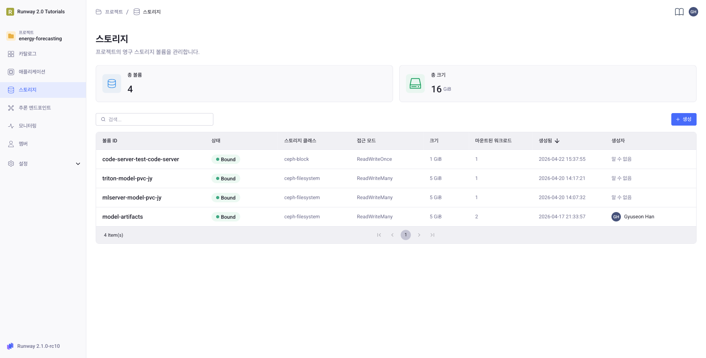

### 입력 값

| 필드 | 값 | 이유 |
|---|---|---|
| 볼륨 ID | `wind-power-models` | 영문 소문자 + 하이픈, 최대 63자 |
| 스토리지 클래스 | `ceph-filesystem` | RWX 지원 (IDE + 추론 Pod 동시 마운트 가능) |
| 접근 모드 | `ReadWriteMany` | 여러 Pod 에서 동시 접근 |
| 크기 | `5` (GiB) | 모델 아티팩트 저장용 |

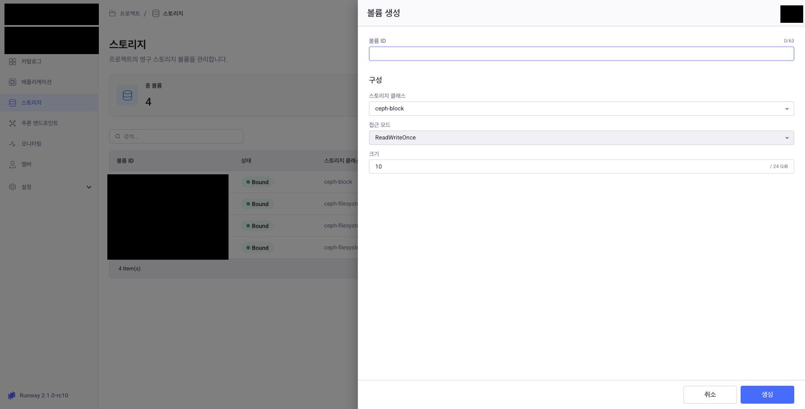

**생성** 버튼 → 목록에 `Bound` 상태로 표시되면 성공.

---

## Step 2. Code Server IDE 배포 (PVC 마운트)

### UI 경로

1. 좌측 **카탈로그** → **Code server** 카드 → 우측 상단 **+ 애플리케이션 생성**

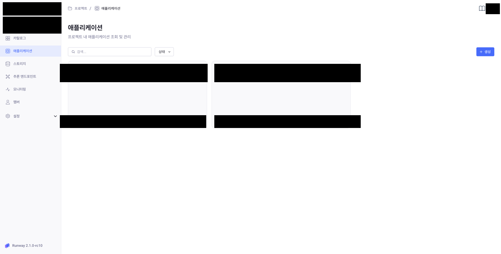

### 기본 정보

| 필드 | 값 (예시) |
|---|---|
| 이름 | `Wind Power IDE` |
| ID | `wind-power-ide` |
| 설명 | (선택) `풍력 예측 튜토리얼 개발용 VS Code` |

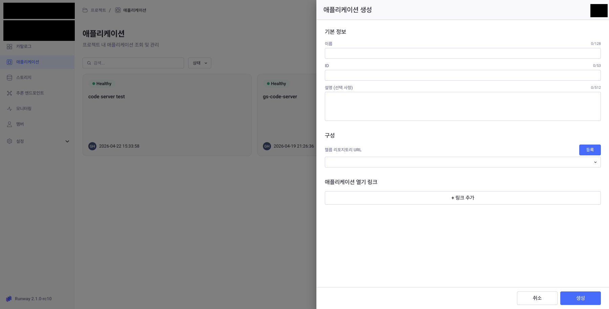

### Helm values.yaml 수정

기본 템플릿에서 두 군데만 바꿉니다:

**① `persistence` 를 기존 볼륨 재사용으로**
```yaml
persistence:
  enabled: true
  mountPath: /mnt/models
  existingClaim: wind-power-models   # Step 1 에서 만든 볼륨 ID
  # existingClaim 사용 시 아래 필드는 무시됨
  # accessMode: ReadWriteMany
  # storageClassName: ""
  # size: 5Gi
```

**② `httpRoute.hostname` 을 본인 서브도메인으로**
```yaml
httpRoute:
  enabled: true
  hostname: "wind-power-ide.<your-runway-domain>"
  hostnames: []
```

### 생성 & 접속

**생성** → 좌측 **애플리케이션** 메뉴 → 카드 상태가 `Healthy` 가 될 때까지 1-2분 대기 → 카드 클릭 → **상세 페이지 상단의 접속 URL** 로 진입하면 브라우저 VS Code 가 열립니다.

---

## Step 3. IDE 기본 환경 설정 — 패키지 & 토큰

Code Server 터미널을 엽니다 (`Terminal > New Terminal` 또는 ``Ctrl+` ``).

> git 사용자 정보 / 작업 디렉토리 이동은 Step 5 (저장소 clone 직전) 에서 함께 처리합니다. 이번 단계에선 이후에 계속 쓸 **파이썬 패키지 설치와 토큰 확보** 만 합니다.

### 3-1. 시스템 Python 설치 (apt)

Code Server 의 기본 이미지에는 Python 도 pip 도 설치돼 있지 않으므로 먼저 OS 패키지를 설치합니다.

```bash
sudo apt update
sudo apt install -y python3 python3-pip python3-venv
```

> 위 패키지들은 IDE Pod 가 살아있는 동안 한 번만 설치하면 됩니다. venv 생성과 프로젝트 의존성(`requirements.txt`) 설치는 **Step 5-3 (소스 코드 복사 후 `setup.sh` 실행)** 에서 처리합니다.

### 3-2. OpenBao 서비스 토큰 확보 (AWS 키 + runway_api_key 조회용)

이 토큰이 **튜토리얼 전체에서 하드코딩되는 유일한 시크릿** 입니다. 이 토큰으로 OpenBao 에 접근해 나머지 시크릿(AWS 키, runway_api_key 등) 을 조회하므로, 다른 시크릿을 코드에 넣지 않아도 됩니다.

1. 새 탭에서 `https://openbao.<your-runway-domain>` 접속
2. 프로젝트 namespace 로 로그인 — 자동 발급되는 서비스 토큰을 **우측 상단 프로필 → Copy token** 으로 복사
3. 토큰 값을 메모 (Step 5 의 `.env` 와 DAG 상수에 각각 사용)

> **토큰 만료 시 대응** (세션 종료 또는 재로그인 시 이전 토큰 무효화됨):
> 1. OpenBao 콘솔 → 프로필 → Copy token 으로 새 토큰 복사
> 2. `~/workspace/wind-power-prediction/.env` 의 `OPENBAO_TOKEN` 갱신
> 3. `wind_power_prediction.py` 상단의 `OPENBAO_TOKEN` 도 같이 갱신 (DAG 스케줄러용)
> 4. `git add wind_power_prediction.py && git commit -m "fix: refresh openbao token" && git push`
> 5. Sync DAG 워크플로우 완료 후 Airflow UI 에서 DAG 재실행
>
> 토큰이 살아있는지 빠르게 확인:
> ```bash
> # 확인할 토큰을 환경변수로 세팅 (따옴표 안에 붙여넣기)
> export OPENBAO_TOKEN="s.<your-openbao-token>"
>
> curl -s -o /dev/null -w "%{http_code}\n" \
>   -H "X-Vault-Token: $OPENBAO_TOKEN" \
>   -H "X-Vault-Namespace: your-project-id" \
>   https://openbao.<your-runway-domain>/v1/secret/data/wind-power
> # 200 OK / 403 만료·권한없음 / 404 KV 경로 없음 / 401·400 토큰·네임스페이스 형식 오류
> ```

### 3-3. Runway API 토큰 확보 (MLflow / 추론용)

**OpenBao 토큰과 별개**입니다. 이 토큰은 DAG 가 MLflow 에 접근할 때, 그리고 추론 endpoint 호출 시 `Authorization: Bearer` 헤더로 사용됩니다. 이 값은 코드에 하드코딩되지 않고 **OpenBao 의 `runway_api_key` 키로 저장** 되어 `task_runner.py` / `test_inference.py` 가 런타임에 조회합니다 (Step 6 참조).

1. Runway 콘솔 우측 상단 **프로필 아이콘** → **계정 설정** → 좌측 **액세스 키** 탭 → **API 키**
2. 기존 키가 없으면 **+ 생성**, 있으면 값을 그대로 복사. (사용자당 최대 1개)
3. Step 6 에서 OpenBao `secret/wind-power` 의 `runway_api_key` 값으로 등록

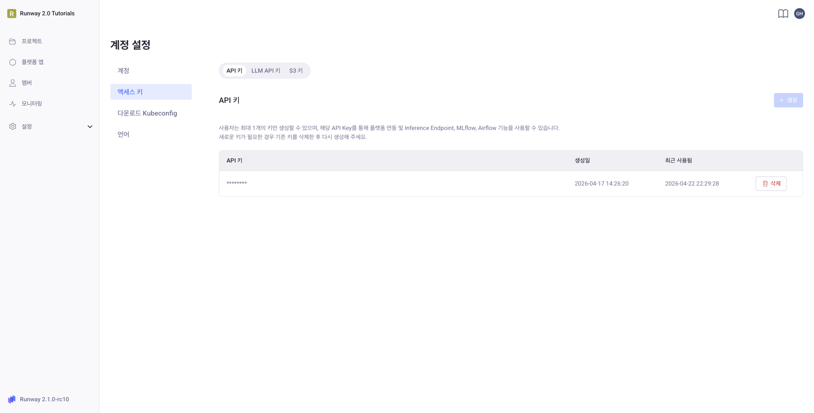

> 같은 사용자가 콘솔에서 새 토큰을 발급받으면 **이전 토큰은 무효화**됩니다. 실행 도중 재발급했다면 OpenBao 콘솔에서 `runway_api_key` 값만 갱신하면 됨 (DAG/코드 변경 불필요).

---

## Step 4. Gitea 에 본인 저장소(`wind-power-prediction`) 생성

### 4-1. 저장소 생성

1. `https://gitea.<your-runway-domain>` 접속 & 로그인
2. 우측 상단 **+ → 새 저장소 만들기**
3. 입력:
   - **소유자**: 본인 프로젝트 ID 와 동일 조직
   - **저장소 이름**: `wind-power-prediction`
   - **가시성**: Private (팀 내부)
   - **저장소 초기화**: 체크 (README.md 자동 생성 — 첫 커밋 용)
4. **저장소 만들기**

> `airflow-dags` 저장소는 **이미 생성되어 있음** (플랫폼 기본 제공). 손대지 않습니다.

### 4-2. Actions Secrets 등록

저장소 **Settings → Secrets and Variables → Actions** 메뉴에 3개:

| 이름 | 값 |
|---|---|
| `GIT_USERNAME` | 본인의 Gitea 로그인명 |
| `GIT_TOKEN` | 개인 액세스 토큰 (패키지 write + `airflow-dags` write 권한) |
| `IMAGE_TAG` | `gitea.<your-runway-domain>/<your-project-id>/wind-power-prediction:latest` |

> 개인 액세스 토큰 발급: Gitea 우측 상단 아바타 → **Settings → Applications → Manage Access Tokens → Generate New Token** — UI 에서 **Repository**(write) 와 **Package**(write) 권한 체크. 이 토큰은 저장소 push 와 Container Registry push 양쪽에 동시에 쓰입니다.

---

## Step 5. IDE 에서 소스 코드 구성

공개 튜토리얼 저장소(`makinarocks/runway-v2-tutorials`) 를 참고 자료로 받아서 본인 Gitea 저장소에 맞게 복사/수정하는 흐름입니다.

> ⚠️ **보안 주의** — 이 튜토리얼은 단순화를 위해 **`OPENBAO_TOKEN` 을 코드(DAG)에 하드코딩** 하는 방식을 사용합니다. 그러므로:
> - Gitea 저장소를 **반드시 Private 으로 유지** (4-1 에서 이미 Private 선택). 실수로 Public 전환 시 토큰이 노출됩니다.
> - 프로덕션 환경에서는 **Gitea Actions Secrets + OpenBao + K8s Secret** 으로 완전 분리 권장.
> - 토큰이 유출되었다고 판단되면 즉시 Runway UI / Gitea UI 에서 토큰 revoke 후 재발급 → 저장소 갱신.

### 5-1. git 기본 설정 & 빈 저장소 clone

IDE 터미널에서:

```bash
# Code Server 홈 내 개발 디렉토리 (소스 코드 작업 공간)
cd ~/workspace

# git 사용자 정보 (본인 값으로) — 이 세션에서 최초 1회만
git config --global user.name  "your-name"
git config --global user.email "your-email@example.com"

# 자격증명 캐시: username/토큰 한 번 입력 후 재사용
git config --global credential.helper store

# 4-1 에서 만든 본인 저장소 clone
git clone https://gitea.<your-runway-domain>/your-project-id/wind-power-prediction.git
cd wind-power-prediction
```

> **두 경로의 역할 구분** — `~/workspace` 는 소스 코드 개발용 (git clone 대상), `/mnt/models` 는 Step 1 에서 마운트한 PVC 로 **모델 아티팩트 전용** (Step 9 의 `download_model.py` 출력). 섞지 마세요.

> clone 시 username 에 본인 Gitea 로그인명, password 에 4-2 에서 만든 개인 액세스 토큰 입력. `credential.helper store` 덕분에 이번 한 번만 입력.

### 5-2. 참고용 공개 저장소에서 파일 복사

> `makinarocks/runway-v2-tutorials` 는 GitHub public 저장소입니다 — 별도 인증 없이 clone 가능. 접근이 안 되면 플랫폼 담당자에게 대체 URL 을 문의하세요.

```bash
# 잠시 상위로 이동해서 reference 저장소 clone
cd ~/workspace
git clone https://github.com/makinarocks/runway-v2-tutorials.git reference

# 튜토리얼 소스를 본인 저장소로 복사 (.git 제외)
cd reference/tutorials/wind-power-prediction-with-xgboost
cp -r Dockerfile requirements.txt task_runner.py config.py .env.example \
      wind_power_prediction.py download_model.py test_inference.py \
      run_dag.sh setup.sh dataset ~/workspace/wind-power-prediction/
cp -r .gitea ~/workspace/wind-power-prediction/

# (선택) 문서도 함께
cp README.md ~/workspace/wind-power-prediction/

# reference 는 삭제 가능
cd ~/workspace && rm -rf reference
```

### 5-3. venv 생성 + 의존성 설치 (`setup.sh`)

저장소 루트에 포함된 `setup.sh` 가 venv 생성, pip 업그레이드, `requirements.txt` 설치까지 한 번에 처리합니다.

```bash
cd ~/workspace/wind-power-prediction
bash setup.sh
```

스크립트가 끝나면 venv 가 활성화된 상태로 떠있고 `boto3`, `hvac`, `pandas`, `requests`, `python-dotenv` 등 IDE 스크립트가 필요로 하는 모든 패키지가 설치됩니다.

> **새 터미널을 열 때마다 venv 재활성화 필요**:
> ```bash
> cd ~/workspace/wind-power-prediction && source venv/bin/activate
> ```
> 이걸 잊고 `python download_model.py` 를 실행하면 `ModuleNotFoundError` 가 납니다.

> `setup.sh` 가 사용하는 시스템 도구는 Step 3-1 의 `python3` / `pip` / `venv` 패키지뿐. apt 단계가 안 끝나있으면 첫 줄에서 실패합니다.

### 5-4. 본인 환경 값 설정 — **세 줄만** 수정

설정이 `config.py` + `.env` + DAG 상단 3줄로 중앙화돼 있어서, 사용자가 손댈 값은 **`RUNWAY_PROJECT_ID` + `RUNWAY_BASE_DOMAIN` + `OPENBAO_TOKEN` 3개** 입니다. 나머지 값(`NAMESPACE`, `IMAGE`, 모든 서비스 URL, `EXPERIMENT_NAME`, `MODEL_NAME`, `S3_ARTIFACT_PREFIX` 등)은 이 3개에서 자동 파생됩니다.

#### ① `.env` 생성 (IDE 스크립트용)

VS Code 에서 `~/workspace/wind-power-prediction/` 워크스페이스를 연 뒤 터미널에서:

```bash
cd ~/workspace/wind-power-prediction
cp .env.example .env
```

`.env` 를 열어 아래 값 설정:

```dotenv
RUNWAY_PROJECT_ID=your-project-id              # 본인 프로젝트 ID
RUNWAY_BASE_DOMAIN=your-runway-domain.com      # Runway 베이스 도메인 (예: runway.example.com)
OPENBAO_TOKEN=s.<3-2 에서 복사한 OpenBao 서비스 토큰>

# 추론 테스트는 Step 10 (모델 배포) 이후 채움. 지금은 비워둬도 됨.
INFERENCE_ENDPOINT=
DEPLOYMENT_ID=default
```

> `.env` 는 `.gitignore` 에 포함되어 있어 Gitea 로 커밋되지 않습니다. IDE 스크립트 (`download_model.py`, `test_inference.py`) 가 `config.py` 를 통해 자동 로드합니다.

#### ② DAG 파일 상수 (`wind_power_prediction.py`)

파일 상단 [사용자 설정] 섹션의 **3줄만** 수정:

```python
RUNWAY_PROJECT_ID  = "your-project-id"               # ← 본인 프로젝트 ID
RUNWAY_BASE_DOMAIN = "your-runway-domain.com"        # ← Runway 베이스 도메인
OPENBAO_TOKEN      = "s.<3-2 의 OpenBao 서비스 토큰>"
```

그 아래 [파생값] 섹션은 **수정 불필요** — f-string 으로 `NAMESPACE`, `IMAGE`, `OPENBAO_URL`, `OPENBAO_NAMESPACE` 등이 자동 계산됩니다 (`gitea.{BASE_DOMAIN}/...`, `https://openbao.{BASE_DOMAIN}` 형태).

> **왜 DAG 는 `.env` 를 못 쓰나?** DAG 는 `airflow-dags` 저장소로 sync 되어 Airflow 스케줄러 Pod 에서 실행됩니다. 사용자의 `.env` 파일은 거기 없으므로 DAG 상단에 직접 하드코딩해야 합니다. 대신 주입되는 env 는 최소한 (`RUNWAY_PROJECT_ID`, `OPENBAO_TOKEN`, `DAG_RUN_ID`) 으로 줄어 있습니다.

> **`RUNWAY_API_KEY` 는?** 코드에서 완전히 빠졌습니다 — `task_runner.py` 와 `test_inference.py` 가 OpenBao `secret/wind-power` 의 `runway_api_key` 값을 런타임에 조회합니다 (Step 6 참조).

#### ③ `.gitea/workflows/` (수정 불필요 — 자동 도출)

`build-image.yml` 은 `IMAGE_TAG` Secret 에서 호스트를 자동 추출하고, `sync-dag.yml` 은 현재 저장소의 `github.server_url` + `github.repository_owner` 컨텍스트에서 Gitea 호스트와 조직명을 자동 도출합니다. **YAML 자체는 손댈 필요 없음.**

> 단, **`airflow-dags` 가 같은 조직 안에 있다는 전제** 입니다 (Runway 기본 구성). 다른 조직에 있으면 `sync-dag.yml` 의 `DAGS_REPO=` 라인을 본인 환경에 맞게 수정.

---

## Step 6. OpenBao 에 시크릿 등록

OpenBao 콘솔(3-2 에서 로그인한 탭) 에서:

1. 좌측 **Secret Engines** → `secret/` 클릭 → **Create secret +**
2. **Path**: `wind-power`
3. **Secret data** 에 아래 **5개** key-value 입력:

| Key | Value | 누가 쓰나 |
|---|---|---|
| `aws_access_key_id` | Runway 에서 발급받은 S3 Access Key ID | task_runner / download_model (S3) |
| `aws_secret_access_key` | 위 Access Key 의 Secret | 위와 동일 |
| `gitea_username` | 4-2 의 `GIT_USERNAME` 과 동일 | ensure_pull_secret (이미지 pull 인증) |
| `gitea_password` | 4-2 의 `GIT_TOKEN` 과 동일 | 위와 동일 |
| `runway_api_key` | 3-3 에서 발급받은 Keycloak offline token | task_runner (MLflow 인증), test_inference (Bearer) |

> `runway_api_key` 는 MLflow 인증과 추론 엔드포인트 호출에서 사용됩니다. 여기 한 곳에만 넣으면 두 스크립트 모두 자동으로 가져다 씁니다.
>
> S3 자격증명은 Runway 관리자에게 문의 또는 콘솔의 **Keys** 메뉴에서 발급.

---

## Step 7. 첫 Push — CI/CD 자동 트리거

이제 본인 코드를 Gitea 로 올리면 Gitea Actions 가 자동으로 이미지를 빌드하고 DAG 파일을 airflow-dags 로 동기화합니다.

```bash
cd ~/workspace/wind-power-prediction
git add .
git commit -m "feat: initial wind-power-prediction setup"
git push origin main
```

### 7-1. Gitea Actions 동작 확인

Gitea 저장소 **Actions** 탭 진입. 두 워크플로우가 실행됩니다:

- **Build and Push to Gitea CR** — Docker 이미지 빌드 & CR 푸시 (`task_runner.py`, `config.py`, `Dockerfile`, `requirements.txt`, `dataset/**` 변경 시)
- **Sync DAG to airflow-dags** — DAG 파일을 `<your-project-id>/airflow-dags` 저장소의 `wind_power_prediction/wind_power_prediction.py` 로 복사 (`wind_power_prediction.py` 변경 시)

두 개 모두 녹색 체크로 끝날 때까지 대기 (이미지 빌드는 5-10분).

### 7-2. DAG 인식 확인

Airflow UI (`https://airflow.<your-runway-domain>`) → DAG 목록에 `wind_power_prediction` 가 있어야 합니다. 없으면 **Sync DAG 워크플로우** 로그 확인.

### 이후 업데이트 시

두 Gitea Actions workflow 는 **서로 독립** 적으로 동작합니다 (어느 한쪽이 다른 쪽을 트리거하지 않음). 변경 파일의 성격에 따라 해당 경로만 갱신됩니다:

| 변경 파일 | 자동 동작 | 반영 경로 |
|---|---|---|
| `task_runner.py`, `config.py`, `Dockerfile`, `requirements.txt`, `dataset/**` | 이미지 재빌드 (`build-image.yml`) | Gitea CR `:latest` 태그 갱신 → 다음 DAG 실행 시 새 이미지 pull (`image_pull_policy="Always"`) |
| `wind_power_prediction.py` | DAG 파일 동기화 (`sync-dag.yml`) | `airflow-dags/wind_power_prediction/wind_power_prediction.py` 업데이트 → Airflow 가 git-sync 후 재파싱 |

> `task_runner.py` 와 DAG 파일을 **동시에** 수정한 경우엔 두 워크플로우가 **동시에 트리거** 됩니다. Gitea Actions 러너 수가 제한된 환경에서는 순차 실행될 수 있습니다.

---

## Step 8. DAG 실행 (최초 학습)

### 옵션 A — Airflow UI (권장)

1. `wind_power_prediction` DAG 클릭 → 우측 ▶ **Trigger DAG**
2. 그래프 뷰에서 태스크가 순서대로 초록색으로 바뀌는지 확인:
   ```
   ensure_pull_secret → [load_data, load_model] → train_model → evaluate_model → log_to_mlflow
   ```
3. 각 태스크 클릭 → **Logs** 탭에서 표준출력 확인 (실패 시 에러 추적)

> **첫 태스크 `ensure_pull_secret` 가 하는 일** — Gitea Container Registry 에서 이미지를 pull 할 수 있도록 `gitea-registry-pull` K8s Secret 을 자동 생성·갱신합니다. OpenBao 의 `gitea_username`/`gitea_password` → dockerconfigjson → K8s Secret. 자세한 동작은 [imagePullSecret 자동 관리](#imagepullsecret-자동-관리-ensure_pull_secret) 섹션 참조.

### 옵션 B — IDE 에서 `run_dag.sh`

> ⚠️ `run_dag.sh` 상단 `API_KEY=` 는 **Airflow 전용 JWT** (Runway API 토큰과 다름, 수명 ~24h). 실행 전에 본인 값으로 교체 필수.
>
> **Airflow JWT 획득 방법** (Airflow 3.0 기준):
> ```bash
> curl -X POST "https://airflow.<your-runway-domain>/auth/token" \
>   -H "Content-Type: application/json" \
>   -d '{"username":"<본인 계정>","password":"<본인 비밀번호>"}'
> ```
> 응답의 `access_token` 값을 `run_dag.sh` 의 `API_KEY` 에 붙여넣기.
>
> 또는 브라우저에서 Airflow UI 로그인 후 DevTools → Network 탭에서 API 요청의 `Authorization: Bearer <token>` 헤더를 복사.

```bash
cd ~/workspace/wind-power-prediction
# 에디터에서 run_dag.sh 의 API_KEY 변경 후
bash run_dag.sh
```

### MLflow 에서 결과 확인

`https://mlflow.<your-runway-domain>` → Experiments → `your-project-id.wind-power-prediction` → 최신 run 에서 파라미터/메트릭/아티팩트 확인. Registered Models 에 `your-project-id.wind-power-xgboost` 가 등록되어 있어야 합니다.

---

## Step 9. 모델 아티팩트를 PVC 로 복사

IDE 터미널에서:

```bash
cd ~/workspace/wind-power-prediction
source venv/bin/activate                 # Step 5-3 setup.sh 가 만든 venv

# OpenBao 토큰이 .env 에 있는지 확인 (Runway API 토큰은 OpenBao 에 저장됨)
grep OPENBAO_TOKEN .env | head -c 30   # 앞부분이 보이면 OK

# 사용 가능한 모델 목록
python download_model.py --list

# 최신 모델 다운로드
python download_model.py
```

완료되면 `/mnt/models/m-xxxxxxxx.../` 에 아티팩트 복사:
```
/mnt/models/m-aa64f3852e0845838624882dfc40794b/
  ├── MLmodel
  ├── model.ubj
  ├── conda.yaml
  ├── python_env.yaml
  └── requirements.txt
```

> 이 디렉토리 전체 경로가 다음 단계의 **모델 경로** 가 됩니다. 복사해두세요.

---

## Step 10. 추론 엔드포인트 & 모델 배포

### 10-1. 엔드포인트 생성

1. Runway 콘솔 좌측 **추론 엔드포인트** → **+ 생성**

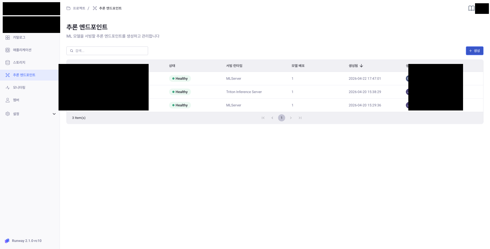

2. 입력:

| 필드 | 값 |
|---|---|
| 엔드포인트 이름 | `Wind Power Prediction` |
| 엔드포인트 ID | `wind-power-prediction` |
| 서빙 런타임 | `MLServer` |

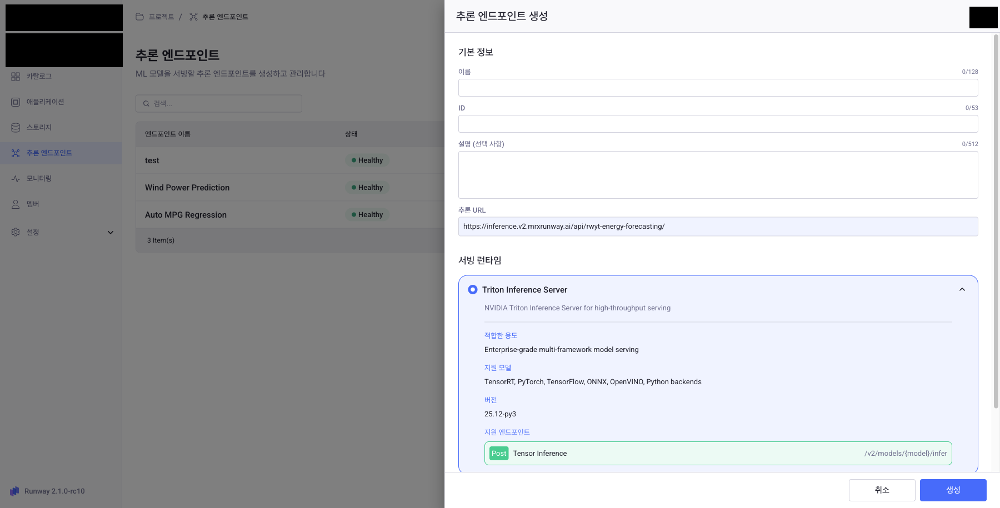

> MLServer = sklearn/XGBoost/LightGBM 용. Triton = 딥러닝(PyTorch/TF/ONNX) 용. XGBoost 이므로 MLServer.

### 10-2. 첫 모델 배포 추가

엔드포인트 상세 페이지 우측 상단 **모델 배포** 클릭:

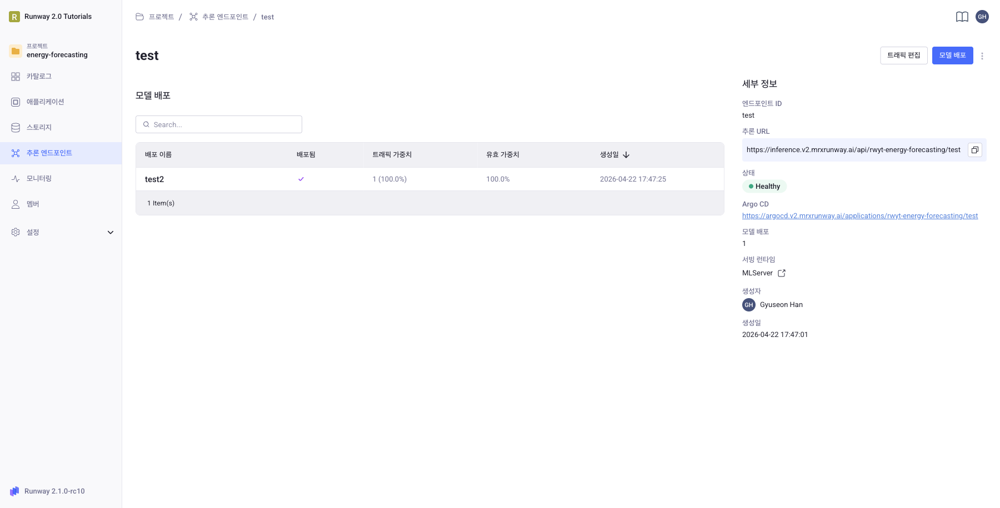

**기본 정보**

| 필드 | 값 |
|---|---|
| 이름 | `Wind Power Model v1` |
| ID | `wind-power-v1` |

**모델 소스**

| 필드 | 값 |
|---|---|
| 볼륨 | `wind-power-models` |
| 모델 경로 | `/mnt/models/m-aa64f3852e0845838624882dfc40794b` (Step 9 에서 복사한 디렉토리) |

**컴퓨팅 리소스**

| 필드 | 값 |
|---|---|
| CPU (millicores) | `500` |
| Memory (MiB) | `1024` |
| GPU | Off |

**스케일링**: 복제본 `1`

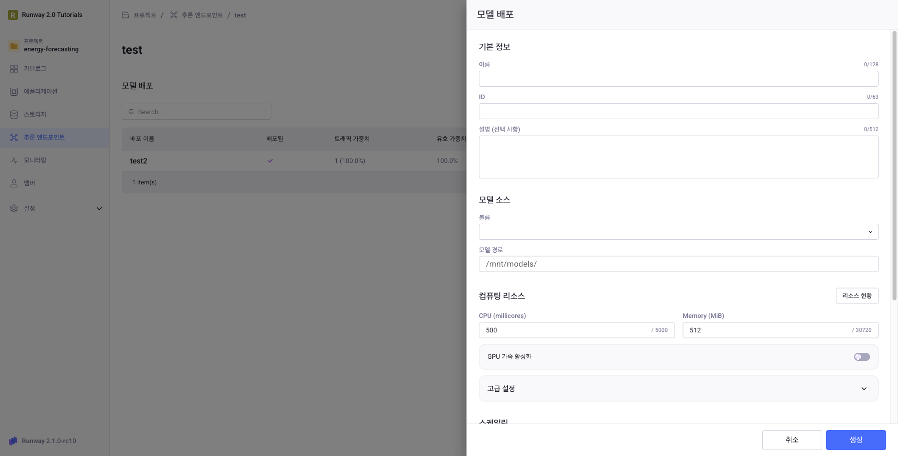

**생성** 클릭 → 엔드포인트가 `Healthy` 로 전환되면 서빙 준비 완료.

---

## Step 11. 추론 호출 테스트

### 11-1. 추론 URL 확인 (중요)

**엔드포인트 상세 페이지 > 해당 배포 클릭 > 하단 "직접 API 접근" 섹션의 요청 URL 을 그대로 복사** 해서 사용. 이 섹션은 브라우저에서 바로 payload 를 붙여넣어 호출 테스트도 할 수 있습니다.

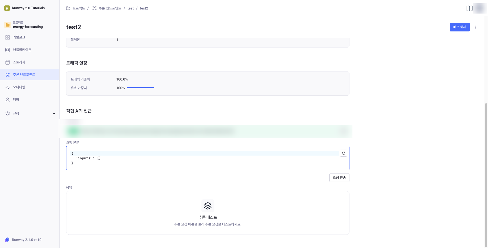

형식:
```
https://inference.<your-runway-domain>/api/<project-id>/<endpoint-id>/<deployment-id>/v2/models/default/infer
```

- 앞 3 경로 세그먼트 (`<project-id>/<endpoint-id>/<deployment-id>`) = **Runway 라우팅 경로** — UI 에서 본인이 설정한 엔드포인트 ID / 배포 ID 가 반영됨
- 끝 `/v2/models/default/infer` = **KServe V2 Inference Protocol 경로** — Runway MLServer 는 내부 모델명을 `default` 로 고정

`test_inference.py` 는 이 URL 을 두 부분으로 나눠 사용:

| 환경변수 | 값 |
|---|---|
| `INFERENCE_ENDPOINT` | `https://inference.<your-runway-domain>/api/<project-id>/<endpoint-id>/<deployment-id>` (끝의 `/v2/...` 이전까지) |
| `DEPLOYMENT_ID` | `default` (KServe V2 의 model name, Runway 고정값) |

> ⚠️ **"배포 ID" 가 두 번 등장** — 10-2 에서 만든 배포 ID (예: `wind-power-v1`) 는 URL 3번째 세그먼트로 **이미 INFERENCE_ENDPOINT 에 포함** 됩니다. `DEPLOYMENT_ID` 환경변수는 별개의 개념 (KServe 모델명) 이며 Runway 에서는 항상 `default` 입니다.

참고로 배포 상세 페이지 상단에서 모델 소스/리소스/스케일링 등 전반 설정도 확인 가능:

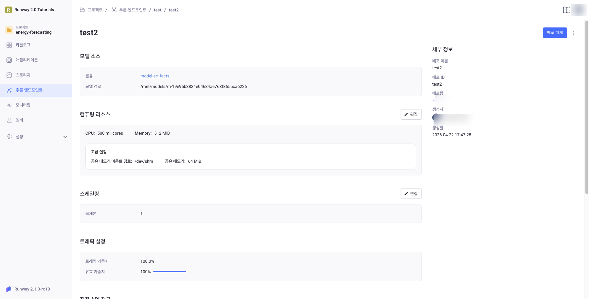

### 11-2. 인증 토큰

`Authorization: Bearer` 헤더에 **Runway API 토큰** (Keycloak offline token) 이 필요합니다. `test_inference.py` 는 다음 우선순위로 토큰을 찾습니다:

1. `--token` CLI 인자 (명시적 오버라이드)
2. env `RUNWAY_API_KEY`
3. **OpenBao 의 `runway_api_key`** (기본 — `.env` 에 `OPENBAO_TOKEN` 만 있으면 자동 조회)

Step 6 에서 OpenBao 에 `runway_api_key` 를 등록했다면 **토큰 관련 인자를 따로 지정할 필요가 없습니다**.

### 11-3. 학습 데이터셋으로 추론 테스트 (권장)

저장소에 포함된 `test_inference.py` 가 `dataset/turbine_data.csv` 에서 행을 뽑아 `task_runner.py` 와 동일한 전처리(`id/datetime/uuid/index/wtg` 제외)를 수행한 뒤 KServe V2 payload 로 호출하고, 예측값과 실제 `activepower` 값을 나란히 출력합니다.

IDE 터미널에서:

```bash
# 저장소 루트에서 실행
cd ~/workspace/wind-power-prediction
source venv/bin/activate                 # Step 5-3 setup.sh 가 만든 venv

# .env 파일에 INFERENCE_ENDPOINT 추가 (한 번만)
#   INFERENCE_ENDPOINT=<11-1 UI 요청 URL 에서 /v2/models/... 이전까지>
#   DEPLOYMENT_ID=default            # Runway MLServer 고정값

# CSV 첫 행으로 호출 — 토큰/엔드포인트 자동 로드
python test_inference.py

# 랜덤 5개 행을 한 번에 배치 호출 (MAE 자동 계산)
python test_inference.py --num-rows 5 --random

# 네트워크 호출 없이 payload JSON 만 확인 (스키마 디버깅용)
python test_inference.py --dry-run
```

출력 예:
```
[test_inference] 전체 행: 10060, 피처 수: 19
[test_inference] 선택된 행 인덱스: [0]
[test_inference] payload shape: [1, 19]
[test_inference] POST https://inference.<your-runway-domain>/api/<proj>/<ep>/<deploy>/v2/models/default/infer  (verify_tls=True)
[test_inference] 예측 vs 실제:
     row |      predicted |         actual |    abs_err
-------------------------------------------------------
       0 |       362.1845 |       363.1963 |     1.0118
```

### 11-4. curl 로 직접 호출 (옵션 — 내부 페이로드 확인용)

스크립트를 쓰지 않고 페이로드를 직접 보고 싶으면 `python test_inference.py --dry-run` 출력을 복사해 curl 에 붙여넣거나 아래 형태로 보냅니다. 피처 순서는 `task_runner.py` 의 전처리와 동일(`id/datetime/uuid/index/wtg/activepower` 제외)이며 총 **19 개** 입니다.

curl 은 `.env` 를 직접 읽지 못하므로 `RUNWAY_API_KEY` 는 별도로 export 해야 합니다 (OpenBao 콘솔 또는 Step 6 에서 등록한 값을 복사):

```bash
export RUNWAY_API_KEY="eyJhbGciOi..."
export INFERENCE_ENDPOINT="https://inference.<your-runway-domain>/api/<proj>/<ep>/<deploy>"
export DEPLOYMENT_ID="default"          # Runway MLServer KServe V2 모델명 (고정)

curl -X POST "${INFERENCE_ENDPOINT}/v2/models/${DEPLOYMENT_ID}/infer" \
  -H "Authorization: Bearer ${RUNWAY_API_KEY}" \
  -H "Content-Type: application/json" \
  -d '{
    "inputs": [
      {
        "name": "input-0",
        "shape": [1, 19],
        "datatype": "FP32",
        "data": [[v1, v2, ..., v19]]
      }
    ]
  }'
```

응답 예:
```json
{
  "model_name": "default",
  "outputs": [
    { "name": "output-0", "datatype": "FP32", "shape": [1, 1], "data": [362.18] }
  ]
}
```

> **환경별 검증 필요**
> - 인증 방식 (Bearer / API key header / 무인증)
> - `input-0` / `output-0` 텐서 이름 — 다르면 `test_inference.py --tensor-name <name>` 으로 재시도
> - 400/422 나면 MLServer Pod 로그(엔드포인트 상세 → ArgoCD 링크) 에서 기대하는 입력 스키마 확인

---

## Step 12. 정리 / 재실행

### 삭제 순서

1. **추론 엔드포인트** → 모델 배포 먼저 삭제 → 엔드포인트 삭제
2. **애플리케이션** → `Wind Power IDE` 삭제 (볼륨은 남음)
3. **스토리지** → `wind-power-models` 삭제 (재사용할 거면 유지)
4. **Gitea 저장소 / Actions Secrets / OpenBao 시크릿** 은 재사용 가능

### 재실행

같은 구성으로 다시 돌린다면 **Step 8 (DAG 실행)** 부터 바로 가능. 코드만 바꿀 경우 IDE 에서 수정 → `git push` → CI/CD 자동 동작 → Airflow 재실행.

---

## imagePullSecret 자동 관리 (`ensure_pull_secret`)

KubernetesPodOperator 가 task_runner 이미지를 Gitea Container Registry 에서 pull 하려면 프로젝트 namespace 안에 **`gitea-registry-pull`** 이라는 dockerconfigjson 타입 K8s Secret 이 있어야 합니다. 이 Secret 을 **DAG 의 첫 태스크 `ensure_pull_secret` 가 매 실행마다 자동으로 생성/갱신** 합니다 — 사용자가 `kubectl create secret docker-registry ...` 를 직접 실행할 필요 없음.

### 동작 흐름

```
  [ OpenBao KV v2 — secret/wind-power ]
        │  urllib HTTP (X-Vault-Token)
        │  keys: gitea_username, gitea_password
        ▼
  ┌─────────────────────────────────────────────────┐
  │ Airflow scheduler Pod — ensure_pull_secret      │
  │                                                 │
  │   1) OpenBao 에서 gitea creds 조회              │
  │   2) dockerconfigjson 구성:                     │
  │        auths.<gitea-host>.auth =                │
  │          base64(<user>:<pass>)                  │
  │   3) K8s API: create_or_update Secret           │
  │        type=kubernetes.io/dockerconfigjson      │
  │        name=gitea-registry-pull                 │
  │        namespace=<your-project-id>              │
  └─────────────────────────────────────────────────┘
        │
        ▼
  ┌─────────────────────────────────────────────────┐
  │ KubernetesPodOperator (load_data, ...)          │
  │   spec.imagePullSecrets:                        │
  │     - name: gitea-registry-pull                 │
  │   → 이미지 pull 성공                            │
  └─────────────────────────────────────────────────┘
```

### 왜 매번 재생성 하는가

Runway 환경에서는 namespace 의 imagePullSecret 이 **주기적으로 사라지는 현상** 이 관찰돼서, 매 DAG 실행마다 보장하도록 첫 태스크로 두었습니다. 변경이 없으면 K8s API 가 멱등적으로 동작합니다.

### 왜 `@task` (PythonOperator) 인가

다른 태스크는 모두 KubernetesPodOperator 인데 이것만 `@task` 인 이유:
- KubernetesPodOperator 가 Pod 를 띄우려면 `imagePullSecret` 이 namespace 에 이미 있어야 함
- 그런데 그 Secret 을 만드는 태스크 자체는 Secret 이 없어도 돌아야 함 → **닭과 달걀**
- 해결: `@task` 로 Airflow 스케줄러 Pod 내부에서 직접 K8s API 호출 (스케줄러 SA 의 `edit` RoleBinding 활용)

따라서 [사전 준비](#사전-준비-관리자플랫폼-영역) 의 RoleBinding 이 안 돼있으면 이 태스크부터 실패합니다.

### 수동 검증

```bash
# 본인 namespace 에 Secret 이 있는지 확인 (Gitea 자격증명 마스킹된 형태로 출력)
kubectl get secret gitea-registry-pull -n <your-project-id> -o yaml

# Secret 내용 디코드 (디버깅용 — 토큰 평문이 출력되니 주의)
kubectl get secret gitea-registry-pull -n <your-project-id> \
  -o jsonpath='{.data.\.dockerconfigjson}' | base64 -d
```

### 수동 생성 (DAG 실행 전 미리 만들고 싶을 때 — 거의 불필요)

`ensure_pull_secret` 가 자동 처리하므로 보통 불필요하지만, DAG 실행 없이 다른 워크로드를 같은 이미지로 띄우고 싶을 때 사용:

```bash
kubectl create secret docker-registry gitea-registry-pull \
  --docker-server=gitea.<your-runway-domain> \
  --docker-username=<gitea-username> \
  --docker-password=<gitea-token> \
  -n <your-project-id>
```

### 트러블슈팅 (imagePullSecret)

| 증상 | 원인 / 대응 |
|---|---|
| `ensure_pull_secret` 태스크 `HTTPError: 403 Forbidden` | OpenBao 토큰 만료 — Step 3-2 의 "토큰 만료 시 대응" 절차 |
| `ensure_pull_secret` 태스크 `KeyError: 'gitea_username'` | OpenBao `secret/wind-power` 에 키 미등록 — Step 6 재확인 |
| `ensure_pull_secret` 태스크 `Forbidden: cannot create resource secrets` | 사전 준비 의 RoleBinding 누락 — `kubectl create rolebinding` 재실행 |
| 후속 태스크가 `FailedToRetrieveImagePullSecret (gitea-registry-pull)` | Secret 이 사라진 상태 — DAG 재실행하면 첫 태스크가 자동 복구 |
| 이미지 pull 은 되는데 `FailedToRetrieveImagePullSecret` 경고가 함께 뜸 | 노드 이미지 캐시 hit 로 임시 성공한 상태. 다른 노드 스케줄링 / 새 이미지 태그 push 시 즉시 실패 → `ensure_pull_secret` 로그 확인하여 근본 해결 |

---

## 아키텍처 상세

### 인증 / 자격증명 흐름

```
┌─ OpenBao (KV v2) ────────────────────────────┐
│  namespace=<your-project-id>                 │
│  secret/data/wind-power                      │
│    aws_access_key_id                         │
│    aws_secret_access_key                     │
│    gitea_username                            │
│    gitea_password                            │
│    runway_api_key                            │
└──────────────────────────────────────────────┘
         ▲
         │  hvac / urllib (X-Vault-Token)
         │
  ┌──────┴───────────────────────────────────┐
  │                                          │
  │  Airflow scheduler (@task)               │
  │  ensure_pull_secret                      │
  │    → gitea creds 조회                    │
  │    → dockerconfigjson 구성               │
  │    → K8s Secret create/update            │
  │       (gitea-registry-pull)              │
  │                                          │
  │  KubernetesPodOperator Pod               │
  │  task_runner.py                          │
  │    → load_secrets()                      │
  │    → AWS 키 → boto3 S3 client            │
  │    → runway_api_key → MLflow 인증        │
  └──────────────────────────────────────────┘
```

### MLflow

- **Tracking URI**: `https://mlflow.<your-runway-domain>` (config.py 가 RUNWAY_BASE_DOMAIN 에서 파생)
- **인증**: `MLFLOW_TRACKING_TOKEN=<runway_api_key>` (Keycloak offline token 직접 사용)
- **Experiment naming rule**: `{프로젝트ID}.{실험명}` (Runway 규약) — 예: `<your-project-id>.wind-power-prediction`
- **Artifact location**: `s3://{프로젝트ID}/mlflow/experiments/{실험명}/models/m-{id}/artifacts/`

### 태스크 간 아티팩트 공유 (S3)

DAG_RUN_ID 별 고유 prefix:

```
s3://{S3_BUCKET}/wind-power/dag-runs/{DAG_RUN_ID}/
  ├── turbine_data.csv   # load_data → train_model
  ├── model_init.pkl     # load_model → train_model
  ├── model_trained.pkl  # train_model → evaluate_model, log_to_mlflow
  ├── test_data.pkl      # train_model → evaluate_model
  └── metrics.json       # evaluate_model → log_to_mlflow
```

---

## 보안

이 튜토리얼은 단순화를 위해 `OPENBAO_TOKEN` 을 DAG 파일에 하드코딩합니다. 다른 시크릿 (AWS 키, Gitea 자격증명, runway_api_key) 은 모두 OpenBao 에 저장되어 코드에 노출되지 않습니다. 다음 원칙을 지키세요:

- **저장소는 반드시 Private**. public 전환 시 OpenBao 토큰 노출 → revoke 필요.
- 다른 프로젝트로 **fork / 이식** 시 모든 토큰/키 값을 **본인 환경 값으로 교체**.
- **프로덕션** 환경에선 아래로 완전 분리 권장:
  - Airflow Pod env: K8s Secret `env_from` (OPENBAO_TOKEN 도 분리)
  - CI/CD 토큰: Gitea Actions Secrets
  - 런타임 조회 대상: OpenBao + hvac (현재 AWS 키/runway_api_key 는 이미 이 방식)
- **토큰 유출 의심** 시: Runway UI 에서 API 토큰 revoke 후 새로 발급 → OpenBao namespace 에서 서비스 토큰 재발급 → 저장소의 값 일괄 갱신.

---

## 트러블슈팅

| 증상 | 원인 가능성 & 대응 |
|---|---|
| Code Server 가 `Pending` 에서 안 넘어감 | 스토리지 클래스/access mode 미지원. 스토리지 목록 확인 후 클래스 변경 |
| IDE 터미널에서 `/mnt/models` 쓰기 실패 (`permission denied`) | PVC fsGroup 이슈. Code Server values 의 `podSecurityContext.fsGroup: 1000` 확인. 또는 `sudo chown -R $(id -u):$(id -g) /mnt/models` (sudo 가능 시) |
| `git clone` 인증 실패 | username 은 로그인명, password 는 **개인 액세스 토큰** (패스워드 아님). `credential.helper store` 설정 |
| Gitea Actions 에서 `build-image.yml` 이 실패 | `IMAGE_TAG` Secret 값 확인. Gitea CR 에 같은 경로로 저장됨. 401 이면 `GIT_TOKEN` 의 packages write 권한 확인 |
| Gitea Actions 에서 `sync-dag.yml` 이 `The target couldn't be found (404)` | `airflow-dags` 저장소가 빈 상태. README 자동 생성으로 초기화했는지 확인 |
| `ensure_pull_secret` 태스크 실패 | [imagePullSecret 트러블슈팅](#트러블슈팅-imagepullsecret) 참조 |
| `load_data` / `train_model` 등이 `FailedToRetrieveImagePullSecret` | `ensure_pull_secret` 가 만든 Secret 이 사라졌을 수 있음. DAG 재실행 (다음 run 에서 자동 복구) |
| `log_to_mlflow` 에서 `permission denied` 또는 `Failed to validate offline token` | OpenBao `runway_api_key` 값이 만료됨. OpenBao 콘솔 → 해당 키 값만 새 Runway API 토큰으로 갱신 (Step 3-3 재발급) — DAG/코드 변경 불필요 |
| MLflow experiment 생성 `permission denied` | `EXPERIMENT_NAME` 이 `{프로젝트ID}.{실험명}` 규약 위반. `task_runner.py` 또는 `config.py` 의 `EXPERIMENT_SHORT_NAME` 확인 |
| `download_model.py` 에서 `permission denied` (S3) | `OPENBAO_TOKEN` 만료 가능성. Step 3-2 의 "토큰 만료 시 대응" 참고. `config.py` 가 만료 시 친절한 에러 메시지 출력함 |
| `download_model.py` 에서 아티팩트를 못 찾음 (`아티팩트를 찾을 수 없습니다`) | 실험 이름을 바꿨다면 `S3_ARTIFACT_PREFIX` 도 같이 수정해야 함. `EXPERIMENT_SHORT_NAME=my-new-exp` → `S3_ARTIFACT_PREFIX=mlflow/experiments/my-new-exp/models/` (`{프로젝트ID}.{실험명}` 중 `.` 뒤 부분이 S3 prefix 의 경로 세그먼트와 일치해야 함) |
| `run_dag.sh` 실행 시 `401 Unauthorized` | 스크립트 내 `API_KEY` 가 Airflow JWT 만료/플레이스홀더. 본인 Airflow JWT 로 교체 (수명 ~24h) |
| 엔드포인트 생성 후 `Unhealthy` / `NotReady` | 모델 경로가 잘못됐거나 PVC 가 비어있음. 추론 엔드포인트 상세 → ArgoCD 링크로 Pod 로그 확인 |
| 추론 호출 404 | 11-1 의 UI 복사 URL + `/v2/models/<deployment-id>/infer` 조합인지 재확인 |
| 추론 호출 401/403 | 토큰을 OpenBao 토큰과 혼동했는지 확인. Runway API 토큰 재발급(Step 3-3) |
| 추론 호출 400/422 | payload 스키마(텐서 이름/shape) 가 모델 시그너처와 불일치. MLServer 로그에서 기대 입력 확인 |

---

## 데이터셋

- **위치**: `dataset/turbine_data.csv` (Docker 이미지에 번들)
- **크기**: ~10,000 행
- **타겟**: `activepower` (풍력 발전 출력)
- **특성**: 풍속, 풍향, 블레이드 각도 등 터빈 센서 값

---

## 참고

- 현재 DAG 는 KubernetesPodOperator + S3 아티팩트 공유 + OpenBao + ensure_pull_secret 구조입니다 (`wind_power_prediction.py`).
